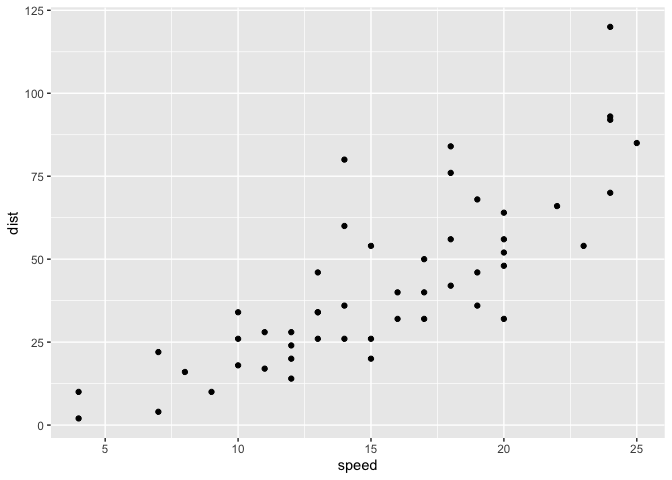
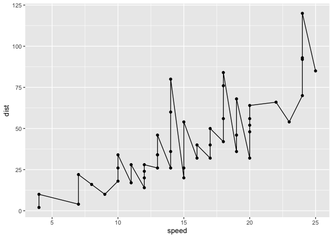
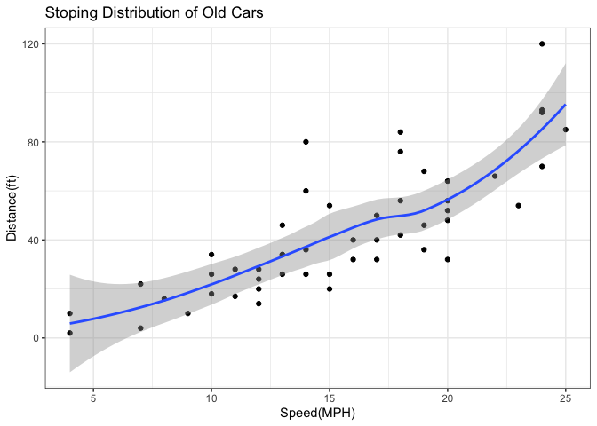
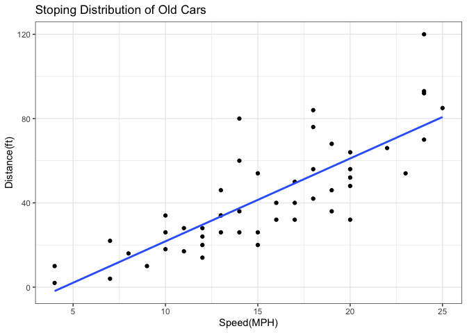
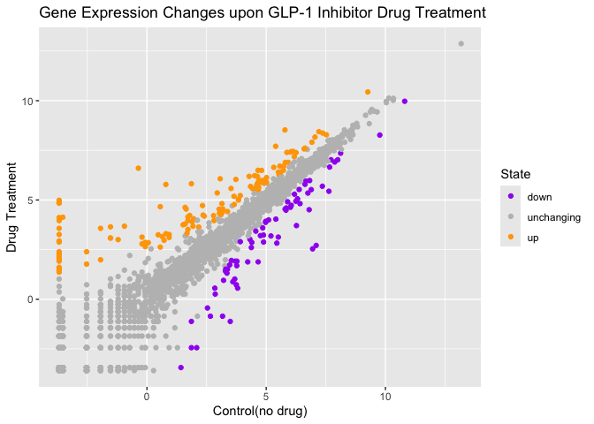
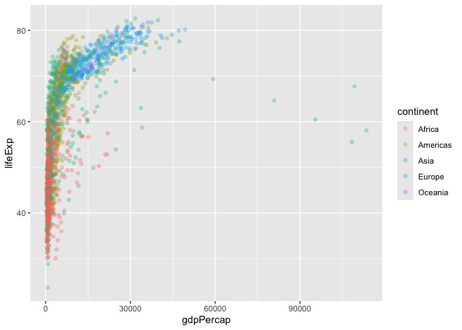
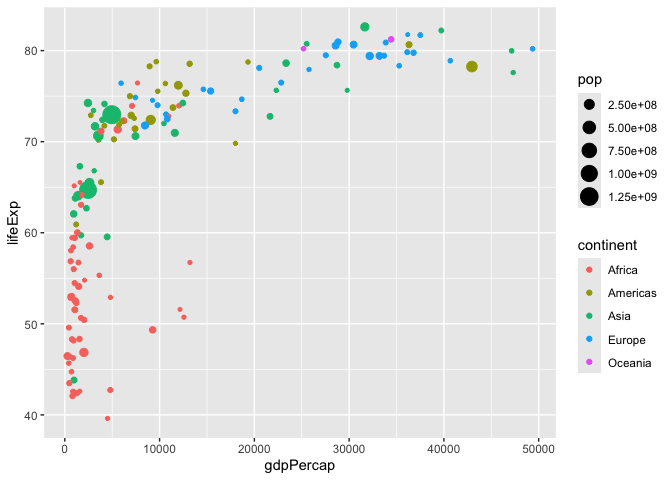

# Class 5: Data Viz with ggplot2
Madina(PID: 185)

- [Background](#background)
- [Add some custom features](#add-some-custom-features)
- [Gene Expression Data](#gene-expression-data)

## Background

There are many graphics system in R for making plots and figures. These
include so-called *“base R” graphics* like the `plot()` function and add
on packages like **ggplot2**.

Let’s compare how we make a simple figure with these two systems:

We can use the in-built `cars` dataset:

``` r
head(cars)
```

      speed dist
    1     4    2
    2     4   10
    3     7    4
    4     7   22
    5     8   16
    6     9   10

``` r
plot(cars)
```


Before I can use the **ggplot2** I need to install it on my computer. To
do this we can use the function `install.packages("ggplot2")`.

> **N.B.** We never run `install.packages()` in our quarto doc (we run
> it once only in R console) as it would re-install the package
> everytime we render the code.

Once installed we need to load up the package into our R brain

``` r
library(ggplot2)
```

The main function in **ggplot2** package is called `ggplot()`

``` r
ggplot(cars)
```


Every ggplot has at least 3 layers

- The **data** (a data.frame of the stuff we wnat to plot)
- The **aes**thetics ( how the data maps to the plot)
- The **geom** layer(how you want the plot drawn, e.g points, line,
  etc.)

``` r
ggplot(cars) +
  aes(x=speed ,y=dist ) + 
  geom_point()
```



## Add some custom features

Let’s add a trend line that shows the relationship between the speec and
distance.

``` r
ggplot(cars) +
  aes(x=speed ,y=dist ) + 
  geom_point() +
  geom_line()
```



``` r
ggplot(cars) +
  aes(x=speed ,y=dist ) + 
  geom_point() +
  geom_smooth() +
  theme_bw() + 
  labs(title = "Stoping Distribution of Old Cars",
       x="Speed(MPH)",
       y="Distance(ft)")
```

    `geom_smooth()` using method = 'loess' and formula = 'y ~ x'



> Q. Can you maek the `geom_smooth()` function produce alinea straight
> line fit to the data trend line and trun-off the grey error region.

``` r
ggplot(cars) +
  aes(x=speed ,y=dist ) + 
  geom_point() +
  geom_smooth(method = lm, se=FALSE) +
  theme_bw() + 
  labs(title = "Stoping Distribution of Old Cars",
       x="Speed(MPH)",
       y="Distance(ft)")
```

    `geom_smooth()` using formula = 'y ~ x'



------------------------------------------------------------------------

## Gene Expression Data

``` r
url <- "https://bioboot.github.io/bimm143_S20/class-material/up_down_expression.txt"
genes <- read.delim(url)
head(genes)
```

            Gene Condition1 Condition2      State
    1      A4GNT -3.6808610 -3.4401355 unchanging
    2       AAAS  4.5479580  4.3864126 unchanging
    3      AASDH  3.7190695  3.4787276 unchanging
    4       AATF  5.0784720  5.0151916 unchanging
    5       AATK  0.4711421  0.5598642 unchanging
    6 AB015752.4 -3.6808610 -3.5921390 unchanging

``` r
up <- sum(genes$State == "up")
up
```

    [1] 127

``` r
total <- nrow(genes)
total
```

    [1] 5196

``` r
ncol(genes)
```

    [1] 4

``` r
fraction <- up/total
fraction
```

    [1] 0.02444188

``` r
round(fraction, 2)
```

    [1] 0.02

A useful new function in this context is the `table()` function.

``` r
table(genes$State)
```


          down unchanging         up 
            72       4997        127 

My first plot attempt

``` r
ggplot(genes) + 
  aes(Condition1, Condition2, col=State) + 
  geom_point() +
  labs(title="Gene Expression Changes upon GLP-1 Inhibitor Drug Treatment", x="Control(no drug)", y="Drug Treatment") + 
  scale_color_manual(values = c("purple", "grey","orange"))
```



Here we read the famous gapminder

``` r
url <- "https://raw.githubusercontent.com/jennybc/gapminder/master/inst/extdata/gapminder.tsv"

gapminder <- read.delim(url)
head(gapminder)
```

          country continent year lifeExp      pop gdpPercap
    1 Afghanistan      Asia 1952  28.801  8425333  779.4453
    2 Afghanistan      Asia 1957  30.332  9240934  820.8530
    3 Afghanistan      Asia 1962  31.997 10267083  853.1007
    4 Afghanistan      Asia 1967  34.020 11537966  836.1971
    5 Afghanistan      Asia 1972  36.088 13079460  739.9811
    6 Afghanistan      Asia 1977  38.438 14880372  786.1134

> Q. How many entries (i.e. rows are in this dataset)

``` r
nrow(gapminder)
```

    [1] 1704

> Q. How many “countries” are in this dataset?

``` r
length(table(gapminder$country))
```

    [1] 142

``` r
length(unique(gapminder$country))
```

    [1] 142

Let’s make our first plot of the entire dataset.

Plot of the “gdpPercap” vs “lifeExp” colored by “continent”.

``` r
p <- ggplot(gapminder) +
  aes(gdpPercap, lifeExp, col=continent) +
  geom_point(alpha=0.3)
```

``` r
p
```



I can add more layers to “p”

``` r
p + facet_wrap(~continent)
```


Make a plot for 1977 and 2007 not all year in the dataset.

First use the **dplyr** package and the `filter()` function from the
package to extract the rows from the year 2007.

``` r
library(dplyr)
```

``` r
gapminder_year_2007 <- filter(gapminder, year == 2007)
gapminder_year_1977 <- filter(gapminder, year == 1977)
g <- filter(gapminder, year ==2007 | year == 1977)
```

``` r
ggplot(gapminder_year_2007) + 
aes(gdpPercap, lifeExp, col=continent, size=pop) + 
  geom_point()
```



``` r
ggplot(g) + 
  aes(gdpPercap, lifeExp, col=continent, size = pop) + 
  geom_point() + 
  facet_wrap(~year)
```


> Q. Make a histogram of lifeExp colored by continent.(use
> `fill=continent` or `col=continent`)

``` r
ggplot(gapminder) + 
  aes(lifeExp, fill = continent) + 
  geom_histogram()
```

    `stat_bin()` using `bins = 30`. Pick better value `binwidth`.


> Q. Make a histogram of lifeExp faceted by continent

``` r
ggplot(gapminder) + 
  aes(lifeExp, fill = continent) + 
  geom_histogram() + 
  facet_wrap(~continent)
```

    `stat_bin()` using `bins = 30`. Pick better value `binwidth`.


