# Class 7: Machine Learning 1
Madina Khorami (A18555185)

- [Background](#background)
- [K-means Clustering](#k-means-clustering)
- [Hierarchical Clustering](#hierarchical-clustering)
- [Principal Component Analysis
  (PCA)](#principal-component-analysis-pca)
- [Analysis of UK Food data](#analysis-of-uk-food-data)
- [Data Import](#data-import)
- [Tidy data](#tidy-data)
- [Exploratory Analysis](#exploratory-analysis)
- [Heatmap: Another Data
  Visualization](#heatmap-another-data-visualization)
- [PCA to the rescue](#pca-to-the-rescue)

## Background

Today we will explore some core machine learning methods that are very
popular in bioinformatics. These include, **clustering** and
**dimensionallity reductiontio**.

## K-means Clustering

The main function in “base” R for k-mean clustering is called
`kmeans()`.

Before we go too deep let’s make up some “simple” data that we can
cluster and know if we are getting a good answer or not. To help us do
this we can use the `rnowm()` function:

``` r
# The default mean is at 0 but if we give a value for mean it would center the data around that value

hist( rnorm(10000, mean = 3) )
```

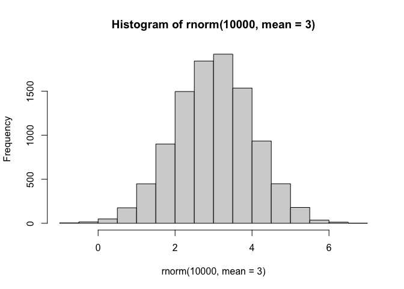

``` r
x <- c(rnorm(30, mean = -3), rnorm(30, mean = 3))
```

``` r
# Reverse the order of the value defined for x, rev(x)
# cbind() are columnize the vector and rbind() in rows
z <- cbind(x = x, y = rev(x))
plot(z)
```

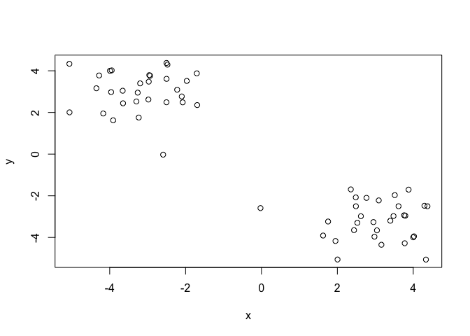

Now we can run `kmeans()` on this input `z` to see what the results look
like.

``` r
## centers tells how many cluster do we want and the cluster vector in the result says what cluseter each value depends on so it would be 1 or 2.

km <- kmeans(z, centers = 2)
km
```

    K-means clustering with 2 clusters of sizes 30, 30

    Cluster means:
              x         y
    1 -3.173919  3.014658
    2  3.014658 -3.173919

    Clustering vector:
     [1] 1 1 1 1 1 1 1 1 1 1 1 1 1 1 1 1 1 1 1 1 1 1 1 1 1 1 1 1 1 1 2 2 2 2 2 2 2 2
    [39] 2 2 2 2 2 2 2 2 2 2 2 2 2 2 2 2 2 2 2 2 2 2

    Within cluster sum of squares by cluster:
    [1] 52.45043 52.45043
     (between_SS / total_SS =  91.6 %)

    Available components:

    [1] "cluster"      "centers"      "totss"        "withinss"     "tot.withinss"
    [6] "betweenss"    "size"         "iter"         "ifault"      

``` r
## attributes store information of kmeans that are not primary data more like extra info.
attributes(km)
```

    $names
    [1] "cluster"      "centers"      "totss"        "withinss"     "tot.withinss"
    [6] "betweenss"    "size"         "iter"         "ifault"      

    $class
    [1] "kmeans"

> Q. How many points are in each cluster?

``` r
km$size
```

    [1] 30 30

> Q. What “component of your result object details cluster
> assignment/membership?

``` r
km$cluster
```

     [1] 1 1 1 1 1 1 1 1 1 1 1 1 1 1 1 1 1 1 1 1 1 1 1 1 1 1 1 1 1 1 2 2 2 2 2 2 2 2
    [39] 2 2 2 2 2 2 2 2 2 2 2 2 2 2 2 2 2 2 2 2 2 2

> Q. What “component of your result object details cluster center”?

``` r
km$centers
```

              x         y
    1 -3.173919  3.014658
    2  3.014658 -3.173919

> Q. Plot`z` colored by the kmeans cluster assignment and add cluster
> centers as blue points.

``` r
## color will be assigned to like one red 2 is blue 3 is red ....

plot(z, col = c("red","blue"))
```

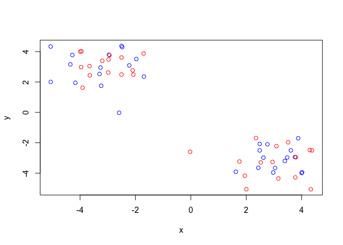

``` r
## As each number represents a color we can just type in the number and the color will show up
## Also we can assign the cluster of k mean as color and it will perfectly devide them based on their cluster.
plot(z, col = km$cluster)
points(km$centers, col = "blue", pch = 15)
```

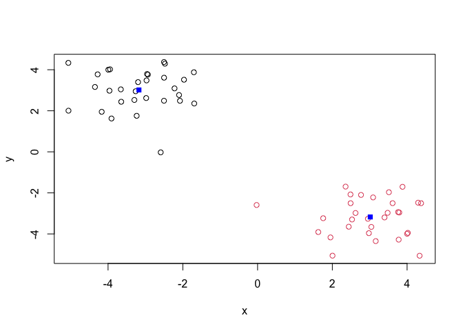

> Q. Run a kmeans clustering and add plot the results asking for 4
> clusters (K=4)?

``` r
km4 <- kmeans(z, centers = 4)
plot(z, col=km4$cluster)
points(km4$centers, col = km4$cluster, pch = 15)
```

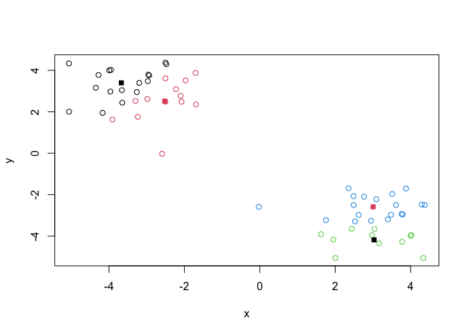

> **N.B.** You need to tell K-means the number of clusters (i.e set
> `centers=2`)!!

One approach is to try different values for `centers` and then pick the
best …

``` r
## tot.withinss give u the center value 
ans <- NULL
for (i in 1:10) {
  km <- kmeans(z, centers = i)
ans <- c(ans, km$tot.withinss)

}
plot(ans,  typ ="o",
     xlab=" Number of Clusters", ylab= "Total Number of Within SS")
```

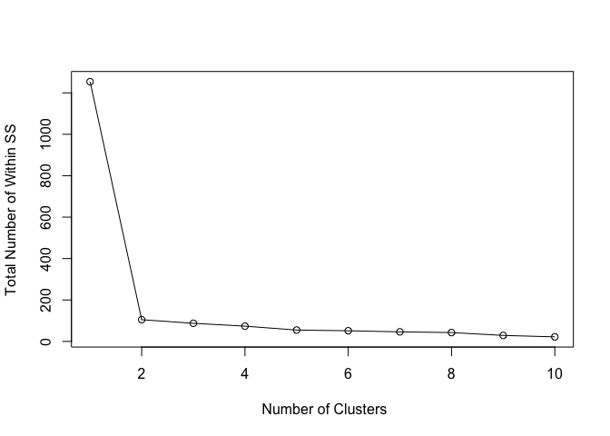

## Hierarchical Clustering

The main function in “base” R for Hierarchical Clustering is called
`hclust()`.

This function does not take your “raw” data for clustering. You must
first build a “distance matrix” from your data and pass this as input to
`hclust()`.

``` r
# first build the distance matrix where it print out the result symmetrical.
d <- dist(z)

## now create the hierachical clustering of the matrix
hc <- hclust(d)
hc
```


    Call:
    hclust(d = d)

    Cluster method   : complete 
    Distance         : euclidean 
    Number of objects: 60 

There is a bespoke `plot()` method for `hclust()` result object.

``` r
plot(hc)
abline(h=8, col = "red")
```

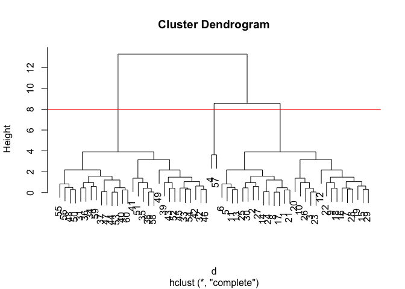

Once we have our `hclust()` object (Our “tree of cluster dendogram”) we
can *“cut”* the tree to reval the clustering pattern.

``` r
cutree(hc, h=8)
```

     [1] 1 1 1 2 1 1 1 1 1 1 1 1 1 1 1 1 1 1 1 1 1 1 1 1 1 1 1 1 1 1 3 3 3 3 3 3 3 3
    [39] 3 3 3 3 3 3 3 3 3 3 3 3 3 3 3 3 3 3 2 3 3 3

> Q. Make a plot of `z` with your hclust results (i.e. colored by
> cluster membership)

``` r
grps <- cutree(hc, k=2)
plot(z, col = grps)
```

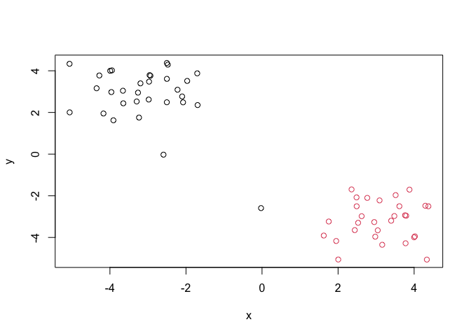

## Principal Component Analysis (PCA)

PCA is a dimensionality reduction method that is popular for revealing
patterns in complex datasets.

## Analysis of UK Food data

Let’s look at some data on the eating habits of folks from the UK to see
if there are patterns and trends that hace some regions being distinct
from others.

## Data Import

The data is made available in csv format so we can use the `read.csv()`
function to read the data.

``` r
url <- "https://tinyurl.com/UK-foods"
x <- read.csv(url)
x
```

                         X England Wales Scotland N.Ireland
    1               Cheese     105   103      103        66
    2        Carcass_meat      245   227      242       267
    3          Other_meat      685   803      750       586
    4                 Fish     147   160      122        93
    5       Fats_and_oils      193   235      184       209
    6               Sugars     156   175      147       139
    7      Fresh_potatoes      720   874      566      1033
    8           Fresh_Veg      253   265      171       143
    9           Other_Veg      488   570      418       355
    10 Processed_potatoes      198   203      220       187
    11      Processed_Veg      360   365      337       334
    12        Fresh_fruit     1102  1137      957       674
    13            Cereals     1472  1582     1462      1494
    14           Beverages      57    73       53        47
    15        Soft_drinks     1374  1256     1572      1506
    16   Alcoholic_drinks      375   475      458       135
    17      Confectionery       54    64       62        41

> Q1. How many rows and columns are in your new data frame named x? What
> R functions could you use to answer this questions?

``` r
nrow(x)
```

    [1] 17

``` r
ncol(x)
```

    [1] 5

> Preview the first 6 rows

``` r
head(x, n=6)
```

                   X England Wales Scotland N.Ireland
    1         Cheese     105   103      103        66
    2  Carcass_meat      245   227      242       267
    3    Other_meat      685   803      750       586
    4           Fish     147   160      122        93
    5 Fats_and_oils      193   235      184       209
    6         Sugars     156   175      147       139

> Note how the minus indexing works

``` r
rownames(x) <- x[,1]
x <- x[,-1]
head(x)
```

                   England Wales Scotland N.Ireland
    Cheese             105   103      103        66
    Carcass_meat       245   227      242       267
    Other_meat         685   803      750       586
    Fish               147   160      122        93
    Fats_and_oils      193   235      184       209
    Sugars             156   175      147       139

> To check the Dimension

``` r
dim(x)
```

    [1] 17  4

> Another way to change the row name of the dataset

``` r
x <- read.csv(url, row.names=1)
head(x)
```

                   England Wales Scotland N.Ireland
    Cheese             105   103      103        66
    Carcass_meat       245   227      242       267
    Other_meat         685   803      750       586
    Fish               147   160      122        93
    Fats_and_oils      193   235      184       209
    Sugars             156   175      147       139

> Q2. Which approach to solving the ‘row-names problem’ mentioned above
> do you prefer and why? Is one approach more robust than another under
> certain circumstances?

I prefer the second approach `read.csv(url, rownames...)` because it is
easy to use and error-prone, as it introduce the row name at the time we
import the file so no need to take another step for introducing a new
object. This way we can also avoid forgetting to remove the row name
later on since it is done at the beginning. whereas manually setting
`rownames(x) <- x[,1]` works but is easier to mess up, especially with
messy or inconsistent data.

``` r
# Using base R
barplot(as.matrix(x), beside=T, col=rainbow(nrow(x)))
```


> Q3: Changing what optional argument in the above barplot() function
> results in the following plot?

By changeing the beside to False we tell the barplot to create stacks
the rows on top of each other into a singular verticlebar and this is
the default as well.

``` r
barplot(as.matrix(x), beside=F, col=rainbow(nrow(x)))
```

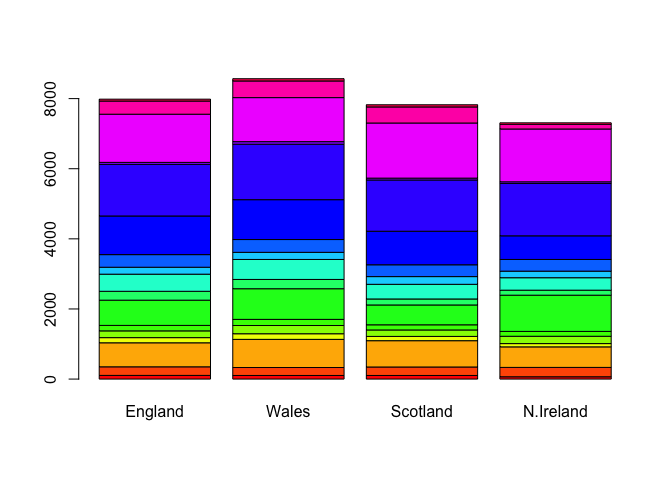

## Tidy data

fix anything that went wrong with data import

``` r
# Currently we have wide format
dim(x)
```

    [1] 17  4

``` r
head(x)
```

                   England Wales Scotland N.Ireland
    Cheese             105   103      103        66
    Carcass_meat       245   227      242       267
    Other_meat         685   803      750       586
    Fish               147   160      122        93
    Fats_and_oils      193   235      184       209
    Sugars             156   175      147       139

To convert this to “long” format we want one row per measurement -
maximizes rows**&(17x4=68)**, minimizes columns (with a singe
Consumption measurement value per Country). We will do tidying with the
`pivot_longer()` function from the tidyr package:

``` r
library(tidyr)

# Convert data to long format for ggplot with `pivot_longer()`
x_long <- x |> 
          tibble::rownames_to_column("Food") |> 
          pivot_longer(cols = -Food, 
                       names_to = "Country", 
                       values_to = "Consumption")

dim(x_long)
```

    [1] 68  3

``` r
head(x_long)
```

    # A tibble: 6 × 3
      Food            Country   Consumption
      <chr>           <chr>           <int>
    1 "Cheese"        England           105
    2 "Cheese"        Wales             103
    3 "Cheese"        Scotland          103
    4 "Cheese"        N.Ireland          66
    5 "Carcass_meat " England           245
    6 "Carcass_meat " Wales             227

``` r
library(ggplot2)
```

``` r
# Create grouped bar plot

ggplot(x_long) +
  aes(x = Country, y = Consumption, fill = Food) +
  geom_col(position = "dodge") +
  theme_bw()
```


> Q4: Changing what optional argument in the above ggplot() code results
> in a stacked barplot figure?

To make the plot we change the position in`geom_col()` to default which
is stacked bars of rows. so remove the position from dodge to default.

``` r
ggplot(x_long) +
  aes(x = Country, y = Consumption, fill = Food) +
  geom_col() +
  theme_bw()
```


## Exploratory Analysis

Make some plots to help make sense of obvious trends.

> Q5: We can use the pairs() function to generate all pairwise plots for
> our countries. Can you make sense of the following code and resulting
> figure? What does it mean if a given point lies on the diagonal for a
> given plot?

``` r
pairs(x, col=rainbow(nrow(x)), pch=16)
```


The `pairs()` code creates a matrix of scatterplots showing all pairwise
comparisons between the variables in x, with each point representing a
country and colored uniquely.

If a point lies on the diagonal in any of the off-diagonal plots, it
means that for that country the two variables being compared have equal
or very similar values (so x = y for that pair).

## Heatmap: Another Data Visualization

``` r
library(pheatmap)

pheatmap( as.matrix(x) )
```


**Key-point** Even relatively small datasets can prove challenging to
interpret

> Q6. Based on the pairs and heatmap figures, which countries cluster
> together and what does this suggest about their food consumption
> patterns? Can you easily tell what the main differences between N.
> Ireland and the other countries of the UK in terms of this data-set?

Based on both the pairs plot and the heatmap, England, Wales, and
Scotland cluster closely together, while Northern Ireland appears more
separate, suggesting that England, Wales, and Scotland have more similar
overall food consumption patterns, whereas Northern Ireland differs
somewhat. The heatmap hints that Northern Ireland tends to have
different levels in certain categories (like cereals, potatoes, or fats)
compared to the others.

## PCA to the rescue

The main function in “base” R for PCA is called `prcomp()`. This
function expects to be rows and the “variables” to be columns.

So here we need to take the traspose of our `x` input object.

``` r
## t will transpose the data, this will tell how well the capture of the component is by using the prcomp
pca <- prcomp( t(x) )
summary(pca)
```

    Importance of components:
                                PC1      PC2      PC3       PC4
    Standard deviation     324.1502 212.7478 73.87622 2.921e-14
    Proportion of Variance   0.6744   0.2905  0.03503 0.000e+00
    Cumulative Proportion    0.6744   0.9650  1.00000 1.000e+00

The returned `pca` object has components that wr can use to make out
main result figure. PC1 is more important because it has more varience
than all other PCs.

``` r
attributes(pca)
```

    $names
    [1] "sdev"     "rotation" "center"   "scale"    "x"       

    $class
    [1] "prcomp"

The main result figure from this analysis is called a “PC score plot” or
” Ordenation plot”, “PC plot” or PC1 vs PC2.

``` r
pca$x
```

                     PC1         PC2        PC3           PC4
    England   -144.99315   -2.532999 105.768945 -9.152022e-15
    Wales     -240.52915 -224.646925 -56.475555  5.560040e-13
    Scotland   -91.86934  286.081786 -44.415495 -6.638419e-13
    N.Ireland  477.39164  -58.901862  -4.877895  1.329771e-13

> Q7. Complete the code below to generate a plot of PC1 vs PC2. The
> second line adds text labels over the data points.

``` r
# Create a data frame for plotting
df <- as.data.frame(pca$x)
df$Country <- rownames(df)

# Plot PC1 vs PC2 with ggplot
ggplot(pca$x) +
  aes(x = PC1, y = PC2, label = rownames(pca$x)) +
  geom_point(size = 3) +
  geom_text(vjust = -0.5) +
  xlim(-270, 500) +
  xlab("PC1") +
  ylab("PC2") +
  theme_bw()
```


> Q8. Customize your plot so that the colors of the country names match
> the colors in our UK and Ireland map and table at start of this
> document.

``` r
plot_df <- data.frame(pca$x)
plot_df$Country <- rownames(plot_df)

ggplot(plot_df, aes(x = PC1, y = PC2)) +
   geom_point(color = "grey60",size = 2) +    
  geom_text(aes(label = Country, color = Country), size = 3, vjust = -1) +
  scale_color_manual(values = c(
    "England" = "orange",
    "Wales" = "red",
    "Scotland" = "blue",
    "N.Ireland" = "darkgreen"
  )) +
  xlim(-270, 500) +
  xlab("PC1") +
  ylab("PC2") +
  theme_bw() +
  theme(legend.position = "none")
```

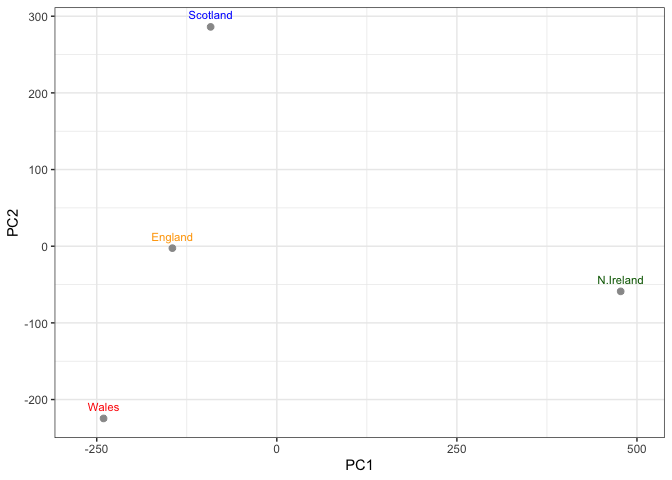

> Below we can use the square of pca\$sdev , which stands for “standard
> deviation”, to calculate how much variation in the original data each
> PC accounts for.

``` r
v <- round( pca$sdev^2/sum(pca$sdev^2) * 100 )
v
```

    [1] 67 29  4  0

``` r
## or the second row here...
z <- summary(pca)
z$importance
```

                                 PC1       PC2      PC3          PC4
    Standard deviation     324.15019 212.74780 73.87622 2.921348e-14
    Proportion of Variance   0.67444   0.29052  0.03503 0.000000e+00
    Cumulative Proportion    0.67444   0.96497  1.00000 1.000000e+00

``` r
# Create scree plot with ggplot
variance_df <- data.frame(
  PC = factor(paste0("PC", 1:length(v)), levels = paste0("PC", 1:length(v))),
  Variance = v
)

ggplot(variance_df) +
  aes(x = PC, y = Variance) +
  geom_col(fill = "steelblue") +
  xlab("Principal Component") +
  ylab("Percent Variation") +
  theme_bw() +
  theme(axis.text.x = element_text(angle = 0))
```

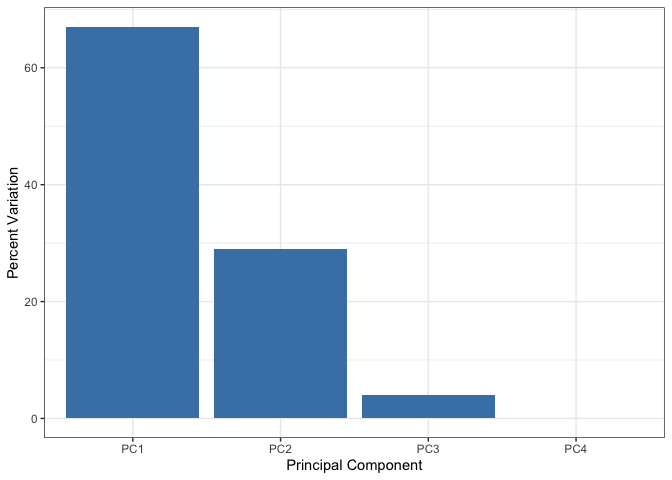

``` r
## Lets focus on PC1 as it accounts for > 90% of variance 
ggplot(pca$rotation) +
  aes(x = PC1, 
      y = reorder(rownames(pca$rotation), PC1)) +
  geom_col(fill = "steelblue") +
  xlab("PC1 Loading Score") +
  ylab("") +
  theme_bw() +
  theme(axis.text.y = element_text(size = 9))
```

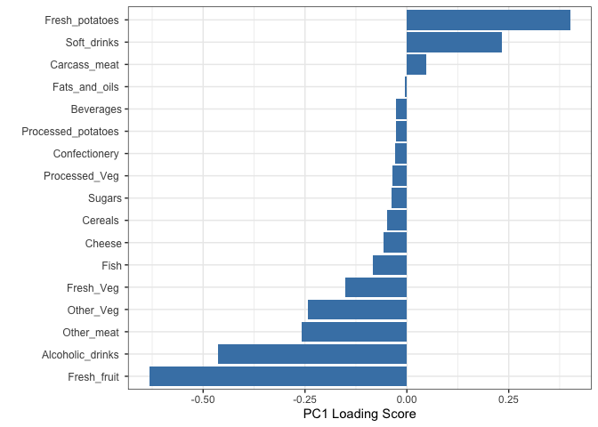

Here we see observations (foods) with the largest positive loading
scores that effectively “push” N. Ireland to right positive side of the
plot `(including Fresh_potatoes and Soft_drinks)`.

We can also see the observations/foods with high negative scores that
push the other countries to the left side of the plot
`(including Fresh_fruit and Alcoholic_drinks)`.

> Q9: Generate a similar ‘loadings plot’ for PC2. What two food groups
> feature prominantely and what does PC2 maninly tell us about?

``` r
ggplot(pca$rotation) +
  aes(x = PC2, 
      y = reorder(rownames(pca$rotation), PC2)) +
  geom_col(fill = "steelblue") +
  xlab("PC2 Loading Score") +
  ylab("") +
  theme_bw() +
  theme(axis.text.y = element_text(size = 9))
```

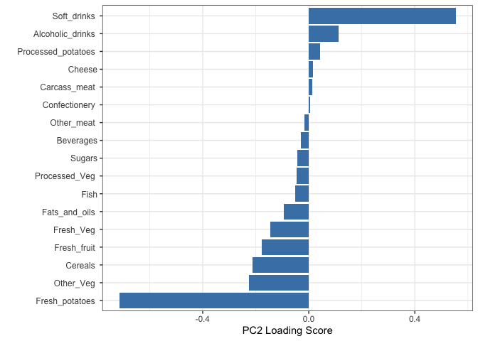

> The two food groups that usually stand out most on *PC2* are
> **Fresh_fruit** and **Fresh_potatoes**. *PC2* mainly tells us about a
> second pattern of variation that separates countries based on
> differences in specific food preferences, especially fresh produce
> consumption, rather than the overall general consumption level that
> *PC1* captures.

**Key-Point**: PCA basically helps simplify the data by reducing it from
17 variables down to just 2 main components, while still keeping most of
the important information. From this, we can see that England, Wales,
and Scotland behave pretty similarly, while Northern Ireland stands out
as being different. This makes it easier to visualize patterns and
compare countries without getting overwhelmed by too many variables. It
also shows that most of the variation in the data can be explained by
just a couple of key trends.
