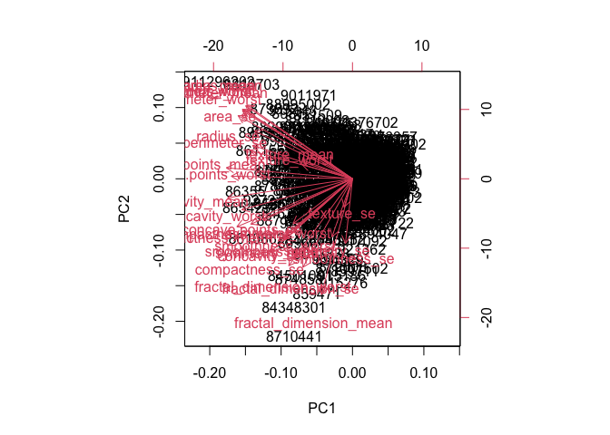
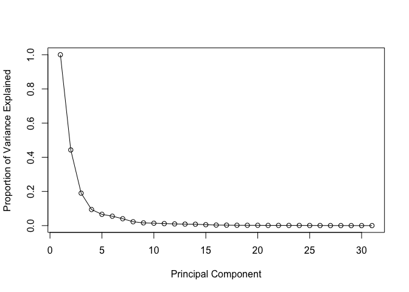
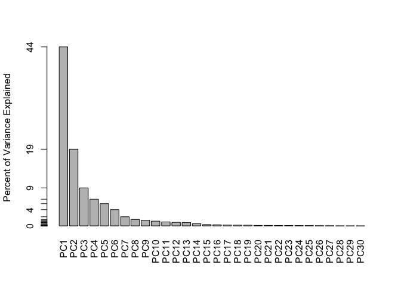
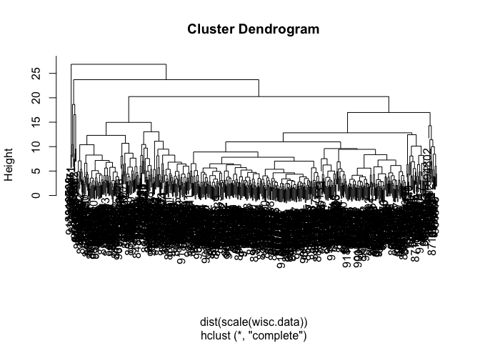
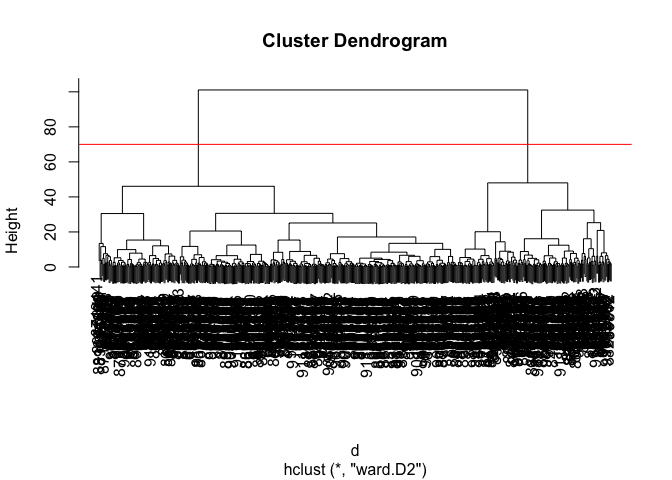
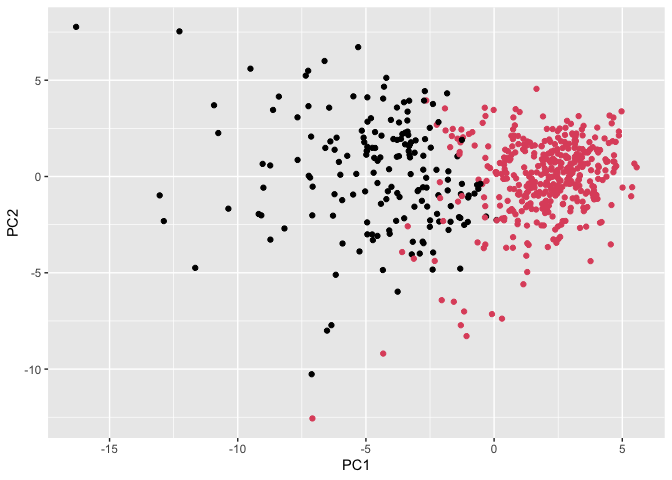
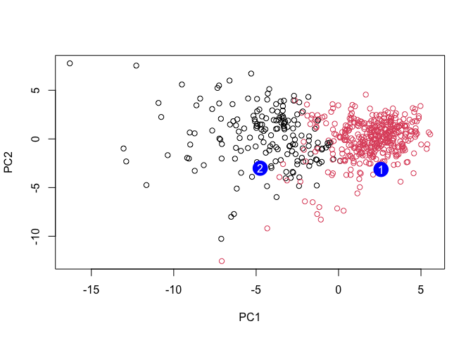

# Lab08:Unsupervised Learning Mini-Project
Madina Khorami (A18555185)

- [Background](#background)
- [Data Import](#data-import)
- [Exploratory Data](#exploratory-data)
- [Principal Component Analysis
  (PCA)](#principal-component-analysis-pca)
- [Interpreting PCA Results](#interpreting-pca-results)
- [Scree Plot](#scree-plot)
- [Heirarchical Clustering](#heirarchical-clustering)
- [Combining Method](#combining-method)
- [Selecting Number of Clusters](#selecting-number-of-clusters)
- [Prediction](#prediction)

## Background

The goal of this mini-project is for you to explore a complete analysis
using the unsupervised learning techniques covered in class.

Today we will analyse a biosbsy data-set from fine needle aspiration
(FNA) of a breast mass.

## Data Import

The dara is made available as a CSV file for download. We can read this
using `read.csv()`”

``` r
wisc.df <- read.csv("WisconsinCancer.csv", row.names = 1)
```

``` r
head(wisc.df, 4)
```

             diagnosis radius_mean texture_mean perimeter_mean area_mean
    842302           M       17.99        10.38         122.80    1001.0
    842517           M       20.57        17.77         132.90    1326.0
    84300903         M       19.69        21.25         130.00    1203.0
    84348301         M       11.42        20.38          77.58     386.1
             smoothness_mean compactness_mean concavity_mean concave.points_mean
    842302           0.11840          0.27760         0.3001             0.14710
    842517           0.08474          0.07864         0.0869             0.07017
    84300903         0.10960          0.15990         0.1974             0.12790
    84348301         0.14250          0.28390         0.2414             0.10520
             symmetry_mean fractal_dimension_mean radius_se texture_se perimeter_se
    842302          0.2419                0.07871    1.0950     0.9053        8.589
    842517          0.1812                0.05667    0.5435     0.7339        3.398
    84300903        0.2069                0.05999    0.7456     0.7869        4.585
    84348301        0.2597                0.09744    0.4956     1.1560        3.445
             area_se smoothness_se compactness_se concavity_se concave.points_se
    842302    153.40      0.006399        0.04904      0.05373           0.01587
    842517     74.08      0.005225        0.01308      0.01860           0.01340
    84300903   94.03      0.006150        0.04006      0.03832           0.02058
    84348301   27.23      0.009110        0.07458      0.05661           0.01867
             symmetry_se fractal_dimension_se radius_worst texture_worst
    842302       0.03003             0.006193        25.38         17.33
    842517       0.01389             0.003532        24.99         23.41
    84300903     0.02250             0.004571        23.57         25.53
    84348301     0.05963             0.009208        14.91         26.50
             perimeter_worst area_worst smoothness_worst compactness_worst
    842302            184.60     2019.0           0.1622            0.6656
    842517            158.80     1956.0           0.1238            0.1866
    84300903          152.50     1709.0           0.1444            0.4245
    84348301           98.87      567.7           0.2098            0.8663
             concavity_worst concave.points_worst symmetry_worst
    842302            0.7119               0.2654         0.4601
    842517            0.2416               0.1860         0.2750
    84300903          0.4504               0.2430         0.3613
    84348301          0.6869               0.2575         0.6638
             fractal_dimension_worst
    842302                   0.11890
    842517                   0.08902
    84300903                 0.08758
    84348301                 0.17300

Make sure we remove or exclude the `diagnosis` column from the data-st
that we use for further analysis- this is the expert diagnosis as either
M or B.

``` r
# We can us -1 to remove the first column

wisc.data <- wisc.df[,-1]
diagnosis <- as.factor(wisc.df$diagnosis)
```

## Exploratory Data

> **Q1.** How many observations are in this dataset?

``` r
nrow(wisc.data)
```

    [1] 569

> **Q2.** How many of the observations have a malignant diagnosis?

There are 212 malignant diagnosis

``` r
# It will show all the variables number of the specific column u ask
table(wisc.df$diagnosis)
```


      B   M 
    357 212 

OR

``` r
sum(wisc.df$diagnosis=="M")
```

    [1] 212

> **Q3.** How many variables/features in the data are suffixed with
> \_mean?

``` r
colnames(wisc.data)
```

     [1] "radius_mean"             "texture_mean"           
     [3] "perimeter_mean"          "area_mean"              
     [5] "smoothness_mean"         "compactness_mean"       
     [7] "concavity_mean"          "concave.points_mean"    
     [9] "symmetry_mean"           "fractal_dimension_mean" 
    [11] "radius_se"               "texture_se"             
    [13] "perimeter_se"            "area_se"                
    [15] "smoothness_se"           "compactness_se"         
    [17] "concavity_se"            "concave.points_se"      
    [19] "symmetry_se"             "fractal_dimension_se"   
    [21] "radius_worst"            "texture_worst"          
    [23] "perimeter_worst"         "area_worst"             
    [25] "smoothness_worst"        "compactness_worst"      
    [27] "concavity_worst"         "concave.points_worst"   
    [29] "symmetry_worst"          "fractal_dimension_worst"

We can use the `grep()` function to help us here to find how many column
have the mean suffix in it.

``` r
## the length shows how many the grep shows where are they in columns

length(grep(pattern = "_mean", colnames(wisc.data) ))
```

    [1] 10

## Principal Component Analysis (PCA)

We need to scale our data before PCA with the `scale=TRUE` argument to
`prcomp()`.

``` r
wisc.pr <- prcomp(wisc.data, scale. = T)
summary(wisc.pr)
```

    Importance of components:
                              PC1    PC2     PC3     PC4     PC5     PC6     PC7
    Standard deviation     3.6444 2.3857 1.67867 1.40735 1.28403 1.09880 0.82172
    Proportion of Variance 0.4427 0.1897 0.09393 0.06602 0.05496 0.04025 0.02251
    Cumulative Proportion  0.4427 0.6324 0.72636 0.79239 0.84734 0.88759 0.91010
                               PC8    PC9    PC10   PC11    PC12    PC13    PC14
    Standard deviation     0.69037 0.6457 0.59219 0.5421 0.51104 0.49128 0.39624
    Proportion of Variance 0.01589 0.0139 0.01169 0.0098 0.00871 0.00805 0.00523
    Cumulative Proportion  0.92598 0.9399 0.95157 0.9614 0.97007 0.97812 0.98335
                              PC15    PC16    PC17    PC18    PC19    PC20   PC21
    Standard deviation     0.30681 0.28260 0.24372 0.22939 0.22244 0.17652 0.1731
    Proportion of Variance 0.00314 0.00266 0.00198 0.00175 0.00165 0.00104 0.0010
    Cumulative Proportion  0.98649 0.98915 0.99113 0.99288 0.99453 0.99557 0.9966
                              PC22    PC23   PC24    PC25    PC26    PC27    PC28
    Standard deviation     0.16565 0.15602 0.1344 0.12442 0.09043 0.08307 0.03987
    Proportion of Variance 0.00091 0.00081 0.0006 0.00052 0.00027 0.00023 0.00005
    Cumulative Proportion  0.99749 0.99830 0.9989 0.99942 0.99969 0.99992 0.99997
                              PC29    PC30
    Standard deviation     0.02736 0.01153
    Proportion of Variance 0.00002 0.00000
    Cumulative Proportion  1.00000 1.00000

> **Q4.** From your results, what proportion of the original variance is
> captured by the first principal component (PC1)?

44.27% of the vairance is captured by PC1

> **Q5.** How many principal components (PCs) are required to describe
> at least 70% of the original variance in the data?

To reach at least 70% of the original variance total of first PC 3 is
required.

> **Q6.** How many principal components (PCs) are required to describe
> at least 90% of the original variance in the data?

To reach at least 90% of the original variance, 7 principal components
are required, since the cumulative variance at PC7 is about 91%.

## Interpreting PCA Results

``` r
## The biplot creates a plot of all datas from dataset.

biplot(wisc.pr)
```



> **Q7.** What stands out to you about this plot? Is it easy or
> difficult to understand? Why?

The plot is very messy and the result it show is very weak and almost
impossible to read, with lots of overlapping points and labels, making
it hard to clearly see patterns. It is difficult to understand because
the data points are all clustered together in the center and the
variable arrows overlap, so nothing is clearly separated. Even though
the biplot contains a lot of information, it’s not very readable in this
form.

Let’s see the “PC Score Plot” for the first 2 component of the data
which are PC1 and PC2.

``` r
# Scatter plot observations by components 1 and 2 

library(ggplot2)

ggplot(wisc.pr$x) + 
  aes(PC1, PC2, col=diagnosis) + 
  geom_point()
```


> **Q8.** Generate a similar plot for principal components 1 and 3. What
> do you notice about these plots?

``` r
# Scatter plot observations by components 1 and 3 

library(ggplot2)

ggplot(wisc.pr$x) + 
  aes(PC1, PC3, col=diagnosis) + 
  geom_point()
```


## Scree Plot

Calculate the variance of each principal component by squaring the sdev
component of wisc.pr (i.e. wisc.pr\$sdev^2). Save the result as an
object called pr.var.

``` r
pr.var <- wisc.pr$sdev^2
head(pr.var)
```

    [1] 13.281608  5.691355  2.817949  1.980640  1.648731  1.207357

``` r
# Variance explained by each principal component: pve
pve <- pr.var / sum(pr.var)

# Plot variance explained for each principal component
plot(c(1,pve), xlab = "Principal Component", 
     ylab = "Proportion of Variance Explained", 
     ylim = c(0, 1), type = "o")
```



``` r
# Alternative scree plot of the same data, note data driven y-axis
barplot(pve, ylab = "Percent of Variance Explained",
     names.arg=paste0("PC",1:length(pve)), las=2, axes = FALSE)
axis(2, at=pve, labels=round(pve,2)*100 )
```



> **Q9.** For the first principal component, what is the component of
> the loading vector (i.e. wisc.pr\$rotation\[,1\]) for the feature
> concave.points_mean? This tells us how much this original feature
> contributes to the first PC. Are there any features with larger
> contributions than this one?

``` r
wisc.pr$rotation["concave.points_mean", "PC1"]
```

    [1] -0.2608538

The loading value for concave.points_mean in PC1 is about -0.26, which
means it has a fairly strong contribution to the first principal
component. The negative sign just indicates the direction.

## Heirarchical Clustering

Now from scree plot we can choose which PCs contain most of the vairance
and that is PC1-PC4.

``` r
wisc.hclust <- hclust(dist(scale(wisc.data)))
plot(wisc.hclust)
```



> **Q10.** Using the plot() and abline() functions, what is the height
> at which the clustering model has 4 clusters?

The hieght of 4 clusters combined is approximately 70.

## Combining Method

``` r
d <- dist(wisc.pr$x[, 1:4])
wisc.pr.hclust <- hclust(d, method = "ward.D2")
plot(wisc.pr.hclust)
abline(h=70, col="red")
```



## Selecting Number of Clusters

``` r
wisc.hclust.clusters <- cutree(wisc.hclust, k=4)
table(wisc.hclust.clusters, diagnosis)
```

                        diagnosis
    wisc.hclust.clusters   B   M
                       1  12 165
                       2   2   5
                       3 343  40
                       4   0   2

``` r
grps <- cutree(wisc.pr.hclust, h=70, k=2)
table(grps)
```

    grps
      1   2 
    171 398 

How does clustering `grps` correspond to the expert diagnosis?

``` r
table(diagnosis)
```

    diagnosis
      B   M 
    357 212 

``` r
table(diagnosis, grps)
```

             grps
    diagnosis   1   2
            B   6 351
            M 165  47

> **Q11.** OPTIONAL: Can you find a better cluster vs diagnoses match by
> cutting into a different number of clusters between 2 and 6? How do
> you judge the quality of your result in each case?

``` r
grps2 <- cutree(wisc.pr.hclust, k=2)
table(diagnosis, grps2)
```

             grps2
    diagnosis   1   2
            B   6 351
            M 165  47

``` r
grps3 <- cutree(wisc.pr.hclust, k=3)
table(diagnosis, grps3)
```

             grps3
    diagnosis   1   2   3
            B   0   6 351
            M 104  61  47

``` r
grps4 <- cutree(wisc.pr.hclust, k=4)
table(diagnosis, grps4)
```

             grps4
    diagnosis   1   2   3   4
            B   0   6 267  84
            M 104  61  41   6

Clustering with 2 groups already does a good job separating benign and
malignant samples, with most benign cases grouped together and many
malignant cases in another cluster. Trying different numbers of clusters
(like 3 or 4) have slightly improved separation, but can also made the
results harder to interpret.

``` r
ggplot(wisc.pr$x) +
  aes(PC1, PC2) +
  geom_point(col=grps)
```



> **Q12.** Which method gives your favorite results for the same
> data.dist dataset? Explain your reasoning.

The ward.D2 method gives the best results for this dataset. It creates
clusters that are more balanced and compact, with clearer separation
between groups compared to the other methods.

``` r
## Use the distance along the first 7 PCs for clustering i.e. wisc.pr$x[, 1:7]
wisc.pr.hclust <- hclust(dist(wisc.pr$x[, 1:7]), method="ward.D2")
```

``` r
# Step 2: cut into 2 clusters
wisc.pr.hclust.clusters <- cutree(wisc.pr.hclust, k=2)

# Step 3: compare with diagnosis
table(wisc.pr.hclust.clusters, diagnosis)
```

                           diagnosis
    wisc.pr.hclust.clusters   B   M
                          1  28 188
                          2 329  24

> **Q13.** How well does the newly created hclust model with two
> clusters separate out the two “M” and “B” diagnoses?

The new clustering using the first 7 PCs separates benign and malignant
samples slightly better, with clearer grouping and less noise. Most
benign samples fall into one cluster and most malignant samples into
another, although a few misclassifications still remain.

> **Q14.**How well do the hierarchical clustering models you created in
> the previous sections (i.e. without first doing PCA) do in terms of
> separating the diagnoses? Again, use the table() function to compare
> the output of each model (wisc.hclust.clusters and
> wisc.pr.hclust.clusters) with the vector containing the actual
> diagnoses.

``` r
# With PCA (first 7 PCs)
table(wisc.hclust.clusters, diagnosis)
```

                        diagnosis
    wisc.hclust.clusters   B   M
                       1  12 165
                       2   2   5
                       3 343  40
                       4   0   2

The hierarchical clustering without PCA separates the diagnoses fairly
well, with one cluster mainly containing benign samples and another
mainly containing malignant samples. However, there are some smaller
clusters that contain mixed diagnoses, showing that the separation is
not perfect.

> **Q15.** OPTIONAL: Which of your analysis procedures resulted in a
> clustering model with the best specificity? How about sensitivity?

The clustering based on the first 7 principal components showed the best
performance overall. It had higher sensitivity because it correctly
identified more malignant cases, and also maintained good specificity by
grouping most benign cases together. In comparison, the clustering
without PCA had more mixing between groups, leading to slightly lower
sensitivity and specificity.

## Prediction

``` r
#url <- "new_samples.csv"
url <- "https://tinyurl.com/new-samples-CSV"
new <- read.csv(url)
npc <- predict(wisc.pr, newdata=new)
npc
```

               PC1       PC2        PC3        PC4       PC5        PC6        PC7
    [1,]  2.576616 -3.135913  1.3990492 -0.7631950  2.781648 -0.8150185 -0.3959098
    [2,] -4.754928 -3.009033 -0.1660946 -0.6052952 -1.140698 -1.2189945  0.8193031
                PC8       PC9       PC10      PC11      PC12      PC13     PC14
    [1,] -0.2307350 0.1029569 -0.9272861 0.3411457  0.375921 0.1610764 1.187882
    [2,] -0.3307423 0.5281896 -0.4855301 0.7173233 -1.185917 0.5893856 0.303029
              PC15       PC16        PC17        PC18        PC19       PC20
    [1,] 0.3216974 -0.1743616 -0.07875393 -0.11207028 -0.08802955 -0.2495216
    [2,] 0.1299153  0.1448061 -0.40509706  0.06565549  0.25591230 -0.4289500
               PC21       PC22       PC23       PC24        PC25         PC26
    [1,]  0.1228233 0.09358453 0.08347651  0.1223396  0.02124121  0.078884581
    [2,] -0.1224776 0.01732146 0.06316631 -0.2338618 -0.20755948 -0.009833238
                 PC27        PC28         PC29         PC30
    [1,]  0.220199544 -0.02946023 -0.015620933  0.005269029
    [2,] -0.001134152  0.09638361  0.002795349 -0.019015820

``` r
plot(wisc.pr$x[,1:2], col=grps)
points(npc[,1], npc[,2], col="blue", pch=16, cex=3)
text(npc[,1], npc[,2], c(1,2), col="white")
```



> **Q16.** Which of these new patients should we prioritize for follow
> up based on your results?

Patient 2 is closer to the cluster that contains more malignant (black
points), while patient 1 is clearly grouped with the benign cluster (red
points). This suggests that patient 2 has features more similar to
malignant cases and may be at higher risk, so, patient 2 should be
checked first.
