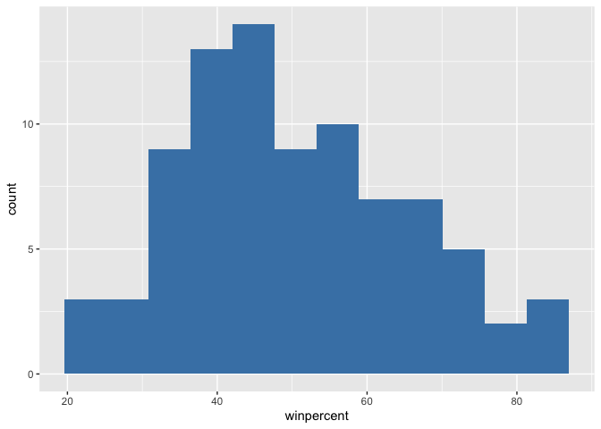
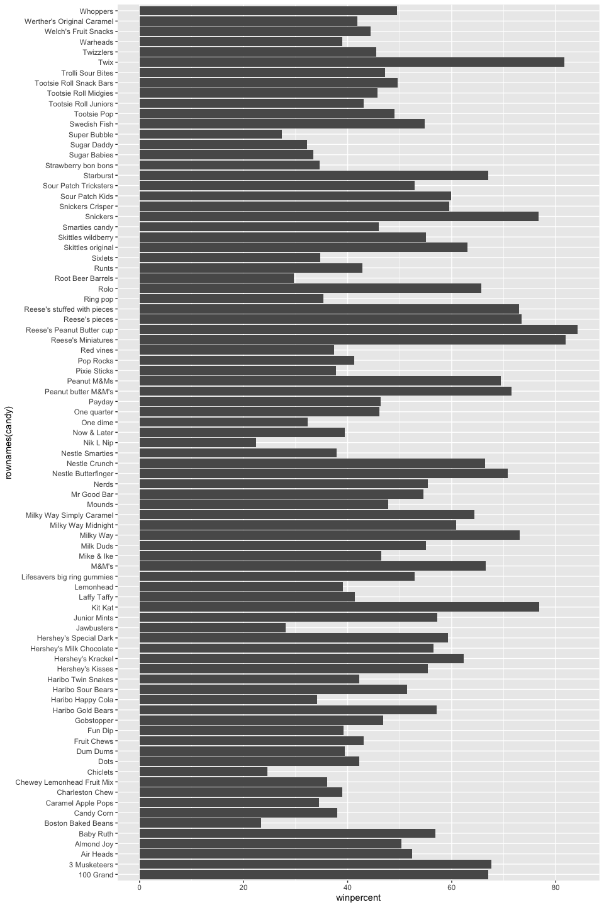
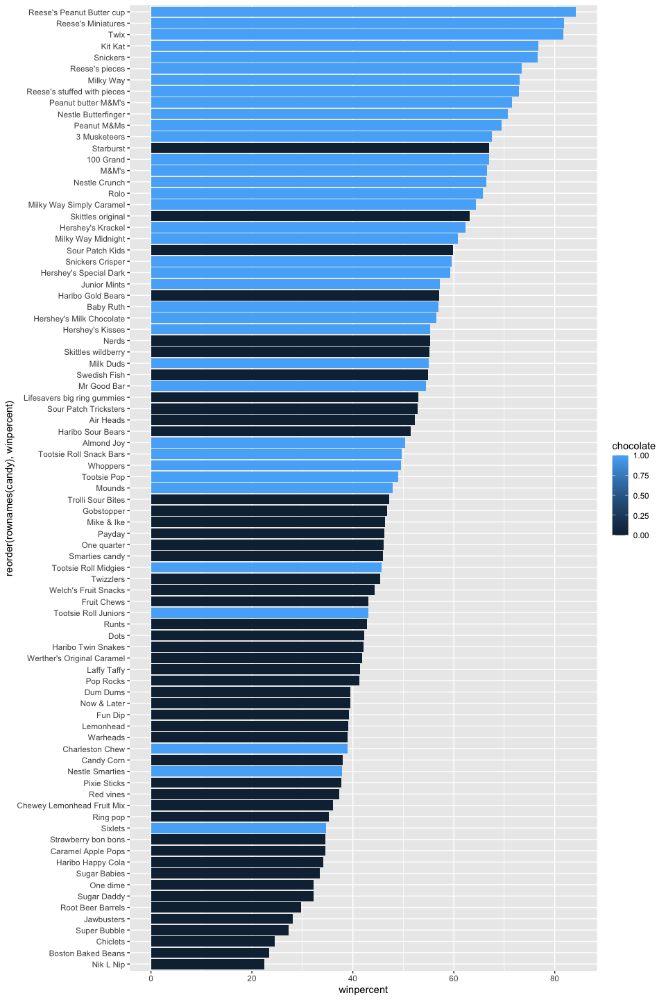
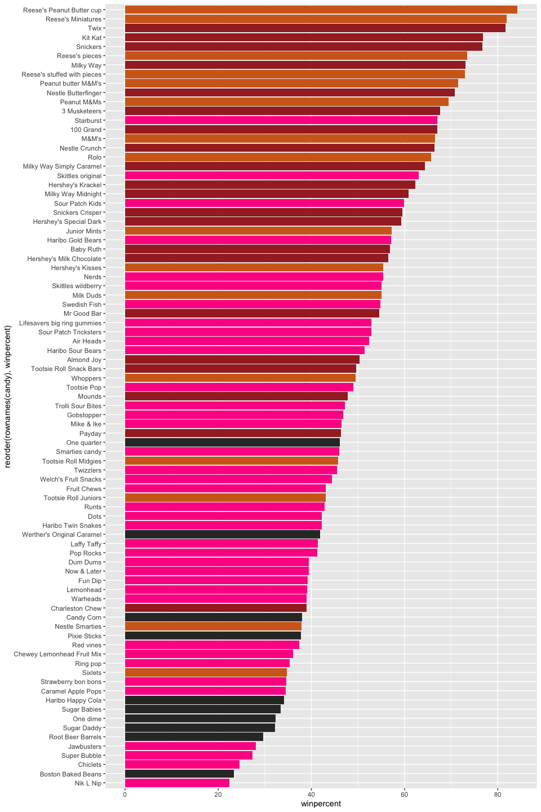
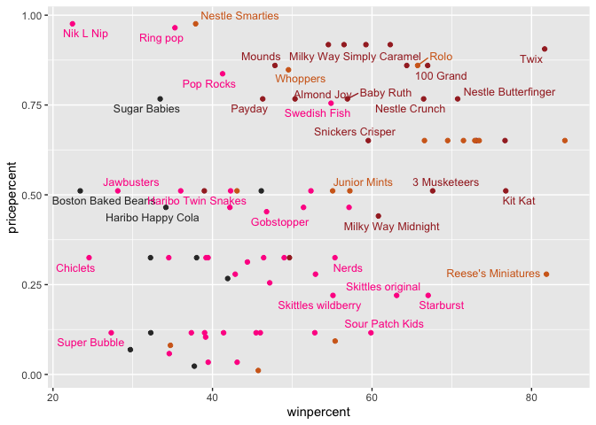
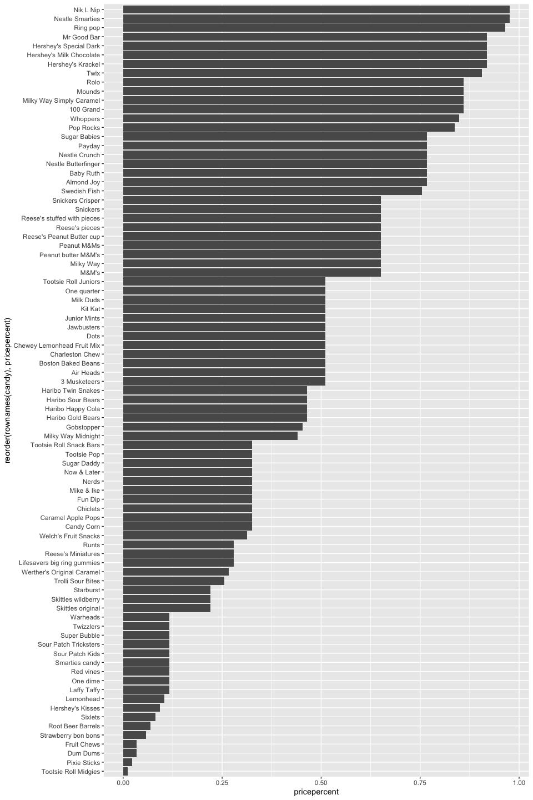
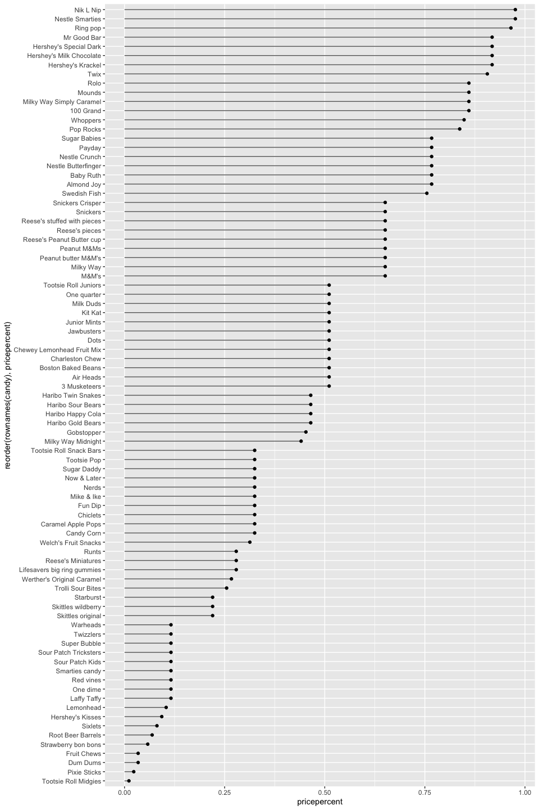
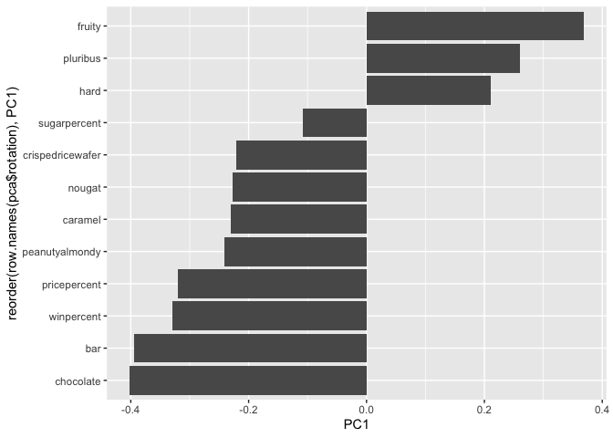
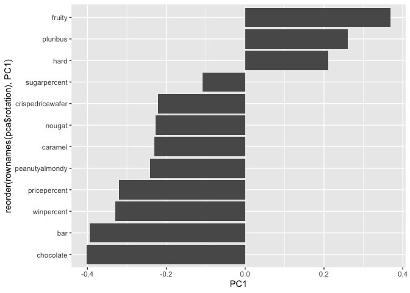

# Class09: Candy Mini Project
Madina Khorami (A18555185)

- [Background](#background)
- [Data Import](#data-import)
- [Exploratory Analysis](#exploratory-analysis)
- [Overall Candy Ranking](#overall-candy-ranking)
- [Taking a look at pricepercent](#taking-a-look-at-pricepercent)
- [Exploring the Correlation](#exploring-the-correlation)
- [Principal Component Analysis](#principal-component-analysis)
- [Summary](#summary)

## Background

Today we are taking a detour to analyze a fun and dataset (that we have
more intrinsic insight into) with the most useful method we have learned
thus far - Principal Component Analysis (PCA).

## Data Import

The data is all related to Halloween can and is from 538 websites.

``` r
candy <- read.csv("candy-data.csv", row.names = 1)
head(candy)
```

                 chocolate fruity caramel peanutyalmondy nougat crispedricewafer
    100 Grand            1      0       1              0      0                1
    3 Musketeers         1      0       0              0      1                0
    One dime             0      0       0              0      0                0
    One quarter          0      0       0              0      0                0
    Air Heads            0      1       0              0      0                0
    Almond Joy           1      0       0              1      0                0
                 hard bar pluribus sugarpercent pricepercent winpercent
    100 Grand       0   1        0        0.732        0.860   66.97173
    3 Musketeers    0   1        0        0.604        0.511   67.60294
    One dime        0   0        0        0.011        0.116   32.26109
    One quarter     0   0        0        0.011        0.511   46.11650
    Air Heads       0   0        0        0.906        0.511   52.34146
    Almond Joy      0   1        0        0.465        0.767   50.34755

> Q1. How many different candy types are in this dataset?

``` r
nrow(candy)
```

    [1] 85

> Q2. How many fruity candy types are in the dataset?

``` r
sum(candy$fruity)
```

    [1] 38

We can access our favorite candy type and find it’s winpercent by just
using the `winpercent()` or from the `dplyr` package.

> Q3. What is your favorite candy (other than Twix) in the dataset and
> what is it’s winpercent value?

``` r
candy["M&M's", ]$winpercent
```

    [1] 66.57458

``` r
library(dplyr)
```


    Attaching package: 'dplyr'

    The following objects are masked from 'package:stats':

        filter, lag

    The following objects are masked from 'package:base':

        intersect, setdiff, setequal, union

``` r
candy |> 
  filter(row.names(candy)=="M&M's") |> 
  select(winpercent)
```

          winpercent
    M&M's   66.57458

> Q4. What is the winpercent value for “Kit Kat”?

``` r
candy["Kit Kat", ]$winpercent
```

    [1] 76.7686

> Q5. What is the winpercent value for “Tootsie Roll Snack Bars”?

``` r
candy["Tootsie Roll Snack Bars", ]$winpercent
```

    [1] 49.6535

> Q6. Is there any variable/column that looks to be on a different scale
> to the majority of the other columns in the dataset?

Yes. The Winpercent column has values that are beyond 0-1 scale that
other columns have.

There is a useful `skim()` function in the **skimr** package that can
help give you a quick overview of a given dataset. Let’s install this
package and try it on our candy data.

``` r
## This way we just used one function from the package not downloading the whole skimr package.
skimr::skim(candy)
```

|                                                  |       |
|:-------------------------------------------------|:------|
| Name                                             | candy |
| Number of rows                                   | 85    |
| Number of columns                                | 12    |
| \_\_\_\_\_\_\_\_\_\_\_\_\_\_\_\_\_\_\_\_\_\_\_   |       |
| Column type frequency:                           |       |
| numeric                                          | 12    |
| \_\_\_\_\_\_\_\_\_\_\_\_\_\_\_\_\_\_\_\_\_\_\_\_ |       |
| Group variables                                  | None  |

Data summary

**Variable type: numeric**

| skim_variable | n_missing | complete_rate | mean | sd | p0 | p25 | p50 | p75 | p100 | hist |
|:---|---:|---:|---:|---:|---:|---:|---:|---:|---:|:---|
| chocolate | 0 | 1 | 0.44 | 0.50 | 0.00 | 0.00 | 0.00 | 1.00 | 1.00 | ▇▁▁▁▆ |
| fruity | 0 | 1 | 0.45 | 0.50 | 0.00 | 0.00 | 0.00 | 1.00 | 1.00 | ▇▁▁▁▆ |
| caramel | 0 | 1 | 0.16 | 0.37 | 0.00 | 0.00 | 0.00 | 0.00 | 1.00 | ▇▁▁▁▂ |
| peanutyalmondy | 0 | 1 | 0.16 | 0.37 | 0.00 | 0.00 | 0.00 | 0.00 | 1.00 | ▇▁▁▁▂ |
| nougat | 0 | 1 | 0.08 | 0.28 | 0.00 | 0.00 | 0.00 | 0.00 | 1.00 | ▇▁▁▁▁ |
| crispedricewafer | 0 | 1 | 0.08 | 0.28 | 0.00 | 0.00 | 0.00 | 0.00 | 1.00 | ▇▁▁▁▁ |
| hard | 0 | 1 | 0.18 | 0.38 | 0.00 | 0.00 | 0.00 | 0.00 | 1.00 | ▇▁▁▁▂ |
| bar | 0 | 1 | 0.25 | 0.43 | 0.00 | 0.00 | 0.00 | 0.00 | 1.00 | ▇▁▁▁▂ |
| pluribus | 0 | 1 | 0.52 | 0.50 | 0.00 | 0.00 | 1.00 | 1.00 | 1.00 | ▇▁▁▁▇ |
| sugarpercent | 0 | 1 | 0.48 | 0.28 | 0.01 | 0.22 | 0.47 | 0.73 | 0.99 | ▇▇▇▇▆ |
| pricepercent | 0 | 1 | 0.47 | 0.29 | 0.01 | 0.26 | 0.47 | 0.65 | 0.98 | ▇▇▇▇▆ |
| winpercent | 0 | 1 | 50.32 | 14.71 | 22.45 | 39.14 | 47.83 | 59.86 | 84.18 | ▃▇▆▅▂ |

> Q7. What do you think a zero and one represent for the
> candy\$chocolate column?

In the Chocolate column the 0 represents FALSE meaning that the candy
does not contain chocolate, and 1 represents TRUE meaning the candy
contains chocolate.

## Exploratory Analysis

> Q8. Plot a histogram of winpercent values using both base R and
> ggplot2.

``` r
hist(candy$winpercent)
```


``` r
library(ggplot2)

ggplot(candy)+ aes(winpercent) + geom_histogram(bins = 12, fill ="steelblue")
```



> Q9. Is the distribution of winpercent values symmetrical?

No, the distribution of the winpercent values is not symmetrical.

> Q10. Is the center of the distribution above or below 50%?

The center of the distribution is above 50%.

``` r
mean(candy$winpercent)
```

    [1] 50.31676

``` r
summary(candy$winpercent)
```

       Min. 1st Qu.  Median    Mean 3rd Qu.    Max. 
      22.45   39.14   47.83   50.32   59.86   84.18 

Based on the summary data the `median()` best tells what the center of
the histogram which is 47% and that is below 50%/.

> Q11. On average is chocolate candy higher or lower ranked than fruit
> candy?

``` r
choc.ind <- as.logical(candy$chocolate)
choc.candy <- candy[choc.ind, ]
choc.win <- choc.candy$winpercent
mean(choc.win)
```

    [1] 60.92153

``` r
fruity.ind <- as.logical(candy$fruity)
fruity.candy <- candy[fruity.ind, ]
fruity.win <- fruity.candy$winpercent
mean(fruity.win)
```

    [1] 44.11974

Based on this comparison results chocolate is more preferred than fruity
candy and has a higher rank.

> Q12. Is this difference statistically significant?

``` r
t.test(choc.win, fruity.win)
```


        Welch Two Sample t-test

    data:  choc.win and fruity.win
    t = 6.2582, df = 68.882, p-value = 2.871e-08
    alternative hypothesis: true difference in means is not equal to 0
    95 percent confidence interval:
     11.44563 22.15795
    sample estimates:
    mean of x mean of y 
     60.92153  44.11974 

The difference is statistically significant.

## Overall Candy Ranking

> Q13. What are the five least liked candy types in this set?

``` r
candy |>
  arrange(winpercent) |>
  select(winpercent) |>
  head(5)
```

                       winpercent
    Nik L Nip            22.44534
    Boston Baked Beans   23.41782
    Chiclets             24.52499
    Super Bubble         27.30386
    Jawbusters           28.12744

> Q14. What are the top 5 all time favorite candy types out of this set?

``` r
candy |>
  arrange(winpercent) |>
  select(winpercent) |>
  tail(5)
```

                              winpercent
    Snickers                    76.67378
    Kit Kat                     76.76860
    Twix                        81.64291
    Reese's Miniatures          81.86626
    Reese's Peanut Butter cup   84.18029

> Q15. Make a first barplot of candy ranking based on winpercent values.

``` r
ggplot(candy) + 
  aes(winpercent, rownames(candy)) +
  geom_col()
```



> Q16. This is quite ugly, use the reorder() function to get the bars
> sorted by winpercent?

``` r
ggplot(candy) + 
  aes(winpercent, reorder(rownames(candy), winpercent)) +
  geom_col()
```


``` r
ggplot(candy) + 
  aes(winpercent, 
      reorder(rownames(candy), winpercent),
      fill = chocolate) +
  geom_col()
```



Now let’s try our barplot with these colors. Note that we use
fill=my_cols for geom_col(). Experiment to see what happens if you use
col=mycols.

``` r
 ## rep keeps repeating the order we give to it.
mycols <- rep("gray20", nrow(candy))

## Chocolate candy
mycols[as.logical(candy$chocolate)] <- "chocolate"

## Candy bars in brown
mycols[as.logical(candy$bar)] <- "brown"

##fruity candy in pink
mycols[as.logical(candy$fruity)] <- "deeppink"

ggplot(candy) + 
  aes(winpercent, reorder(rownames(candy), winpercent)) +
  geom_col(fill = mycols)
```



> Q17. What is the worst ranked chocolate candy?

Based on the plot the worst ranked chocolate candy is “Sixlets”.

``` r
rownames(candy)[candy$chocolate == 1][which.min(candy$winpercent[candy$chocolate == 1])]
```

    [1] "Sixlets"

> Q18. What is the best ranked fruity candy?

The best ranked fruity candy is “Starburst”.

``` r
rownames(candy)[candy$fruity == 1][which.max(candy$winpercent[candy$fruity == 1])]
```

    [1] "Starburst"

## Taking a look at pricepercent

What about value for money? What is the best candy for the least money?
One way to get at this would be to make a plot of **winpercent** vs the
**pricepercent** variable.

``` r
library(ggrepel)

# How about a plot of win vs price
ggplot(candy) +
  aes(winpercent, 
      pricepercent,
      label=rownames(candy)) +
  geom_point(col=mycols) + 
  
  # this fix the labeling overlapping with the dots
  geom_text_repel(col=mycols, size=3.3, max.overlaps = 5)
```



> Q19. Which candy type is the highest ranked in terms of winpercent for
> the least money - i.e. offers the most bang for your buck?

The candy that is highest ranked in terms of winpercent for the least
money is chocolate.

``` r
min_price <- min(candy$pricepercent)
cheap_candies <- candy[candy$pricepercent == min_price, ]
best_row <- which.max(cheap_candies$winpercent)
colnames(cheap_candies)[best_row]
```

    [1] "chocolate"

> Q20. What are the top 5 most expensive candy types in the dataset and
> of these which is the least popular?

The top 5 most expensive candies are in the table below.

``` r
library(dplyr)
candy |>
  arrange(-pricepercent) |> 
  select(pricepercent, winpercent) |> 
  head(n=5)
```

                             pricepercent winpercent
    Nik L Nip                       0.976   22.44534
    Nestle Smarties                 0.976   37.88719
    Ring pop                        0.965   35.29076
    Hershey's Krackel               0.918   62.28448
    Hershey's Milk Chocolate        0.918   56.49050

> Q21. Make a barplot again with geom_col() this time using pricepercent
> and then improve this step by step, first ordering the x-axis by value
> and finally making a so called “dot chat” or “lollipop” chart by
> swapping geom_col() for geom_point() + geom_segment().

``` r
ggplot(candy) + 
  aes(pricepercent, reorder(rownames(candy), pricepercent)) +
  geom_col()
```



``` r
# Make a lollipop chart of pricepercent
ggplot(candy) +
  aes(pricepercent, reorder(rownames(candy), pricepercent)) +
  geom_segment(aes(yend = reorder(rownames(candy), pricepercent), 
                   xend = 0), col="gray40") +
    geom_point()
```



## Exploring the Correlation

We can calculate the pair-wise correlation of all our columns.

``` r
library(corrplot)
```

    corrplot 0.95 loaded

``` r
cij <- cor(candy)
corrplot(cij)
```


> Q22. Examining this plot what two variables are anti-correlated
> (i.e. have minus values)?

Furity and Chocolate are anti correlated variables.

> **Q23.** Use your corrplot result to make a prediction: which
> variables do you expect will have the largest contributions
> (i.e. loadings) to PC1 (i.e., drive the most separation between
> candies along the first principal component)?

From the corrplot, the variables that will contribute most to PC1 are
the ones that are strongly correlated with many others so large dark
blue/red circles which are chocolate, bar, pricepercent, and winpercent
because they show strong correlations and capture the main differences
between candies.

## Principal Component Analysis

In this case we want to be sure to set `scale=TRUE` because we have one
vaiable `winpercent` that is on a very different scale than all other
and would otherwise dominate our PCA results.

``` r
pca <- prcomp(candy, scale. = TRUE)
summary(pca)
```

    Importance of components:
                              PC1    PC2    PC3     PC4    PC5     PC6     PC7
    Standard deviation     2.0788 1.1378 1.1092 1.07533 0.9518 0.81923 0.81530
    Proportion of Variance 0.3601 0.1079 0.1025 0.09636 0.0755 0.05593 0.05539
    Cumulative Proportion  0.3601 0.4680 0.5705 0.66688 0.7424 0.79830 0.85369
                               PC8     PC9    PC10    PC11    PC12
    Standard deviation     0.74530 0.67824 0.62349 0.43974 0.39760
    Proportion of Variance 0.04629 0.03833 0.03239 0.01611 0.01317
    Cumulative Proportion  0.89998 0.93832 0.97071 0.98683 1.00000

First major result figure is the “Score Plot” of PC1 vs PC2 - how
different candies are related to each other on our new PC axis.

``` r
p <- ggplot(pca$x) + 
  aes(PC1, PC2, label=row.names(pca$x)) +
  geom_point(col = mycols) + 
  geom_text_repel(col = mycols, size=3.3, max.overlaps = 7)  + 
  theme(legend.position = "none") +
  labs(title="Halloween Candy PCA Space",
       subtitle="Colored by type: chocolate bar (dark brown), chocolate other (light brown), fruity (red), other (black)",
       caption="Data from 538")
```

We can make a more interactive plot by intorducing the `ggplotly()`

The second major result figure from PCA is so-called “loading Plot”.

``` r
ggplot(pca$rotation) +
  aes(PC1, 
      reorder(row.names(pca$rotation), PC1)) +
  geom_col()
```



> Q24. Complete the code to generate the loadings plot above. What
> original variables are picked up strongly by PC1 in the positive
> direction? Do these make sense to you? Where did you see this
> relationship highlighted previously?

The variables that are strongly positive on PC1 are fruity, pluribus,
and hard. This makes sense because PC1 is basically separating fruity,
hard, non-chocolate candies from chocolate-type candies. On the positive
side, you have fruity and hard candies, while on the negative side you
have chocolate bars with things like caramel, nougat, and nuts. We
already saw this pattern in the correlation plot, where chocolate and
fruity were strongly opposite. It also showed up in the PCA scatter
plot, where fruity candies were on one side and chocolate candies were
on the other. So PC1 is clearly separating candy types, and the loading
plot matches what we saw visually.

``` r
ggplot(pca$rotation) +
  aes(x = PC1, y = reorder(rownames(pca$rotation), PC1)) +
  geom_col()
```



## Summary

> Q25. Based on your exploratory analysis, correlation findings, and PCA
> results, what combination of characteristics appears to make a
> “winning” candy? How do these different analyses (visualization,
> correlation, PCA) support or complement each other in reaching this
> conclusion?

A “winning” candy is usually chocolate-based, comes as a bar, and has
things like caramel, nougat, or nuts. It’s usually not fruity, not hard,
and not a pluribus type, and it tends to be a little more expensive.
This makes sense because in the plots, chocolate bars were closer to the
top of winpercent, while fruity and hard candies were farther away. The
correlation matrix also showed that chocolate, bar, caramel, and nut
features go together, while fruity and hard are kind of the opposite.
The PCA showed the same pattern, with chocolate-type candies on one side
and fruity/hard ones on the other, so all the results point to the same
idea.
