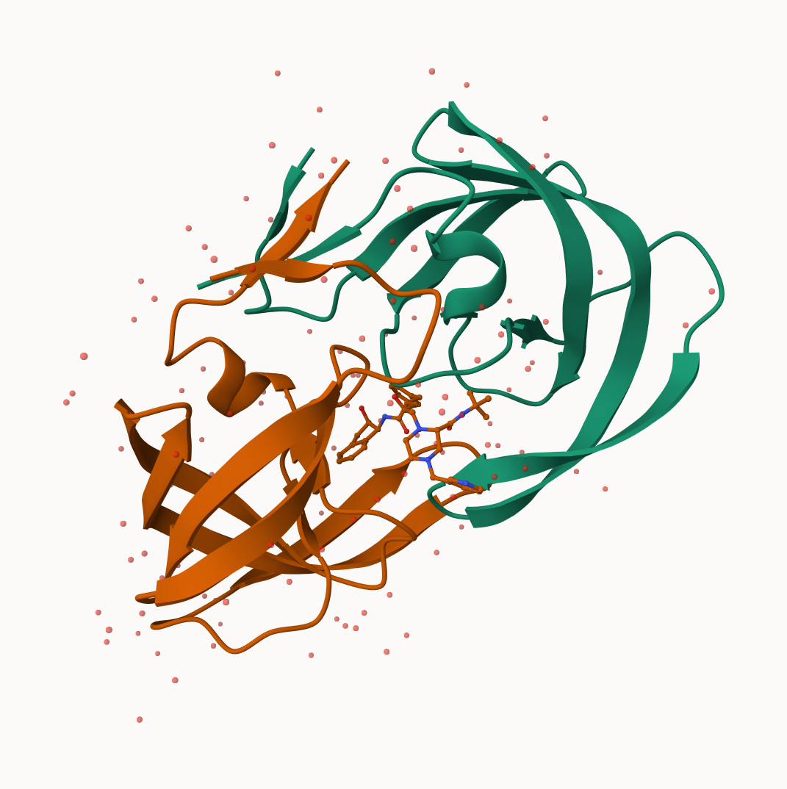
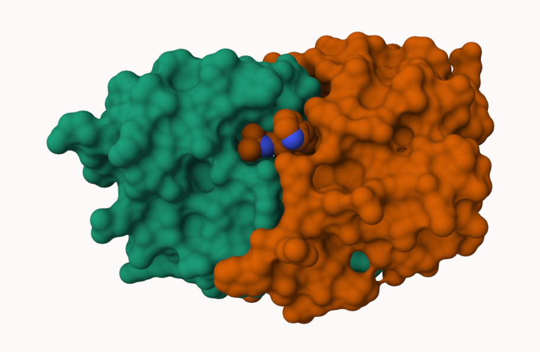
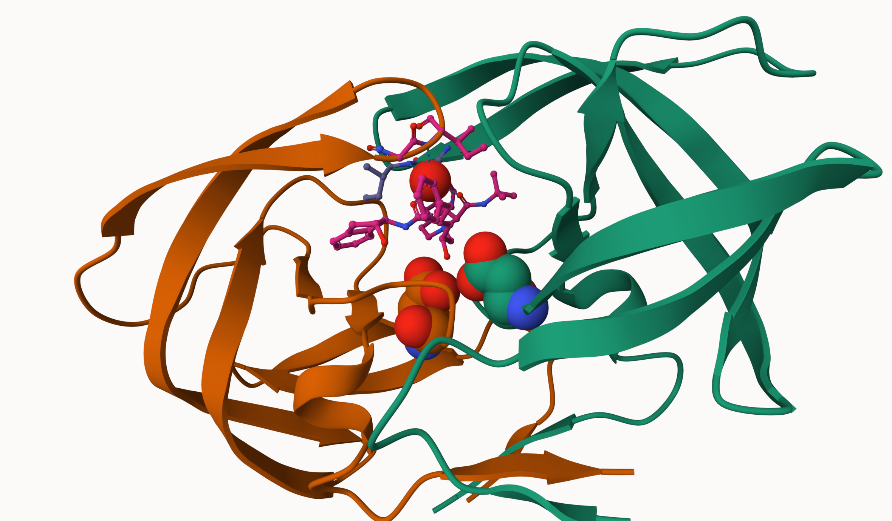

## Background

The main repository of high-resolution structural data on biomolecules is called **"Protein Data Bank"** (PDB).

## PDB Statistics

What is in the PDB in terms of molecules type and structure determination method?


Here we read the data from
https://www.rcsb.org/stats/summary

```{r}
pdb <- read.csv("Data Export Summary.csv")
pdb
```


```{r}
pdb$X.ray
```

This print out above `pdb$X.ray` is "character" not "numeric". Therefore I can't do math with it, so we need to fix this.

Two functions that can help are `sub()` and `as.numeric()`.

```{r}
## We want to get rid of commas or (sub out) commas
sub(",", "" ,x=pdb$X.ray)
```

Or using the `a.numeric()` to convert the characters into numeric values.

```{r}
as.numeric(sub(",", "" ,x=pdb$X.ray))
```


```{r}
x <- pdb$X.ray
tmp <- sub(",", "" ,x=pdb$X.ray)
sum(as.numeric(tmp))
```


We could make a function to do this

```{r}
rm.comma <- function(x) {
  tmp <- sub(",", "" ,x=pdb$X.ray)
  sum(as.numeric(tmp))
}
```

```{r}
rm.comma(pdb$Total)
rm.comma(pdb$EM)
rm.comma(pdb$X.ray)

```

We could also use a different import functions for this CSV file that speaks American (i.e. deals with comma in numbers in a comma separated file).
 
```{r}
library(readr)

stats <- read_csv("Data Export Summary.csv")
```
 
```{r}
n.tot <- sum(stats$Total)
n.em <- sum(stats$EM)
n.xray <- sum(stats$`X-ray`)

```
 
 
> Q1: What percentage of structures in the PDB are solved by X-Ray and Electron Microscopy.

```{r}
(n.xray/n.tot)*100
```

```{r}
(n.em/n.tot)*100
```

 
```{r}
pdb$Total[1]
```
 


> Q2: What proportion of structures in the PDB are protein?

The 97.9% of the total PDB are proteins.

```{r}
n.protein <- sum(stats$Total[grep("Protein", stats$`Molecular Type`)])
(n.protein / n.tot) * 100

```


> **Key-point** We have a very very small structural coverage of known protiens (~0.1%). Most structures we know  about (~80%) come from one one method (X-ray crystallograohy).

> Q3: Type HIV in the PDB website search box on the home page and determine how many HIV-1 protease structures are in the current PDB?

Skipped!


## Visualizing PDB Data

Main stand alone web version  with all features is at,
https://molstar.org/viewer/ 

> Q4: Water molecules normally have 3 atoms. Why do we see just one atom per water molecule in this structure?

The structure shows the space fill picture of the water molecule so it is shown as only on molecule.





> Q5: There is a critical “conserved” water molecule in the binding site. Can you identify this water molecule? What residue number does this water molecule have

The highlighted red ball represnets the water molecule.


> Q6: Generate and save a figure clearly showing the two distinct chains of HIV-protease along with the ligand. You might also consider showing the catalytic residues ASP 25 in each chain and the critical water (we recommend “Ball & Stick” for these side-chains). Add this figure to your Quarto document.



```{r}
library(bio3d)
pdb <- read.pdb("1HSG")

```

```{r}
pdb
```
> Q7: How many amino acid residues are there in this pdb object?

There are 198 amino acid residues in the pdb file.

> Q8: Name one of the two non-protein residues? 

The two non protein residues are HOH water and MK1.

> Q9: How many protein chains are in this structure? 

There are 2 protein chains in the structure.


```{r}
attributes(pdb)
```

```{r}
head(pdb$atom)
```


```{r}
#| eval: !expr knitr::is_html_output()

library(bio3dview)
library(NGLVieweR)

pdb <- read.pdb("1HSG")
view.pdb(pdb)
```


```{r}
#| eval: !expr knitr::is_html_output()

sele <- atom.select(pdb, resno = 25)

view.pdb(pdb, cols = c("navy", "teal"), 
         highlight = sele,
         highlight.style = "spacefill") |>
  setRock()
```


> Q. Create a custom view highlighting the active site ASP (`resno=25`) the two chains in your choice of color and the ligand all on a custom color background.


```{r}
#| eval: !expr knitr::is_html_output()

active.site <- atom.select(pdb, resno = 25)

view.pdb(pdb, 
         cols = c("blue", "red"),
         highlight = active.site,
         highlight.style = "spacefill",
         backgroundColor = "pink") |>
  setRock()
```


## Predict the flexibility of a given structure

Lets do a noram mode analysis NMA to predict the flexibility of a give `pdb` file.

```{r}
adk <- read.pdb("6s36")
```

A quick structure summary

```{r}
adk
```


```{r}
m <- nma( adk )
plot(m)
```

View the results with 

```{r}
#| eval: !expr knitr::is_html_output()

view.nma(m)
```


> Q10. Which of the packages above is found only on BioConductor and not CRAN? 

Bio3dview is only found in bioConductor not CRAN.

Write out the results for viewing in Mol-star:

```{r}
mktrj(m, file="nma.pdb")
mktrj(m, file="adk_m7.pdb")
```

> Q11. Which of the above packages is not found on BioConductor or CRAN?: 

NGLViewer is not found in bioConductor or CRAN becuase it is installed from GitHub.

> Q12. True or False? Functions from the pak package can be used to install packages from GitHub and BitBucket? 

True!


## Comparative Analysis of the ADK family

Our first step is to find a sequence for this family. We will use the database ID "1ake_A" here

```{r}
id <- "1ake_A"

aa <- get.seq(id)
aa
```

> Q13. How many amino acids are in this sequence, i.e. how long is this sequence? 

There are 214 amino acids long with no gap.

```{r}
blast <- blast.pdb(aa)

```

```{r}
head(blast$hit.tbl)
```

```{r}
hits <- NULL
hits$pdb.id <- c('1AKE_A','6S36_A','6RZE_A','3HPR_A','1E4V_A','5EJE_A','1E4Y_A','3X2S_A','6HAP_A','6HAM_A','4K46_A','3GMT_A','4PZL_A')
```

```{r}
plot(blast)
```

```{r}
hits$pdb.id
```

```{r}
files <- get.pdb(hits$pdb.id, path="pdbs", split=TRUE, gzip=TRUE)
```


lLign and superpose all these ADK structures.
```{r}
# Align releated PDBs
pdbs <- pdbaln(files, fit = TRUE, exefile="msa")
```

```{r}
#| eval: !expr knitr::is_html_output()

library(bio3dview)
view.pdbs(pdbs)
```


PCA of all this structural data (x, y, and z atom coordinates):

```{r}
pc <- pca(pdbs)
plot(pc)
```

```{r}
plot(pc, 1:2)
```


Interactive view of the PC1 captured structural differences:

```{r}
#| eval: !expr knitr::is_html_output()

view.pca(pc)
```


```{r}
mktrj(pc, file="pca.pdb")
```


