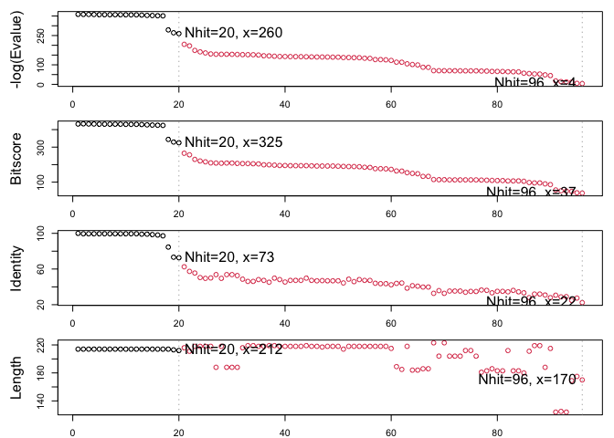
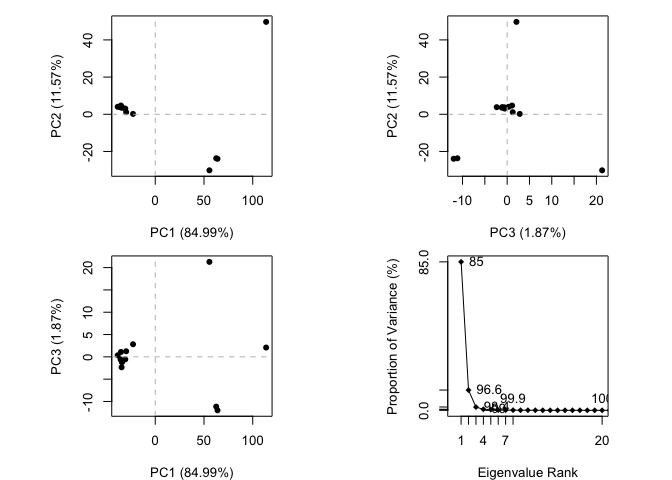

# Lab10: Structural Bioinformatics 1
Madina Khorami (A18555185)

- [Background](#background)
- [PDB Statistics](#pdb-statistics)
- [Visualizing PDB Data](#visualizing-pdb-data)
- [Predict the flexibility of a given
  structure](#predict-the-flexibility-of-a-given-structure)
- [Comparative Analysis of the ADK
  family](#comparative-analysis-of-the-adk-family)

## Background

The main repository of high-resolution structural data on biomolecules
is called **“Protein Data Bank”** (PDB).

## PDB Statistics

What is in the PDB in terms of molecules type and structure
determination method?

Here we read the data from https://www.rcsb.org/stats/summary

``` r
pdb <- read.csv("Data Export Summary.csv")
pdb
```

               Molecular.Type   X.ray     EM    NMR Integrative Multiple.methods
    1          Protein (only) 180,758 23,111 12,813         348              229
    2 Protein/Oligosaccharide  10,488  3,741     34           8               11
    3              Protein/NA   9,205  6,751    287          26                8
    4     Nucleic acid (only)   3,154    250  1,578           3               15
    5                   Other     178     27     35           4                0
    6  Oligosaccharide (only)      11      0      6           0                1
      Neutron Other   Total
    1      84    32 217,375
    2       1     0  14,283
    3       0     0  16,277
    4       3     1   5,004
    5       0     0     244
    6       0     4      22

``` r
pdb$X.ray
```

    [1] "180,758" "10,488"  "9,205"   "3,154"   "178"     "11"     

This print out above `pdb$X.ray` is “character” not “numeric”. Therefore
I can’t do math with it, so we need to fix this.

Two functions that can help are `sub()` and `as.numeric()`.

``` r
## We want to get rid of commas or (sub out) commas
sub(",", "" ,x=pdb$X.ray)
```

    [1] "180758" "10488"  "9205"   "3154"   "178"    "11"    

Or using the `a.numeric()` to convert the characters into numeric
values.

``` r
as.numeric(sub(",", "" ,x=pdb$X.ray))
```

    [1] 180758  10488   9205   3154    178     11

``` r
x <- pdb$X.ray
tmp <- sub(",", "" ,x=pdb$X.ray)
sum(as.numeric(tmp))
```

    [1] 203794

We could make a function to do this

``` r
rm.comma <- function(x) {
  tmp <- sub(",", "" ,x=pdb$X.ray)
  sum(as.numeric(tmp))
}
```

``` r
rm.comma(pdb$Total)
```

    [1] 203794

``` r
rm.comma(pdb$EM)
```

    [1] 203794

``` r
rm.comma(pdb$X.ray)
```

    [1] 203794

We could also use a different import functions for this CSV file that
speaks American (i.e. deals with comma in numbers in a comma separated
file).

``` r
library(readr)

stats <- read_csv("Data Export Summary.csv")
```

    Rows: 6 Columns: 9
    ── Column specification ────────────────────────────────────────────────────────
    Delimiter: ","
    chr (1): Molecular Type
    dbl (4): Integrative, Multiple methods, Neutron, Other
    num (4): X-ray, EM, NMR, Total

    ℹ Use `spec()` to retrieve the full column specification for this data.
    ℹ Specify the column types or set `show_col_types = FALSE` to quiet this message.

``` r
n.tot <- sum(stats$Total)
n.em <- sum(stats$EM)
n.xray <- sum(stats$`X-ray`)
```

> Q1: What percentage of structures in the PDB are solved by X-Ray and
> Electron Microscopy.

``` r
(n.xray/n.tot)*100
```

    [1] 80.48577

``` r
(n.em/n.tot)*100
```

    [1] 13.38046

``` r
pdb$Total[1]
```

    [1] "217,375"

> Q2: What proportion of structures in the PDB are protein?

The 97.9% of the total PDB are proteins.

``` r
n.protein <- sum(stats$Total[grep("Protein", stats$`Molecular Type`)])
(n.protein / n.tot) * 100
```

    [1] 97.91868

> **Key-point** We have a very very small structural coverage of known
> protiens (~0.1%). Most structures we know about (~80%) come from one
> one method (X-ray crystallograohy).

> Q3: Type HIV in the PDB website search box on the home page and
> determine how many HIV-1 protease structures are in the current PDB?

Skipped!

## Visualizing PDB Data

Main stand alone web version with all features is at,
https://molstar.org/viewer/

> Q4: Water molecules normally have 3 atoms. Why do we see just one atom
> per water molecule in this structure?

The structure shows the space fill picture of the water molecule so it
is shown as only on molecule.


 \> Q5: There is a critical “conserved” water
molecule in the binding site. Can you identify this water molecule? What
residue number does this water molecule have

The highlighted red ball represnets the water molecule.

> Q6: Generate and save a figure clearly showing the two distinct chains
> of HIV-protease along with the ligand. You might also consider showing
> the catalytic residues ASP 25 in each chain and the critical water (we
> recommend “Ball & Stick” for these side-chains). Add this figure to
> your Quarto document.


``` r
library(bio3d)
pdb <- read.pdb("1HSG")
```

      Note: Accessing on-line PDB file

``` r
pdb
```


     Call:  read.pdb(file = "1HSG")

       Total Models#: 1
         Total Atoms#: 1686,  XYZs#: 5058  Chains#: 2  (values: A B)

         Protein Atoms#: 1514  (residues/Calpha atoms#: 198)
         Nucleic acid Atoms#: 0  (residues/phosphate atoms#: 0)

         Non-protein/nucleic Atoms#: 172  (residues: 128)
         Non-protein/nucleic resid values: [ HOH (127), MK1 (1) ]

       Protein sequence:
          PQITLWQRPLVTIKIGGQLKEALLDTGADDTVLEEMSLPGRWKPKMIGGIGGFIKVRQYD
          QILIEICGHKAIGTVLVGPTPVNIIGRNLLTQIGCTLNFPQITLWQRPLVTIKIGGQLKE
          ALLDTGADDTVLEEMSLPGRWKPKMIGGIGGFIKVRQYDQILIEICGHKAIGTVLVGPTP
          VNIIGRNLLTQIGCTLNF

    + attr: atom, xyz, seqres, helix, sheet,
            calpha, remark, call

> Q7: How many amino acid residues are there in this pdb object?

There are 198 amino acid residues in the pdb file.

> Q8: Name one of the two non-protein residues?

The two non protein residues are HOH water and MK1.

> Q9: How many protein chains are in this structure?

There are 2 protein chains in the structure.

``` r
attributes(pdb)
```

    $names
    [1] "atom"   "xyz"    "seqres" "helix"  "sheet"  "calpha" "remark" "call"  

    $class
    [1] "pdb" "sse"

``` r
head(pdb$atom)
```

      type eleno elety  alt resid chain resno insert      x      y     z o     b
    1 ATOM     1     N <NA>   PRO     A     1   <NA> 29.361 39.686 5.862 1 38.10
    2 ATOM     2    CA <NA>   PRO     A     1   <NA> 30.307 38.663 5.319 1 40.62
    3 ATOM     3     C <NA>   PRO     A     1   <NA> 29.760 38.071 4.022 1 42.64
    4 ATOM     4     O <NA>   PRO     A     1   <NA> 28.600 38.302 3.676 1 43.40
    5 ATOM     5    CB <NA>   PRO     A     1   <NA> 30.508 37.541 6.342 1 37.87
    6 ATOM     6    CG <NA>   PRO     A     1   <NA> 29.296 37.591 7.162 1 38.40
      segid elesy charge
    1  <NA>     N   <NA>
    2  <NA>     C   <NA>
    3  <NA>     C   <NA>
    4  <NA>     O   <NA>
    5  <NA>     C   <NA>
    6  <NA>     C   <NA>

``` r
library(bio3dview)
library(NGLVieweR)

pdb <- read.pdb("1HSG")
view.pdb(pdb)
```

``` r
sele <- atom.select(pdb, resno = 25)

view.pdb(pdb, cols = c("navy", "teal"), 
         highlight = sele,
         highlight.style = "spacefill") |>
  setRock()
```

> Q. Create a custom view highlighting the active site ASP (`resno=25`)
> the two chains in your choice of color and the ligand all on a custom
> color background.

``` r
active.site <- atom.select(pdb, resno = 25)

view.pdb(pdb, 
         cols = c("blue", "red"),
         highlight = active.site,
         highlight.style = "spacefill",
         backgroundColor = "pink") |>
  setRock()
```

## Predict the flexibility of a given structure

Lets do a noram mode analysis NMA to predict the flexibility of a give
`pdb` file.

``` r
adk <- read.pdb("6s36")
```

      Note: Accessing on-line PDB file
       PDB has ALT records, taking A only, rm.alt=TRUE

A quick structure summary

``` r
adk
```


     Call:  read.pdb(file = "6s36")

       Total Models#: 1
         Total Atoms#: 1898,  XYZs#: 5694  Chains#: 1  (values: A)

         Protein Atoms#: 1654  (residues/Calpha atoms#: 214)
         Nucleic acid Atoms#: 0  (residues/phosphate atoms#: 0)

         Non-protein/nucleic Atoms#: 244  (residues: 244)
         Non-protein/nucleic resid values: [ CL (3), HOH (238), MG (2), NA (1) ]

       Protein sequence:
          MRIILLGAPGAGKGTQAQFIMEKYGIPQISTGDMLRAAVKSGSELGKQAKDIMDAGKLVT
          DELVIALVKERIAQEDCRNGFLLDGFPRTIPQADAMKEAGINVDYVLEFDVPDELIVDKI
          VGRRVHAPSGRVYHVKFNPPKVEGKDDVTGEELTTRKDDQEETVRKRLVEYHQMTAPLIG
          YYSKEAEAGNTKYAKVDGTKPVAEVRADLEKILG

    + attr: atom, xyz, seqres, helix, sheet,
            calpha, remark, call

``` r
m <- nma( adk )
```

     Building Hessian...        Done in 0.012 seconds.
     Diagonalizing Hessian...   Done in 0.261 seconds.

``` r
plot(m)
```


View the results with

``` r
view.nma(m)
```

> Q10. Which of the packages above is found only on BioConductor and not
> CRAN?

Bio3dview is only found in bioConductor not CRAN.

Write out the results for viewing in Mol-star:

``` r
mktrj(m, file="nma.pdb")
mktrj(m, file="adk_m7.pdb")
```

> Q11. Which of the above packages is not found on BioConductor or
> CRAN?:

NGLViewer is not found in bioConductor or CRAN becuase it is installed
from GitHub.

> Q12. True or False? Functions from the pak package can be used to
> install packages from GitHub and BitBucket?

True!

## Comparative Analysis of the ADK family

Our first step is to find a sequence for this family. We will use the
database ID “1ake_A” here

``` r
id <- "1ake_A"

aa <- get.seq(id)
```

    Warning in get.seq(id): Removing existing file: seqs.fasta

    Fetching... Please wait. Done.

``` r
aa
```

                 1        .         .         .         .         .         60 
    pdb|1AKE|A   MRIILLGAPGAGKGTQAQFIMEKYGIPQISTGDMLRAAVKSGSELGKQAKDIMDAGKLVT
                 1        .         .         .         .         .         60 

                61        .         .         .         .         .         120 
    pdb|1AKE|A   DELVIALVKERIAQEDCRNGFLLDGFPRTIPQADAMKEAGINVDYVLEFDVPDELIVDRI
                61        .         .         .         .         .         120 

               121        .         .         .         .         .         180 
    pdb|1AKE|A   VGRRVHAPSGRVYHVKFNPPKVEGKDDVTGEELTTRKDDQEETVRKRLVEYHQMTAPLIG
               121        .         .         .         .         .         180 

               181        .         .         .   214 
    pdb|1AKE|A   YYSKEAEAGNTKYAKVDGTKPVAEVRADLEKILG
               181        .         .         .   214 

    Call:
      read.fasta(file = outfile)

    Class:
      fasta

    Alignment dimensions:
      1 sequence rows; 214 position columns (214 non-gap, 0 gap) 

    + attr: id, ali, call

> Q13. How many amino acids are in this sequence, i.e. how long is this
> sequence?

There are 214 amino acids long with no gap.

``` r
blast <- blast.pdb(aa)
```

     Searching ... please wait (updates every 5 seconds) RID = 1BWK35FH014 
     .....
     Reporting 96 hits

``` r
head(blast$hit.tbl)
```

            queryid subjectids identity alignmentlength mismatches gapopens q.start
    1 Query_7260463     1AKE_A  100.000             214          0        0       1
    2 Query_7260463     8BQF_A   99.533             214          1        0       1
    3 Query_7260463     4X8M_A   99.533             214          1        0       1
    4 Query_7260463     6S36_A   99.533             214          1        0       1
    5 Query_7260463     9R6U_A   99.533             214          1        0       1
    6 Query_7260463     9R71_A   99.533             214          1        0       1
      q.end s.start s.end    evalue bitscore positives mlog.evalue pdb.id    acc
    1   214       1   214 1.82e-156      432    100.00    358.6044 1AKE_A 1AKE_A
    2   214      21   234 2.98e-156      433    100.00    358.1114 8BQF_A 8BQF_A
    3   214       1   214 3.26e-156      432    100.00    358.0215 4X8M_A 4X8M_A
    4   214       1   214 4.78e-156      432    100.00    357.6388 6S36_A 6S36_A
    5   214       1   214 1.07e-155      431     99.53    356.8330 9R6U_A 9R6U_A
    6   214       1   214 1.26e-155      431     99.53    356.6696 9R71_A 9R71_A

``` r
hits <- NULL
hits$pdb.id <- c('1AKE_A','6S36_A','6RZE_A','3HPR_A','1E4V_A','5EJE_A','1E4Y_A','3X2S_A','6HAP_A','6HAM_A','4K46_A','3GMT_A','4PZL_A')
```

``` r
plot(blast)
```

      * Possible cutoff values:    260 3 
                Yielding Nhits:    20 96 

      * Chosen cutoff value of:    260 
                Yielding Nhits:    20 



``` r
hits$pdb.id
```

     [1] "1AKE_A" "6S36_A" "6RZE_A" "3HPR_A" "1E4V_A" "5EJE_A" "1E4Y_A" "3X2S_A"
     [9] "6HAP_A" "6HAM_A" "4K46_A" "3GMT_A" "4PZL_A"

``` r
files <- get.pdb(hits$pdb.id, path="pdbs", split=TRUE, gzip=TRUE)
```

    Warning in get.pdb(hits$pdb.id, path = "pdbs", split = TRUE, gzip = TRUE):
    pdbs/1AKE.pdb.gz exists. Skipping download

    Warning in get.pdb(hits$pdb.id, path = "pdbs", split = TRUE, gzip = TRUE):
    pdbs/6S36.pdb.gz exists. Skipping download

    Warning in get.pdb(hits$pdb.id, path = "pdbs", split = TRUE, gzip = TRUE):
    pdbs/6RZE.pdb.gz exists. Skipping download

    Warning in get.pdb(hits$pdb.id, path = "pdbs", split = TRUE, gzip = TRUE):
    pdbs/3HPR.pdb.gz exists. Skipping download

    Warning in get.pdb(hits$pdb.id, path = "pdbs", split = TRUE, gzip = TRUE):
    pdbs/1E4V.pdb.gz exists. Skipping download

    Warning in get.pdb(hits$pdb.id, path = "pdbs", split = TRUE, gzip = TRUE):
    pdbs/5EJE.pdb.gz exists. Skipping download

    Warning in get.pdb(hits$pdb.id, path = "pdbs", split = TRUE, gzip = TRUE):
    pdbs/1E4Y.pdb.gz exists. Skipping download

    Warning in get.pdb(hits$pdb.id, path = "pdbs", split = TRUE, gzip = TRUE):
    pdbs/3X2S.pdb.gz exists. Skipping download

    Warning in get.pdb(hits$pdb.id, path = "pdbs", split = TRUE, gzip = TRUE):
    pdbs/6HAP.pdb.gz exists. Skipping download

    Warning in get.pdb(hits$pdb.id, path = "pdbs", split = TRUE, gzip = TRUE):
    pdbs/6HAM.pdb.gz exists. Skipping download

    Warning in get.pdb(hits$pdb.id, path = "pdbs", split = TRUE, gzip = TRUE):
    pdbs/4K46.pdb.gz exists. Skipping download

    Warning in get.pdb(hits$pdb.id, path = "pdbs", split = TRUE, gzip = TRUE):
    pdbs/3GMT.pdb.gz exists. Skipping download

    Warning in get.pdb(hits$pdb.id, path = "pdbs", split = TRUE, gzip = TRUE):
    pdbs/4PZL.pdb.gz exists. Skipping download


      |                                                                            
      |                                                                      |   0%
      |                                                                            
      |=====                                                                 |   8%
      |                                                                            
      |===========                                                           |  15%
      |                                                                            
      |================                                                      |  23%
      |                                                                            
      |======================                                                |  31%
      |                                                                            
      |===========================                                           |  38%
      |                                                                            
      |================================                                      |  46%
      |                                                                            
      |======================================                                |  54%
      |                                                                            
      |===========================================                           |  62%
      |                                                                            
      |================================================                      |  69%
      |                                                                            
      |======================================================                |  77%
      |                                                                            
      |===========================================================           |  85%
      |                                                                            
      |=================================================================     |  92%
      |                                                                            
      |======================================================================| 100%

lLign and superpose all these ADK structures.

``` r
# Align releated PDBs
pdbs <- pdbaln(files, fit = TRUE, exefile="msa")
```

    Reading PDB files:
    pdbs/split_chain/1AKE_A.pdb
    pdbs/split_chain/6S36_A.pdb
    pdbs/split_chain/6RZE_A.pdb
    pdbs/split_chain/3HPR_A.pdb
    pdbs/split_chain/1E4V_A.pdb
    pdbs/split_chain/5EJE_A.pdb
    pdbs/split_chain/1E4Y_A.pdb
    pdbs/split_chain/3X2S_A.pdb
    pdbs/split_chain/6HAP_A.pdb
    pdbs/split_chain/6HAM_A.pdb
    pdbs/split_chain/4K46_A.pdb
    pdbs/split_chain/3GMT_A.pdb
    pdbs/split_chain/4PZL_A.pdb
       PDB has ALT records, taking A only, rm.alt=TRUE
    .   PDB has ALT records, taking A only, rm.alt=TRUE
    .   PDB has ALT records, taking A only, rm.alt=TRUE
    .   PDB has ALT records, taking A only, rm.alt=TRUE
    ..   PDB has ALT records, taking A only, rm.alt=TRUE
    ....   PDB has ALT records, taking A only, rm.alt=TRUE
    .   PDB has ALT records, taking A only, rm.alt=TRUE
    ...

    Extracting sequences

    pdb/seq: 1   name: pdbs/split_chain/1AKE_A.pdb 
       PDB has ALT records, taking A only, rm.alt=TRUE
    pdb/seq: 2   name: pdbs/split_chain/6S36_A.pdb 
       PDB has ALT records, taking A only, rm.alt=TRUE
    pdb/seq: 3   name: pdbs/split_chain/6RZE_A.pdb 
       PDB has ALT records, taking A only, rm.alt=TRUE
    pdb/seq: 4   name: pdbs/split_chain/3HPR_A.pdb 
       PDB has ALT records, taking A only, rm.alt=TRUE
    pdb/seq: 5   name: pdbs/split_chain/1E4V_A.pdb 
    pdb/seq: 6   name: pdbs/split_chain/5EJE_A.pdb 
       PDB has ALT records, taking A only, rm.alt=TRUE
    pdb/seq: 7   name: pdbs/split_chain/1E4Y_A.pdb 
    pdb/seq: 8   name: pdbs/split_chain/3X2S_A.pdb 
    pdb/seq: 9   name: pdbs/split_chain/6HAP_A.pdb 
    pdb/seq: 10   name: pdbs/split_chain/6HAM_A.pdb 
       PDB has ALT records, taking A only, rm.alt=TRUE
    pdb/seq: 11   name: pdbs/split_chain/4K46_A.pdb 
       PDB has ALT records, taking A only, rm.alt=TRUE
    pdb/seq: 12   name: pdbs/split_chain/3GMT_A.pdb 
    pdb/seq: 13   name: pdbs/split_chain/4PZL_A.pdb 

``` r
library(bio3dview)
view.pdbs(pdbs)
```

PCA of all this structural data (x, y, and z atom coordinates):

``` r
pc <- pca(pdbs)
plot(pc)
```



``` r
plot(pc, 1:2)
```


Interactive view of the PC1 captured structural differences:

``` r
view.pca(pc)
```

``` r
mktrj(pc, file="pca.pdb")
```
