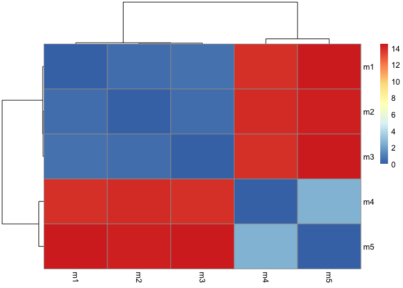
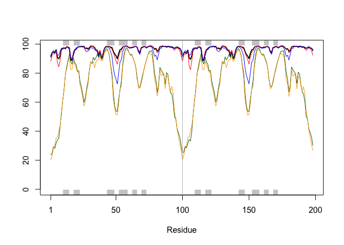
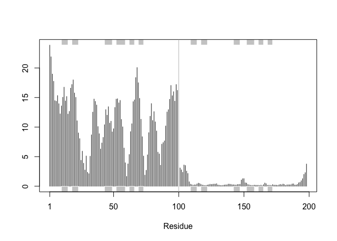
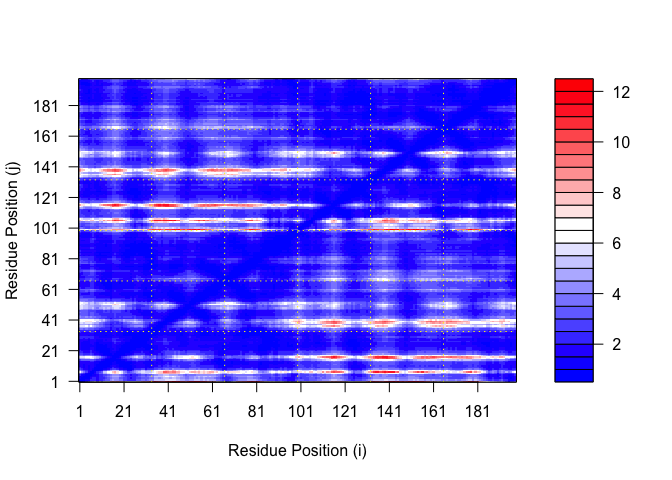
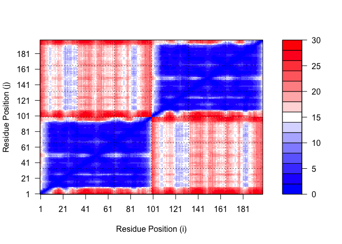
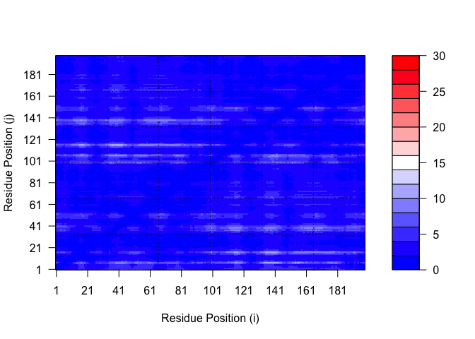
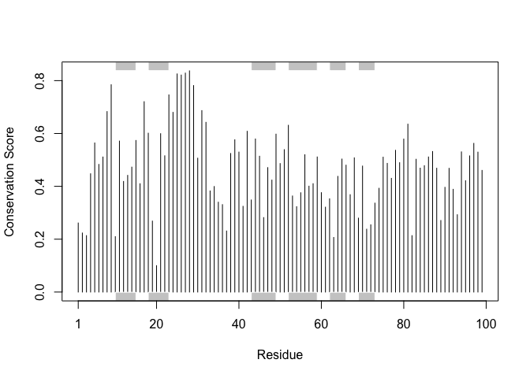

# Class 11: AlphaFold
Madina Khorami (A18555185)

- [The EBI Alphafold Database](#the-ebi-alphafold-database)
- [Running AlphaFold](#running-alphafold)
- [Predicted Alignment Error for
  Domains](#predicted-alignment-error-for-domains)
- [Residue conservation from alignment
  file](#residue-conservation-from-alignment-file)

## The EBI Alphafold Database

T he EBI alphafold database contains alots of computed structure models.
It is increasingly kely that the structure you are interested in is
already in this database at https://alphafold.ebi.ac.uk There are three
major outputs from Alphafold 1. A model of structure in PDB. 2. A pIDDt
score: that tells us how confident the model is for a given residue in
your protein (high value is good, above 70) 3. A PAE score that tells us
about protein packing quality

## Running AlphaFold

We will use Colabfold to run Alphafold on our sequence
https://github.com/sokrypton/ColabFold?tab=readme-ov-file Figure from
Alphafold here!

``` r
library(bio3d)

pdb <- read.pdb("hivpr_dimer_23119/hivpr_dimer_23119_unrelaxed_rank_002_alphafold2_multimer_v3_model_1_seed_000.pdb")

pdb
```


     Call:  read.pdb(file = "hivpr_dimer_23119/hivpr_dimer_23119_unrelaxed_rank_002_alphafold2_multimer_v3_model_1_seed_000.pdb")

       Total Models#: 1
         Total Atoms#: 1514,  XYZs#: 4542  Chains#: 2  (values: A B)

         Protein Atoms#: 1514  (residues/Calpha atoms#: 198)
         Nucleic acid Atoms#: 0  (residues/phosphate atoms#: 0)

         Non-protein/nucleic Atoms#: 0  (residues: 0)
         Non-protein/nucleic resid values: [ none ]

       Protein sequence:
          PQITLWQRPLVTIKIGGQLKEALLDTGADDTVLEEMSLPGRWKPKMIGGIGGFIKVRQYD
          QILIEICGHKAIGTVLVGPTPVNIIGRNLLTQIGCTLNFPQITLWQRPLVTIKIGGQLKE
          ALLDTGADDTVLEEMSLPGRWKPKMIGGIGGFIKVRQYDQILIEICGHKAIGTVLVGPTP
          VNIIGRNLLTQIGCTLNF

    + attr: atom, xyz, calpha, call

Make a vector of input PDB file names that we can read into R.

``` r
pdbfiles <- list.files("hivpr_dimer_23119/", pattern = ".pdb",
           full.names = T)
pdbfiles
```

    [1] "hivpr_dimer_23119//hivpr_dimer_23119_unrelaxed_rank_001_alphafold2_multimer_v3_model_4_seed_000.pdb"
    [2] "hivpr_dimer_23119//hivpr_dimer_23119_unrelaxed_rank_002_alphafold2_multimer_v3_model_1_seed_000.pdb"
    [3] "hivpr_dimer_23119//hivpr_dimer_23119_unrelaxed_rank_003_alphafold2_multimer_v3_model_5_seed_000.pdb"
    [4] "hivpr_dimer_23119//hivpr_dimer_23119_unrelaxed_rank_004_alphafold2_multimer_v3_model_2_seed_000.pdb"
    [5] "hivpr_dimer_23119//hivpr_dimer_23119_unrelaxed_rank_005_alphafold2_multimer_v3_model_3_seed_000.pdb"

``` r
library (bio3dview)
pdbs <- pdbaln(pdbfiles, fit = TRUE, exefile = "msa")
```

    Reading PDB files:
    hivpr_dimer_23119//hivpr_dimer_23119_unrelaxed_rank_001_alphafold2_multimer_v3_model_4_seed_000.pdb
    hivpr_dimer_23119//hivpr_dimer_23119_unrelaxed_rank_002_alphafold2_multimer_v3_model_1_seed_000.pdb
    hivpr_dimer_23119//hivpr_dimer_23119_unrelaxed_rank_003_alphafold2_multimer_v3_model_5_seed_000.pdb
    hivpr_dimer_23119//hivpr_dimer_23119_unrelaxed_rank_004_alphafold2_multimer_v3_model_2_seed_000.pdb
    hivpr_dimer_23119//hivpr_dimer_23119_unrelaxed_rank_005_alphafold2_multimer_v3_model_3_seed_000.pdb
    .....

    Extracting sequences

    pdb/seq: 1   name: hivpr_dimer_23119//hivpr_dimer_23119_unrelaxed_rank_001_alphafold2_multimer_v3_model_4_seed_000.pdb 
    pdb/seq: 2   name: hivpr_dimer_23119//hivpr_dimer_23119_unrelaxed_rank_002_alphafold2_multimer_v3_model_1_seed_000.pdb 
    pdb/seq: 3   name: hivpr_dimer_23119//hivpr_dimer_23119_unrelaxed_rank_003_alphafold2_multimer_v3_model_5_seed_000.pdb 
    pdb/seq: 4   name: hivpr_dimer_23119//hivpr_dimer_23119_unrelaxed_rank_004_alphafold2_multimer_v3_model_2_seed_000.pdb 
    pdb/seq: 5   name: hivpr_dimer_23119//hivpr_dimer_23119_unrelaxed_rank_005_alphafold2_multimer_v3_model_3_seed_000.pdb 

``` r
view.pdbs(pdbs)
```

``` r
# Quick view of model sequence
pdbs
```

                                   1        .         .         .         .         50 
    [Truncated_Name:1]hivpr_dime   PQITLWQRPLVTIKIGGQLKEALLDTGADDTVLEEMSLPGRWKPKMIGGI
    [Truncated_Name:2]hivpr_dime   PQITLWQRPLVTIKIGGQLKEALLDTGADDTVLEEMSLPGRWKPKMIGGI
    [Truncated_Name:3]hivpr_dime   PQITLWQRPLVTIKIGGQLKEALLDTGADDTVLEEMSLPGRWKPKMIGGI
    [Truncated_Name:4]hivpr_dime   PQITLWQRPLVTIKIGGQLKEALLDTGADDTVLEEMSLPGRWKPKMIGGI
    [Truncated_Name:5]hivpr_dime   PQITLWQRPLVTIKIGGQLKEALLDTGADDTVLEEMSLPGRWKPKMIGGI
                                   ************************************************** 
                                   1        .         .         .         .         50 

                                  51        .         .         .         .         100 
    [Truncated_Name:1]hivpr_dime   GGFIKVRQYDQILIEICGHKAIGTVLVGPTPVNIIGRNLLTQIGCTLNFP
    [Truncated_Name:2]hivpr_dime   GGFIKVRQYDQILIEICGHKAIGTVLVGPTPVNIIGRNLLTQIGCTLNFP
    [Truncated_Name:3]hivpr_dime   GGFIKVRQYDQILIEICGHKAIGTVLVGPTPVNIIGRNLLTQIGCTLNFP
    [Truncated_Name:4]hivpr_dime   GGFIKVRQYDQILIEICGHKAIGTVLVGPTPVNIIGRNLLTQIGCTLNFP
    [Truncated_Name:5]hivpr_dime   GGFIKVRQYDQILIEICGHKAIGTVLVGPTPVNIIGRNLLTQIGCTLNFP
                                   ************************************************** 
                                  51        .         .         .         .         100 

                                 101        .         .         .         .         150 
    [Truncated_Name:1]hivpr_dime   QITLWQRPLVTIKIGGQLKEALLDTGADDTVLEEMSLPGRWKPKMIGGIG
    [Truncated_Name:2]hivpr_dime   QITLWQRPLVTIKIGGQLKEALLDTGADDTVLEEMSLPGRWKPKMIGGIG
    [Truncated_Name:3]hivpr_dime   QITLWQRPLVTIKIGGQLKEALLDTGADDTVLEEMSLPGRWKPKMIGGIG
    [Truncated_Name:4]hivpr_dime   QITLWQRPLVTIKIGGQLKEALLDTGADDTVLEEMSLPGRWKPKMIGGIG
    [Truncated_Name:5]hivpr_dime   QITLWQRPLVTIKIGGQLKEALLDTGADDTVLEEMSLPGRWKPKMIGGIG
                                   ************************************************** 
                                 101        .         .         .         .         150 

                                 151        .         .         .         .       198 
    [Truncated_Name:1]hivpr_dime   GFIKVRQYDQILIEICGHKAIGTVLVGPTPVNIIGRNLLTQIGCTLNF
    [Truncated_Name:2]hivpr_dime   GFIKVRQYDQILIEICGHKAIGTVLVGPTPVNIIGRNLLTQIGCTLNF
    [Truncated_Name:3]hivpr_dime   GFIKVRQYDQILIEICGHKAIGTVLVGPTPVNIIGRNLLTQIGCTLNF
    [Truncated_Name:4]hivpr_dime   GFIKVRQYDQILIEICGHKAIGTVLVGPTPVNIIGRNLLTQIGCTLNF
    [Truncated_Name:5]hivpr_dime   GFIKVRQYDQILIEICGHKAIGTVLVGPTPVNIIGRNLLTQIGCTLNF
                                   ************************************************ 
                                 151        .         .         .         .       198 

    Call:
      pdbaln(files = pdbfiles, fit = TRUE, exefile = "msa")

    Class:
      pdbs, fasta

    Alignment dimensions:
      5 sequence rows; 198 position columns (198 non-gap, 0 gap) 

    + attr: xyz, resno, b, chain, id, ali, resid, sse, call

``` r
rd <- rmsd(pdbs, fit = TRUE)
```

    Warning in rmsd(pdbs, fit = TRUE): No indices provided, using the 198 non NA positions

``` r
range(rd)
```

    [1]  0.000 14.526

``` r
dim(rd)
```

    [1] 5 5

``` r
library(pheatmap)

colnames(rd) <- paste0("m",1:5)
rownames(rd) <- paste0("m",1:5)
pheatmap(rd)
```



``` r
# Read a reference PDB Structure

pdb <- read.pdb("1HSG")
```

      Note: Accessing on-line PDB file

Obtain secondary strucutre from a call to `Stride()`, or `dssp()` on any
of the model strucutres.

``` r
plotb3(pdbs$b[1,], typ="l", lwd=2, sse=pdb)
points(pdbs$b[2,], typ="l", col="red")
points(pdbs$b[3,], typ="l", col="blue")
points(pdbs$b[4,], typ="l", col="darkgreen")
points(pdbs$b[5,], typ="l", col="orange")
abline(v=100, col="gray")
```



We can improve the superposition/fitting of our models by finding the
most consistent **“rigid core”** common across all the models. For this
we will use the core. `find()` function:

``` r
core <- core.find(pdbs)
```

     core size 197 of 198  vol = 5437.294 
     core size 196 of 198  vol = 4705.336 
     core size 195 of 198  vol = 1827.704 
     core size 194 of 198  vol = 1121.539 
     core size 193 of 198  vol = 1047.76 
     core size 192 of 198  vol = 999.32 
     core size 191 of 198  vol = 953.718 
     core size 190 of 198  vol = 910.755 
     core size 189 of 198  vol = 870.203 
     core size 188 of 198  vol = 836.304 
     core size 187 of 198  vol = 805.237 
     core size 186 of 198  vol = 775.99 
     core size 185 of 198  vol = 752.564 
     core size 184 of 198  vol = 712.023 
     core size 183 of 198  vol = 685.568 
     core size 182 of 198  vol = 663.911 
     core size 181 of 198  vol = 645.881 
     core size 180 of 198  vol = 627.97 
     core size 179 of 198  vol = 611.812 
     core size 178 of 198  vol = 595.931 
     core size 177 of 198  vol = 581.132 
     core size 176 of 198  vol = 566.736 
     core size 175 of 198  vol = 548.587 
     core size 174 of 198  vol = 534.114 
     core size 173 of 198  vol = 505.214 
     core size 172 of 198  vol = 491.225 
     core size 171 of 198  vol = 473.905 
     core size 170 of 198  vol = 460.426 
     core size 169 of 198  vol = 444.81 
     core size 168 of 198  vol = 431.661 
     core size 167 of 198  vol = 421.542 
     core size 166 of 198  vol = 405.601 
     core size 165 of 198  vol = 392.666 
     core size 164 of 198  vol = 381.077 
     core size 163 of 198  vol = 367.559 
     core size 162 of 198  vol = 358.379 
     core size 161 of 198  vol = 346.865 
     core size 160 of 198  vol = 334.809 
     core size 159 of 198  vol = 324.09 
     core size 158 of 198  vol = 312.153 
     core size 157 of 198  vol = 301.296 
     core size 156 of 198  vol = 290.431 
     core size 155 of 198  vol = 281.319 
     core size 154 of 198  vol = 272.529 
     core size 153 of 198  vol = 263.215 
     core size 152 of 198  vol = 253.54 
     core size 151 of 198  vol = 240.86 
     core size 150 of 198  vol = 227.447 
     core size 149 of 198  vol = 215.581 
     core size 148 of 198  vol = 202.041 
     core size 147 of 198  vol = 195.426 
     core size 146 of 198  vol = 188.721 
     core size 145 of 198  vol = 181.778 
     core size 144 of 198  vol = 173.615 
     core size 143 of 198  vol = 165.946 
     core size 142 of 198  vol = 156.117 
     core size 141 of 198  vol = 149.814 
     core size 140 of 198  vol = 143.616 
     core size 139 of 198  vol = 135.81 
     core size 138 of 198  vol = 127.851 
     core size 137 of 198  vol = 122.596 
     core size 136 of 198  vol = 117.203 
     core size 135 of 198  vol = 109.848 
     core size 134 of 198  vol = 104.812 
     core size 133 of 198  vol = 98.776 
     core size 132 of 198  vol = 94.799 
     core size 131 of 198  vol = 90.494 
     core size 130 of 198  vol = 87.403 
     core size 129 of 198  vol = 83.558 
     core size 128 of 198  vol = 79.08 
     core size 127 of 198  vol = 75.056 
     core size 126 of 198  vol = 71.238 
     core size 125 of 198  vol = 67.735 
     core size 124 of 198  vol = 64.289 
     core size 123 of 198  vol = 61.381 
     core size 122 of 198  vol = 57.515 
     core size 121 of 198  vol = 53.254 
     core size 120 of 198  vol = 48.654 
     core size 119 of 198  vol = 45.832 
     core size 118 of 198  vol = 41.819 
     core size 117 of 198  vol = 38.71 
     core size 116 of 198  vol = 36.294 
     core size 115 of 198  vol = 33.386 
     core size 114 of 198  vol = 30.472 
     core size 113 of 198  vol = 27.786 
     core size 112 of 198  vol = 25.403 
     core size 111 of 198  vol = 22.827 
     core size 110 of 198  vol = 21.106 
     core size 109 of 198  vol = 19.327 
     core size 108 of 198  vol = 17.796 
     core size 107 of 198  vol = 16.235 
     core size 106 of 198  vol = 14.508 
     core size 105 of 198  vol = 12.969 
     core size 104 of 198  vol = 11.834 
     core size 103 of 198  vol = 11.185 
     core size 102 of 198  vol = 10.298 
     core size 101 of 198  vol = 8.898 
     core size 100 of 198  vol = 7.813 
     core size 99 of 198  vol = 6.074 
     core size 98 of 198  vol = 5.286 
     core size 97 of 198  vol = 4.43 
     core size 96 of 198  vol = 3.873 
     core size 95 of 198  vol = 3.321 
     core size 94 of 198  vol = 2.855 
     core size 93 of 198  vol = 2.293 
     core size 92 of 198  vol = 1.937 
     core size 91 of 198  vol = 1.631 
     core size 90 of 198  vol = 1.331 
     core size 89 of 198  vol = 0.957 
     core size 88 of 198  vol = 0.803 
     core size 87 of 198  vol = 0.647 
     core size 86 of 198  vol = 0.532 
     core size 85 of 198  vol = 0.444 
     FINISHED: Min vol ( 0.5 ) reached

We can now use the identified core atom positions as a basis for a more
suitable superposition and write out the fitted structures to a
directory called corefit_structures:

``` r
core.inds <- print(core, vol = 0.5)
```

    # 86 positions (cumulative volume <= 0.5 Angstrom^3) 
      start end length
    1     7   7      1
    2     9  49     41
    3    52  95     44

``` r
xyz <- pdbfit(pdbs, core.inds, outpath = "corefit_structures")
```

Now we can examine the RMSF between positions of the structure. RMSF is
an often used measure of conformational variance along the structure:

``` r
rf <- rmsf(xyz)

plotb3(rf, sse=pdb)
abline(v=100, col="gray", ylab="RMSF")
```



## Predicted Alignment Error for Domains

``` r
library(jsonlite)

# Listing of all PAE JSON files
pae_files <- list.files(path="hivpr_dimer_23119/",
                        pattern=".*model.*\\.json",
                        full.names = TRUE)
```

``` r
## For example purposes lets read the 1st and 5th files
pae1 <- read_json(pae_files[1],simplifyVector = TRUE)
pae5 <- read_json(pae_files[5],simplifyVector = TRUE)

attributes(pae1)
```

    $names
    [1] "plddt"   "max_pae" "pae"     "ptm"     "iptm"   

``` r
# Per-residue pLDT scores

#same as B-factor of PDB..

head (pae1$plddt)
```

    [1] 91.62 94.06 94.56 93.88 96.12 90.69

``` r
pae1$max_pae
```

    [1] 12.33594

``` r
pae5$max_pae
```

    [1] 29.45312

We can plot the N by N (where N is the number of residues) PAE scores
with ggplot or with functions from the Bio3D package:

``` r
plot.dmat (pae1$pae,
xlab="Residue Position (i)",
ylab="Residue Position (j)")
```



``` r
plot.dmat (pae5$pae,


xlab="Residue Position (i)",

ylab="Residue Position (j)",
grid.col = "black",

zlim=c(0,30))
```



``` r
#We should really plot all of these using the same z range. Here is the model 1 plot again b
plot.dmat (pae1$pae,
xlab="Residue Position (i)", ylab="Residue Position (j)",
grid.col = "black",
zlim=c (0,30))
```



## Residue conservation from alignment file

``` r
aln_file <- list.files(path="hivpr_dimer_23119/",
                       pattern=".a3m$",
                        full.names = TRUE)
aln_file
```

    [1] "hivpr_dimer_23119//hivpr_dimer_23119.a3m"

``` r
aln <- read.fasta(aln_file[1], to.upper = TRUE)
```

    [1] " ** Duplicated sequence id's: 101 **"
    [2] " ** Duplicated sequence id's: 101 **"

``` r
dim(aln$ali)
```

    [1] 5397  132

We can score residue conservation in the alignment with the `conserv()`
function.

``` r
sim <- conserv(aln)
```

``` r
plotb3(sim[1:99], sse=trim.pdb(pdb, chain="A"),
       ylab="Conservation Score")
```



``` r
con <- consensus(aln, cutoff = 0.9)
con$seq
```

      [1] "-" "-" "-" "-" "-" "-" "-" "-" "-" "-" "-" "-" "-" "-" "-" "-" "-" "-"
     [19] "-" "-" "-" "-" "-" "-" "D" "T" "G" "A" "-" "-" "-" "-" "-" "-" "-" "-"
     [37] "-" "-" "-" "-" "-" "-" "-" "-" "-" "-" "-" "-" "-" "-" "-" "-" "-" "-"
     [55] "-" "-" "-" "-" "-" "-" "-" "-" "-" "-" "-" "-" "-" "-" "-" "-" "-" "-"
     [73] "-" "-" "-" "-" "-" "-" "-" "-" "-" "-" "-" "-" "-" "-" "-" "-" "-" "-"
     [91] "-" "-" "-" "-" "-" "-" "-" "-" "-" "-" "-" "-" "-" "-" "-" "-" "-" "-"
    [109] "-" "-" "-" "-" "-" "-" "-" "-" "-" "-" "-" "-" "-" "-" "-" "-" "-" "-"
    [127] "-" "-" "-" "-" "-" "-"

For a final visualization of these functionally important sites we can
map this conservation score to the Occupancy column of a PDB file for
viewing in molecular viewer programs such as Mol\*, PyMol, VMD, chimera
etc.

``` r
m1.pdb <- read.pdb(pdbfiles[1])
occ <- vec2resno(c(sim[1:99], sim[1:99]), m1.pdb$atom$resno)
write.pdb(m1.pdb, o=occ, file="m1_conserv.pdb")
```
