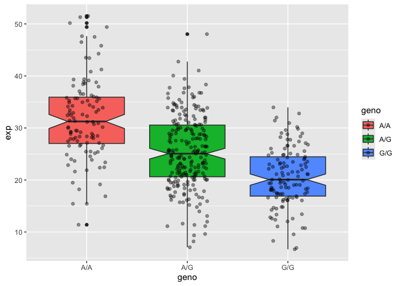

# Lab12: Homework
Madina Khorami (A18555185)
2026-05-09

- [Section 1: Proportion of G\|G in a
  population](#section-1-proportion-of-gg-in-a-population)
- [Section 4: Population Scale
  Analysis](#section-4-population-scale-analysis)

## Section 1: Proportion of G\|G in a population

We read the file from the provided link Ensemble
https://useast.ensembl.org/Homo_sapiens/Variation/Sample?db=core;r=17:39895045-39895145;v=rs8067378;vdb=variation;vf=959672880#373531tablePanel.

> Q5: What proportion of the Mexican Ancestry in Los Angeles sample
> population (MXL) are homozygous for the asthma associated SNP (G\|G)?
> HINT: You can filter the displayed genotypes by entering the
> population code MXL. Then either count those of interest or download a
> CVS file for this population and use excel or the R functions
> read.csv(), and table() to answer this question\]

``` r
mxl_data <- read.csv("373531-SampleGenotypes-Homo_sapiens_Variation_Sample_rs8067378.csv")
head(mxl_data)
```

      Sample..Male.Female.Unknown. Genotype..forward.strand. Population.s. Father
    1                  NA19648 (F)                       A|A ALL, AMR, MXL      -
    2                  NA19649 (M)                       G|G ALL, AMR, MXL      -
    3                  NA19651 (F)                       A|A ALL, AMR, MXL      -
    4                  NA19652 (M)                       G|G ALL, AMR, MXL      -
    5                  NA19654 (F)                       G|G ALL, AMR, MXL      -
    6                  NA19655 (M)                       A|G ALL, AMR, MXL      -
      Mother
    1      -
    2      -
    3      -
    4      -
    5      -
    6      -

``` r
table(mxl_data$Genotype..forward.strand.)
```


    A|A A|G G|A G|G 
     22  21  12   9 

``` r
table(mxl_data$Genotype..forward.strand.) / nrow(mxl_data) * 100
```


        A|A     A|G     G|A     G|G 
    34.3750 32.8125 18.7500 14.0625 

So the the G\|G percentage for the Mexicans living in the Los Angeles is
14% and this means this genotype percentage is associated to the
childhood asthma.

## Section 4: Population Scale Analysis

> Q13: Read this file into R and determine the sample size for each
> genotype and their corresponding median expression levels for each of
> these genotypes.

Read the data from URL.

``` r
url <- "https://bioboot.github.io/bggn213_W19/class-material/rs8067378_ENSG00000172057.6.txt"
data <- read.table(url, header = TRUE)
```

Calculate the sample size (n) for each genotype.

``` r
sample_size <- table(data$geno)
sample_size
```


    A/A A/G G/G 
    108 233 121 

To calculate the median expression of each genotype we Ggroup by
genotype and calculate sample size and median

``` r
library(dplyr)
```


    Attaching package: 'dplyr'

    The following objects are masked from 'package:stats':

        filter, lag

    The following objects are masked from 'package:base':

        intersect, setdiff, setequal, union

``` r
results <- data %>% 
  group_by(geno) %>% 
  summarize(sample_size = n(), 
            median_exp = median(exp))

print(results)
```

    # A tibble: 3 × 3
      geno  sample_size median_exp
      <chr>       <int>      <dbl>
    1 A/A           108       31.2
    2 A/G           233       25.1
    3 G/G           121       20.1

> Q14: Generate a boxplot with a box per genotype, what could you infer
> from the relative expression value between A/A and G/G displayed in
> this plot? Does the SNP effect the expression of ORMDL3?

To make the boxplot we need the ggplot.

``` r
library(ggplot2)
ggplot (data) +
aes (geno, exp, fill=geno) + 
  geom_boxplot (notch=TRUE) +
  geom_jitter(alpha= 0.4, width = 0.2)
```



Yes, the SNP (rs8067378) have a strong effect on the expression of
ORMDL3 as distinct separation between the median expression levels of
the three genotypes visualized in the boxplot it suggests that this
genetic variation is a quantitative trait locus for the ORMDL3 gene. As
the number of G alleles increases, the expression of the gene
significantly decreases
