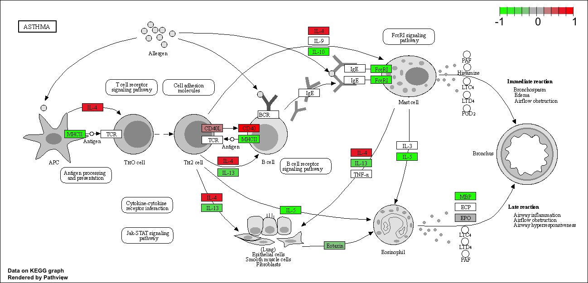

## Background
Today we are going to  do an RNA-sew analysis of a data set on the RNA-seq experiment where airway smooth muscle cells were treated with dexamethasone, a synthetic glucocorticoid steroid with anti-inflammatory effects.


## Data Import
Let's read the `count data and metadata about this eperiment setup fromt he supplied csv file.

```{r}
counts <- read.csv("airway_scaledcounts.csv", row.names=1)
metadata <-  read.csv("airway_metadata.csv")
```


```{r}
head(counts)
```
```{r}
ncol(counts)
```
```{r}
colnames(counts) == metadata$id
```


and the metadata that tells us what is actually in the column of our `count` object.

```{r}
metadata
```

> Q1. How many genes are in this dataset?

There are `r nrow(counts)` genes int this dataset.

> Q2. How many control cell lines do we have?

```{r}
sum(metadata$dex == "control")
```

OR

```{r}
table(metadata$dex)
```

> Q3. How would you make the above code in either approach more robust? Is there a function that could help here? 

- Find the control columns in our `counts` object.
- Extracts just the "control" column values for all genes
- Calculate the average value per gene in these "control" columns.

```{r}
## Find the contol columns
control.inds <- metadata$dex == "control"
## Extract the control columns
control.counts <- counts[ , control.inds]
## take the avergae of control column over all genes
control.mean <- rowMeans(control.counts)

```


```{r}
head(control.mean)
```


> Q4. Follow the same procedure for the treated samples (i.e. calculate the mean per gene across drug treated samples and assign to a labeled vector called treated.mean)

- Find the treated columns in our `counts` object.
- Extracts just the "treated" column values for all genes
- Calculate the average value per gene in these "treated" columns.

```{r}
treated.inds <- metadata$dex =="treated"

treated.counts <- counts[ , treated.inds]

treated.mean <- rowMeans(treated.counts)
```


```{r}
head(treated.mean)
```

First we combine both mean for that dataset, to store them together as a new object called `meancounts`.
```{r}
meancounts <- data.frame(control.mean, treated.mean)
head(meancounts)
```

> Q5 (a). Create a scatter plot showing the mean of the treated samples against the mean of the control samples. Your plot should look something like the following.

Now we make the plot of the `control.mean` vs `treated.mean`

```{r}
plot(meancounts[,1],meancounts[,2], xlab="Control", ylab="Treated")

```
> Q5 (b).You could also use the ggplot2 package to make this figure producing the plot below. What geom_?() function would you use for this plot?

```{r}
library(ggplot2)

ggplot(meancounts, aes( x= control.mean, y=treated.mean)) + 
  geom_point(alpha = 0.4) + 
  labs(x = "Control", y = "Treated")
```

> Q6. Try plotting both axes on a log scale. What is the argument to plot() that allows you to do this?

Our counts data is highly skewed where a huge amount of data falls in one side and very few on the other side, so we see a apttern like this plot it SCREEMS log transfrom this.

```{r}
plot(meancounts, log="xy")
```


We most often use log2 transform for this kind of data cause it has an easier interpretation in bioinformatics area.

```{r}
## Treated / Control
log2(20/20)
log2(10/20)
log2(40/20)
log2(80/20)
```

We call this fraction the "log2 fold change" as it tells us how much more or less gene expression we have in units of doubling, etc.

Let's calculate the log2 fold change for our `treated.mean` vs `control.mean` counts adn call this `log2fc`


```{r}
meancounts$log2fc <- log2(meancounts$treated.mean / meancounts$control.mean)
head(meancounts)
```

A common "rule of thumb" threshold for calling a gene "up regulated" or "down regulated" is a log2 fold change value of +2 or -2 (or greater).

```{r}
zero.vals <- which(meancounts[,1:2]==0, arr.ind=TRUE)

to.rm <- unique(zero.vals[,1])
mycounts <- meancounts[-to.rm,]
head(mycounts)
```

> Q7. What is the purpose of the arr.ind argument in the which() function call above? Why would we then take the first column of the output and need to call the unique() function?

The arr.ind=TRUE argument makes which() return the row and column positions of the zero values as a matrix, instead of just returning a single index number.

We then take the first column because it contains the row numbers where zeros occur. Since a row could contain more than one zero, the same row number might appear multiple times, so unique() is used to keep only one copy of each row number before removing those rows from the dataset.


> Q8. Using the up.ind vector above can you determine how many up regulated genes we have at the greater than 2 fc level?

```{r}
up.ind <- mycounts$log2fc > 2
sum(up.ind)

```
There are 250 up regulated gene that are greater than 2.

> Q9. Using the down.ind vector above can you determine how many down regulated genes we have at the greater than 2 fc level? 

```{r}
down.ind <- mycounts$log2fc < (-2)
sum(down.ind)
```
There are 367 down regulated genes

> Q10. Do you trust these results? Why or why not?

Our analysis so far has only focused on fold change values. However, a gene can show a large increase or decrease in expression without the result actually being statistically significant based on p-values. Because of this, the current results could be misleading. 

## DESeq Analysis
Let's do thi analyze properly and not forget about the signifcant of the difference.

For this we will use the **DESeq2** package.

```{r, message = FALSE}

library(DESeq2)
```

To run a DESeq analysis we need at least two inputs

- `countData`   i.e. are gene counts across different experiments.
- `colData` i.e. our metadata about those count columns.


```{r, warning=FALSE}
dds <- DESeqDataSetFromMatrix(countData = counts,
                              colData = metadata,
                              design = ~dex)
dds
```

Now we can run the DESeq analysis pipeline using the `dds` object that has all the inputs we need.

```{r}
dds <- DESeq(dds)
res <- results(dds)
head(res)
```


## Volcano Plot

This is ubiquitous and common visualizaiton for this type of data that puts the log2 fold change and the adjusted p-value together in one plot that people can get insight for what is going on in the whole dataset results.

```{r}
library(ggplot2)
```

```{r}
ggplot(res) +
  aes(log2FoldChange, padj) + 
  geom_point(alpha = 0.4)
```


That plot is not very useful because we don't need graph with very high p-values, we want the very low values below our alpha threshold (e.g. 0.01).

Let's log the y axis so we can see thses genes/points more clearily.


```{r}
ggplot(res) +
  aes(log2FoldChange, log(padj)) + 
  geom_point(alpha = 0.4)
```

We need to flip the y-axis so out Volcano is not upside down.

```{r}
ggplot(res) +
  aes(log2FoldChange, -log(padj)) + 
  geom_point()
```


Now to make the two side devided we can draw lines.

```{r}
# Setup custom colors
mycols <- rep("gray", nrow(res))
mycols[abs(res$log2FoldChange) > 2] <- "red"

inds <- (res$padj < 0.01) & (abs(res$log2FoldChange) > 2)
mycols[inds] <- "blue"

# Volcano plot with ggplot
ggplot(res) +
  aes(x = log2FoldChange, y = -log(padj)) +
  geom_point(color = mycols, alpha= 0.4) +
  geom_vline(xintercept = c(-2, 2),
             color = "gray", linetype = "dashed") +
  geom_hline(yintercept = -log(0.1),
             color = "gray", linetype = "dashed") +
  xlab("Log2(FoldChange)") +
  ylab("-Log(P-value)") +
  theme_classic()
```

> Add annotaion to this volcano plot including the log2 Fold Change threshold of +2 and -2 and the p-value threshold of 0.05. Also color up just the genes that meet both these thresholds. these are the ones we will focus on next day!

## Save out results to date

```{r}
write.csv(res, file = "myresults.csv")
```


## Adding Annotaion Data

We need to "map" or translate our ENSEMBLE gene identifiers in our results object the date to the identifiers used in the different databases we want to learn from.

For this we will use a couple of  BioCoductor packages, with `BiocManager::install("AnnotationDbi")` and `BiocManager::install("org.Hs.eg.db")`


```{r}
library(AnnotationDbi)
library(org.Hs.eg.db)
```

We can see the columns in `org.Hs.eg.db` that list the different databases 
```{r}
columns(org.Hs.eg.db)
```
> Q11. Run the mapIds() function two more times to add the Entrez ID and UniProt accession and GENENAME as new columns called res$entrez, res$uniprot and res$genename.

We can use the `mapIDs()` function to map between these different database identifiers formats.
```{r}
res$symbol <- mapIds(org.Hs.eg.db,
                     keys=row.names(res), 
                     keytype="ENSEMBL",       
                     column="SYMBOL")
```

> Q. Can you map to "GENENAME" and add asa new col to our `res` object?

```{r}
res$genename <- mapIds(org.Hs.eg.db,
                     keys=row.names(res), 
                     keytype="ENSEMBL",       
                     column="GENENAME")
```

> Q Add "ENTERZID" as `res$entrez`

```{r}
res$entrez <- mapIds(org.Hs.eg.db,
                     keys=row.names(res), 
                     keytype="ENSEMBL",       
                     column="ENTREZID")
```

```{r}
res$uniprot <- mapIds(org.Hs.eg.db,
                     keys=row.names(res), 
                     keytype="ENSEMBL",       
                     column="UNIPROT")
```


```{r}
head(res)
```


## Pathway Analysis

Now we have our annotated results with. their log2 fold-change and p-values we can figure out which biologoical pathways and process these genes are involved with.

We will use the **gage** and **pathview** packages for this step and we can install them with, `BiocManager::install( c("pathview", "gage", "gageData") )`.

```{r, message=FALSE}
library(gage)
library(gageData)
library(pathview)
```


Let's have a peek at gageData,
```{r}
data(kegg.sets.hs)

# Examine the first 2 pathways in this kegg set for humans
head(kegg.sets.hs, 2)
```

We need a named vector of importance (e.g. fold-change values) that has gene ids as names. These name need to be in the correct format (using the correct database format for the IDs)

```{r}
x <- c(10, 9, 7)
names(x) <- c("Alice", "Maddy", "Barry")
x
```


```{r}
names(x)
```


Here we will make a wee input vector called `foldchanges` that has "entrez" ids as names

```{r}
foldchanges <- res$log2FoldChange
names(foldchanges) <- res$entrez
```


Now we can run `gage()` to do our pathway analysis.
```{r}
# Get the results
keggres = gage(foldchanges, gsets=kegg.sets.hs)
```


```{r}
attributes(keggres)
```


The top 3 overlapping pathways from KEGG

```{r}
head(keggres$less, 3)
```

Now we can use the **pathview** package with the found KEGG pathway IDs (e.g. "hsa05310" for the Asthma pathway) to make a pathway figure showing our Differential Expressed Genes (DEGs)

```{r}
pathview(gene.data = foldchanges, pathway.id="hsa05310")
```



> Q12. Can you do the same procedure as above to plot the pathview figures for the top 2 down-regulated pathways?


## Save our annotated results

```{r}
write.csv(res, file = "myresults_annotated.csv")
```


