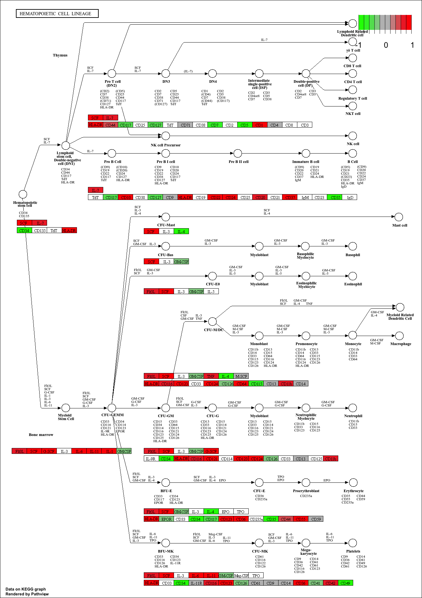
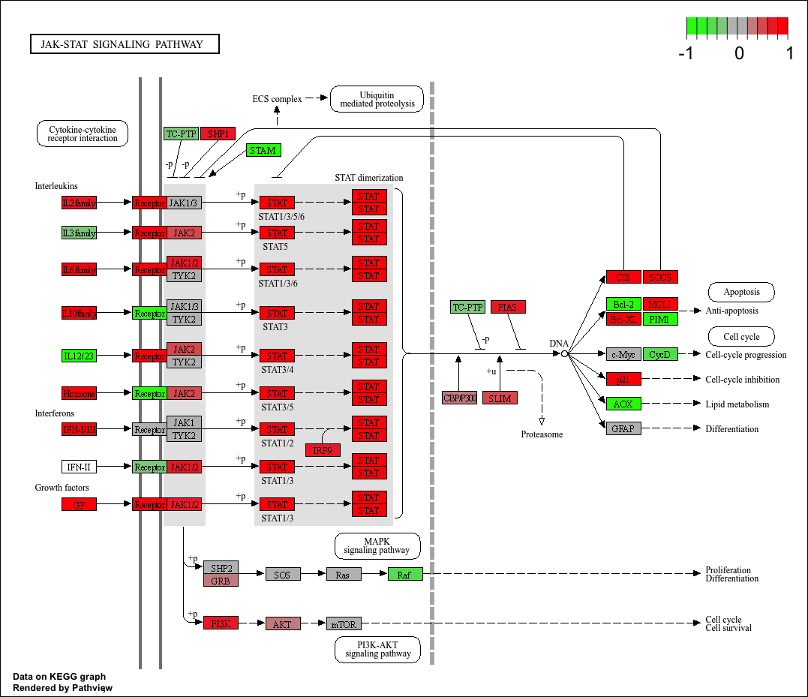
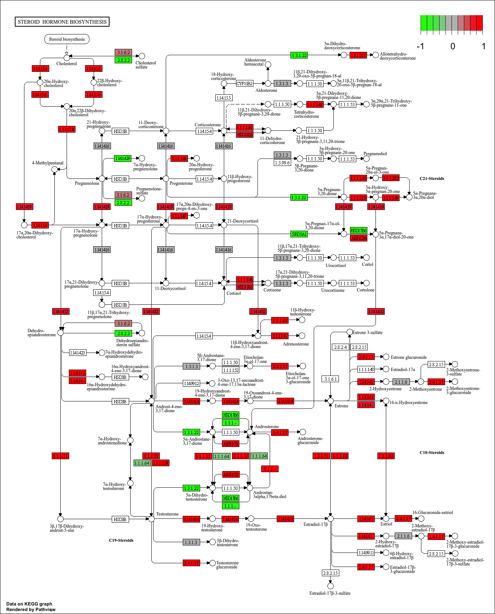
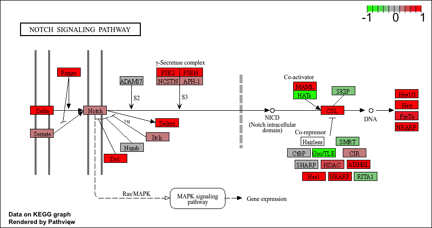
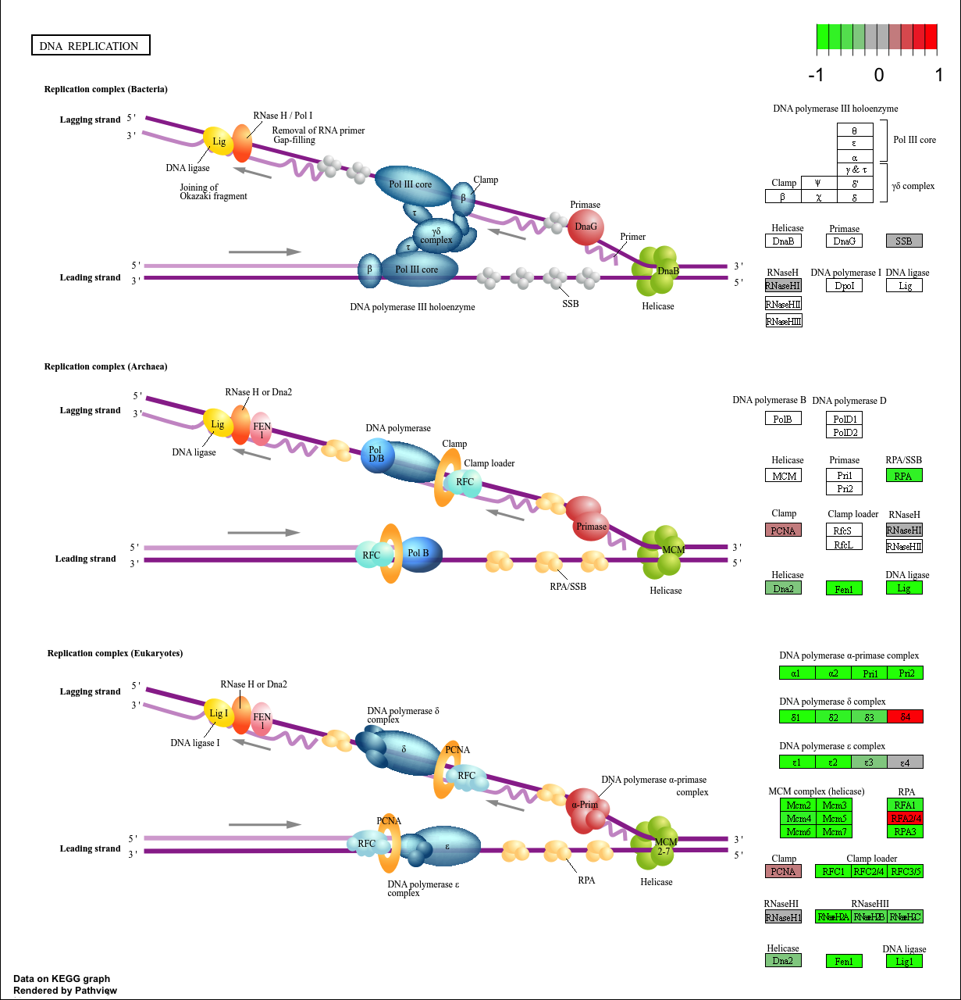
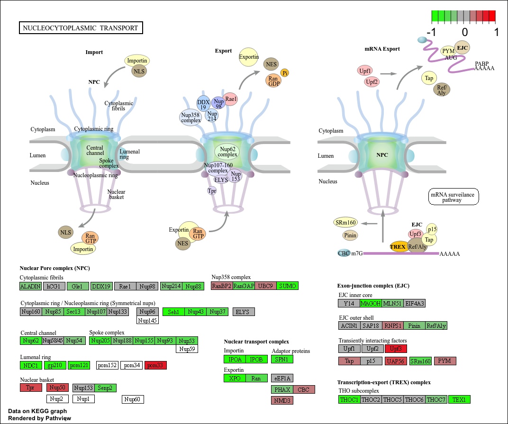
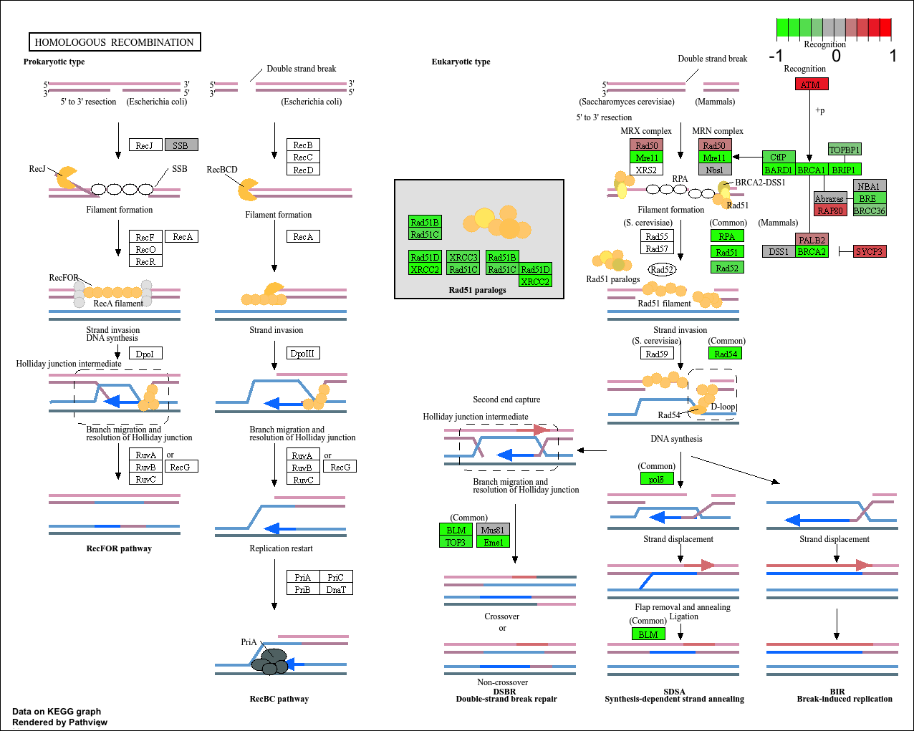
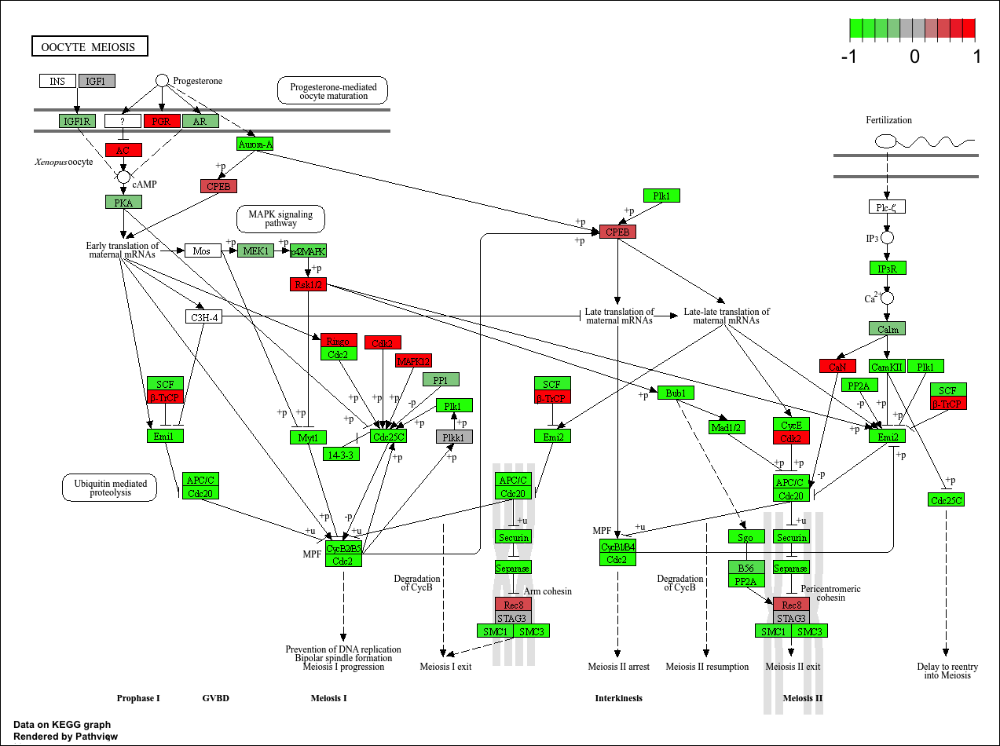

## Background
In today's mini project we analyze a high throughput biological data that require further interpretation. There are many freely available tools for pathway or over-representation analysis. As of Nov 2017 Bioconductor alone has over 80 packages categorized under gene set enrichment and over 120 packages categorized under pathways.

The data for our hands-on session comes from GEO entry, the authors report on differential analysis of lung fibroblasts in responsive to loss of the developmental transcription factor H0XA1.

## Data Import
Read counts and metadata CSV files.

```{r}
metadata <- read.csv("GSE37704_metadata.csv")
countData <- read.csv("GSE37704_featurecounts.csv", row.names = 1)
```


## Sannity Check
We have a peek into our metadata

```{r}
head(metadata)
```
```{r}
head(countData)
```

> Q. Complete the code below to remove the troublesome first column from countData

```{r}
# Note we need to remove the odd first $length col
countData <- countData[,-1]
head(countData)
```
```{r}
colnames(countData)
```

```{r}
metadata$id
```


```{r}
all(colnames(countData)==metadata$id)
```


> Q. Complete the code below to filter countData to exclude genes (i.e. rows) where we have 0 read count across all samples (i.e. columns).

We can sum across the rows for each gene and if the answer is zero then we have zero counts for that gene is all experiments...

```{r}
# Filter count data where you have 0 read count across all samples.
countData = countData[rowSums(countData) > 0, ]
head(countData)
```

```{r}
dim(countData)
```


## Setup DESeq Object

```{r}
library(DESeq2)
```

```{r, warning=FALSE}
dds <- DESeqDataSetFromMatrix(countData = countData,
                              colData = metadata, 
                              design = ~condition)
dds
```
## Run DESeq Analysis Pipeline

Now we can run the DESeq analysis pipeline using the `dds` object that has all the inputs we need.

```{r}
dds <- DESeq(dds)
res <- results(dds)
head(res)
```


## Extract the Results

> Q. Call the summary() function on your results to get a sense of how many genes are up or down-regulated at the default 0.1 p-value cutoff.

```{r}
summary(res)
```


## Data Visualization

**Volcano Plot**

This is ubiquitous and common visualizaiton for this type of data that puts the log2 fold change and the adjusted p-value together in one plot that people can get insight for what is going on in the whole dataset results.

```{r}
library(ggplot2)
```

```{r}
ggplot(res) +
  aes(log2FoldChange, -log(padj)) + 
  geom_point(alpha = 0.4)
```


> Q. Improve this plot by completing the below code, which adds color, axis labels and cutoff lines:

```{r}
# Setup custom colors
mycols <- rep("gray", nrow(res))
mycols[abs(res$log2FoldChange) > 2] <- "blue"

mycols[res$padj > 0.01] <- "gray"

# Volcano plot with ggplot
ggplot(res) +
  aes(x = log2FoldChange, y = -log(padj)) +
  geom_point(color = mycols, alpha= 0.4) +
  geom_vline(xintercept = c(-2, 2),
             color = "black") +
  geom_hline(yintercept = -log(0.1),
             color = "black") +
  xlab("Log2(FoldChange)") +
  ylab("-Log(P-value)") +
  theme_classic()
```


## Add Annotation Data
Add gene symbol and entrez ids

> Q. Use the mapIDs() function multiple times to add SYMBOL, ENTREZID and GENENAME annotation to our results by completing the code below.

```{r}
library("AnnotationDbi")
library("org.Hs.eg.db")

columns(org.Hs.eg.db)

res$symbol = mapIds(org.Hs.eg.db,
                    keys=row.names(res), 
                    keytype="ENSEMBL",
                    column="SYMBOL",
                    multiVals="first")

res$entrez = mapIds(org.Hs.eg.db,
                    keys=row.names(res),
                    keytype="ENSEMBL",
                    column="ENTREZID",
                    multiVals="first")

res$name =   mapIds(org.Hs.eg.db,
                    keys=row.names(res),
                    keytype="ENSEMBL",
                    column="GENENAME",
                    multiVals="first")

head(res, 10)
```
> Q. Finally for this section let's reorder these results by adjusted p-value and save them to a CSV file in your current project directory.

```{r}
res = res[order(res$pvalue),]
write.csv(res, file = "deseq_results.csv")
```


## Pathway Analysis
**KEGG**
Here we use the "gage" package for pathway analysis and once we have a list of enriched pathways, we're going to use the pathview package to draw pathway diagrams, shading the molecules in the pathway by their degree of up/down-regulation.

```{r}
library(pathview)
library(gage)
library(gageData)

data(kegg.sets.hs)
data(sigmet.idx.hs)

# Focus on signaling and metabolic pathways only
kegg.sets.hs = kegg.sets.hs[sigmet.idx.hs]

# Examine the first 3 pathways
head(kegg.sets.hs, 3)
```


```{r}
foldchanges = res$log2FoldChange
names(foldchanges) = res$entrez
head(foldchanges)
```


```{r}
# Get the results
keggres = gage(foldchanges, gsets=kegg.sets.hs)
```

Now lets look at the object returned from gage().

```{r}
attributes(keggres)
```


```{r}
# Look at the first few down (less) pathways
head(keggres$less)
```

Now, let's try out the pathview() function from the **pathview** package to make a pathway plot with our RNA-Seq expression results shown in color.
This downloads the pathway figure data from KEGG and adds our results to it. Here is the default low resolution raster PNG output from the pathview() call above

```{r}
pathview(gene.data=foldchanges, pathway.id="hsa04110")
```


```{r}
# A different PDF based output of the same data
pathview(gene.data=foldchanges, pathway.id="hsa04110", kegg.native=FALSE)
```

```{r}
## Focus on top 5 upregulated pathways here for demo purposes only
keggrespathways <- rownames(keggres$greater)[1:5]

# Extract the 8 character long IDs part of each string
keggresids = substr(keggrespathways, start=1, stop=8)
keggresids
```

```{r}
pathview(gene.data=foldchanges, pathway.id=keggresids, species="hsa")
```






> Q. Can you do the same procedure as above to plot the pathview figures for the top 5 down-regulated pathways?

```{r}
keggrespathways <- rownames(keggres$less)[1:5]

# Extract the 8 character long IDs part of each string
keggresids = substr(keggrespathways, start=1, stop=8)
keggresids
```

```{r}
pathview(gene.data=foldchanges, pathway.id=keggresids, species="hsa")

```







## Gene Onthology (GO)
We can also do a similar procedure with gene ontology. Similar to above, go.sets.hs has all GO terms. go.subs.hs is a named list containing indexes for the BP, CC, and MF ontologies.
```{r}
data(go.sets.hs)
data(go.subs.hs)

# Focus on Biological Process subset of GO
gobpsets = go.sets.hs[go.subs.hs$BP]

gobpres = gage(foldchanges, gsets=gobpsets)

lapply(gobpres, head)
```


## REACTOME

Let's now conduct over-representation enrichment analysis and pathway-topology analysis with Reactome using the previous list of significant genes generated from our differential expression results above.


```{r}
## First, using R, output the list of significant genes at the 0.05 level as a plain text file.

sig_genes <- res[res$padj <= 0.05 & !is.na(res$padj), "symbol"]
print(paste("Total number of significant genes:", length(sig_genes)))
```

```{r}
write.table(sig_genes, file="significant_genes.txt", row.names=FALSE, col.names=FALSE, quote=FALSE)

```

```{r}
reactome <- read.csv("Reactome_results.csv")
head(reactome, 10)
```


> Q: What pathway has the most significant “Entities p-value”? Do the most significant pathways listed match your previous KEGG results? What factors could cause differences between the two methods?

Reactome had the most significant “Entities p-value,” and its results mostly matched the KEGG and GO analyses because all three highlighted similar processes like the cell cycle, mitosis, DNA replication, and chromosome segregation. The results are not exactly the same because KEGG, GO, and Reactome use different pathway databases, gene annotations, and analysis methods, and Reactome is usually more detailed than the other two.


## Save our results


```{r}
write.csv(res, file = "deseq_results2.csv")
```


