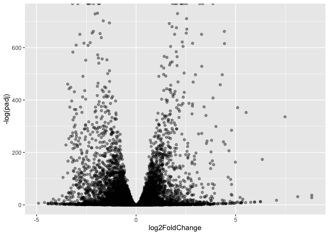
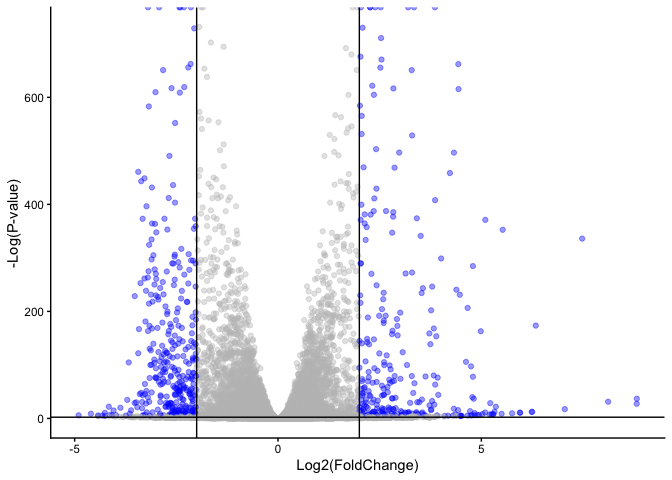

# Lab 14 Mini Project RNA Seq
Madina Khorami (A18555185)

- [Background](#background)
- [Data Import](#data-import)
- [Sannity Check](#sannity-check)
- [Setup DESeq Object](#setup-deseq-object)
- [Run DESeq Analysis Pipeline](#run-deseq-analysis-pipeline)
- [Extract the Results](#extract-the-results)
- [Data Visualization](#data-visualization)
- [Add Annotation Data](#add-annotation-data)
- [Pathway Analysis](#pathway-analysis)
- [Gene Onthology (GO)](#gene-onthology-go)
- [REACTOME](#reactome)
- [Save our results](#save-our-results)

## Background

In today’s mini project we analyze a high throughput biological data
that require further interpretation. There are many freely available
tools for pathway or over-representation analysis. As of Nov 2017
Bioconductor alone has over 80 packages categorized under gene set
enrichment and over 120 packages categorized under pathways.

The data for our hands-on session comes from GEO entry, the authors
report on differential analysis of lung fibroblasts in responsive to
loss of the developmental transcription factor H0XA1.

## Data Import

Read counts and metadata CSV files.

``` r
metadata <- read.csv("GSE37704_metadata.csv")
countData <- read.csv("GSE37704_featurecounts.csv", row.names = 1)
```

## Sannity Check

We have a peek into our metadata

``` r
head(metadata)
```

             id     condition
    1 SRR493366 control_sirna
    2 SRR493367 control_sirna
    3 SRR493368 control_sirna
    4 SRR493369      hoxa1_kd
    5 SRR493370      hoxa1_kd
    6 SRR493371      hoxa1_kd

``` r
head(countData)
```

                    length SRR493366 SRR493367 SRR493368 SRR493369 SRR493370
    ENSG00000186092    918         0         0         0         0         0
    ENSG00000279928    718         0         0         0         0         0
    ENSG00000279457   1982        23        28        29        29        28
    ENSG00000278566    939         0         0         0         0         0
    ENSG00000273547    939         0         0         0         0         0
    ENSG00000187634   3214       124       123       205       207       212
                    SRR493371
    ENSG00000186092         0
    ENSG00000279928         0
    ENSG00000279457        46
    ENSG00000278566         0
    ENSG00000273547         0
    ENSG00000187634       258

> Q. Complete the code below to remove the troublesome first column from
> countData

``` r
# Note we need to remove the odd first $length col
countData <- countData[,-1]
head(countData)
```

                    SRR493366 SRR493367 SRR493368 SRR493369 SRR493370 SRR493371
    ENSG00000186092         0         0         0         0         0         0
    ENSG00000279928         0         0         0         0         0         0
    ENSG00000279457        23        28        29        29        28        46
    ENSG00000278566         0         0         0         0         0         0
    ENSG00000273547         0         0         0         0         0         0
    ENSG00000187634       124       123       205       207       212       258

``` r
colnames(countData)
```

    [1] "SRR493366" "SRR493367" "SRR493368" "SRR493369" "SRR493370" "SRR493371"

``` r
metadata$id
```

    [1] "SRR493366" "SRR493367" "SRR493368" "SRR493369" "SRR493370" "SRR493371"

``` r
all(colnames(countData)==metadata$id)
```

    [1] TRUE

> Q. Complete the code below to filter countData to exclude genes
> (i.e. rows) where we have 0 read count across all samples
> (i.e. columns).

We can sum across the rows for each gene and if the answer is zero then
we have zero counts for that gene is all experiments…

``` r
# Filter count data where you have 0 read count across all samples.
countData = countData[rowSums(countData) > 0, ]
head(countData)
```

                    SRR493366 SRR493367 SRR493368 SRR493369 SRR493370 SRR493371
    ENSG00000279457        23        28        29        29        28        46
    ENSG00000187634       124       123       205       207       212       258
    ENSG00000188976      1637      1831      2383      1226      1326      1504
    ENSG00000187961       120       153       180       236       255       357
    ENSG00000187583        24        48        65        44        48        64
    ENSG00000187642         4         9        16        14        16        16

``` r
dim(countData)
```

    [1] 15975     6

## Setup DESeq Object

``` r
library(DESeq2)
```

    Loading required package: S4Vectors

    Loading required package: stats4

    Loading required package: BiocGenerics

    Loading required package: generics


    Attaching package: 'generics'

    The following objects are masked from 'package:base':

        as.difftime, as.factor, as.ordered, intersect, is.element, setdiff,
        setequal, union


    Attaching package: 'BiocGenerics'

    The following objects are masked from 'package:stats':

        IQR, mad, sd, var, xtabs

    The following objects are masked from 'package:base':

        anyDuplicated, aperm, append, as.data.frame, basename, cbind,
        colnames, dirname, do.call, duplicated, eval, evalq, Filter, Find,
        get, grep, grepl, is.unsorted, lapply, Map, mapply, match, mget,
        order, paste, pmax, pmax.int, pmin, pmin.int, Position, rank,
        rbind, Reduce, rownames, sapply, saveRDS, table, tapply, unique,
        unsplit, which.max, which.min


    Attaching package: 'S4Vectors'

    The following object is masked from 'package:utils':

        findMatches

    The following objects are masked from 'package:base':

        expand.grid, I, unname

    Loading required package: IRanges

    Loading required package: GenomicRanges

    Loading required package: Seqinfo

    Loading required package: SummarizedExperiment

    Loading required package: MatrixGenerics

    Loading required package: matrixStats


    Attaching package: 'MatrixGenerics'

    The following objects are masked from 'package:matrixStats':

        colAlls, colAnyNAs, colAnys, colAvgsPerRowSet, colCollapse,
        colCounts, colCummaxs, colCummins, colCumprods, colCumsums,
        colDiffs, colIQRDiffs, colIQRs, colLogSumExps, colMadDiffs,
        colMads, colMaxs, colMeans2, colMedians, colMins, colOrderStats,
        colProds, colQuantiles, colRanges, colRanks, colSdDiffs, colSds,
        colSums2, colTabulates, colVarDiffs, colVars, colWeightedMads,
        colWeightedMeans, colWeightedMedians, colWeightedSds,
        colWeightedVars, rowAlls, rowAnyNAs, rowAnys, rowAvgsPerColSet,
        rowCollapse, rowCounts, rowCummaxs, rowCummins, rowCumprods,
        rowCumsums, rowDiffs, rowIQRDiffs, rowIQRs, rowLogSumExps,
        rowMadDiffs, rowMads, rowMaxs, rowMeans2, rowMedians, rowMins,
        rowOrderStats, rowProds, rowQuantiles, rowRanges, rowRanks,
        rowSdDiffs, rowSds, rowSums2, rowTabulates, rowVarDiffs, rowVars,
        rowWeightedMads, rowWeightedMeans, rowWeightedMedians,
        rowWeightedSds, rowWeightedVars

    Loading required package: Biobase

    Welcome to Bioconductor

        Vignettes contain introductory material; view with
        'browseVignettes()'. To cite Bioconductor, see
        'citation("Biobase")', and for packages 'citation("pkgname")'.


    Attaching package: 'Biobase'

    The following object is masked from 'package:MatrixGenerics':

        rowMedians

    The following objects are masked from 'package:matrixStats':

        anyMissing, rowMedians

``` r
dds <- DESeqDataSetFromMatrix(countData = countData,
                              colData = metadata, 
                              design = ~condition)
dds
```

    class: DESeqDataSet 
    dim: 15975 6 
    metadata(1): version
    assays(1): counts
    rownames(15975): ENSG00000279457 ENSG00000187634 ... ENSG00000276345
      ENSG00000271254
    rowData names(0):
    colnames(6): SRR493366 SRR493367 ... SRR493370 SRR493371
    colData names(2): id condition

## Run DESeq Analysis Pipeline

Now we can run the DESeq analysis pipeline using the `dds` object that
has all the inputs we need.

``` r
dds <- DESeq(dds)
```

    estimating size factors

    estimating dispersions

    gene-wise dispersion estimates

    mean-dispersion relationship

    final dispersion estimates

    fitting model and testing

``` r
res <- results(dds)
head(res)
```

    log2 fold change (MLE): condition hoxa1 kd vs control sirna 
    Wald test p-value: condition hoxa1 kd vs control sirna 
    DataFrame with 6 rows and 6 columns
                     baseMean log2FoldChange     lfcSE       stat      pvalue
                    <numeric>      <numeric> <numeric>  <numeric>   <numeric>
    ENSG00000279457   29.9136      0.1792571 0.3248215   0.551863 5.81042e-01
    ENSG00000187634  183.2296      0.4264571 0.1402658   3.040350 2.36304e-03
    ENSG00000188976 1651.1881     -0.6927205 0.0548465 -12.630156 1.43993e-36
    ENSG00000187961  209.6379      0.7297556 0.1318599   5.534326 3.12428e-08
    ENSG00000187583   47.2551      0.0405765 0.2718928   0.149237 8.81366e-01
    ENSG00000187642   11.9798      0.5428105 0.5215598   1.040744 2.97994e-01
                           padj
                      <numeric>
    ENSG00000279457 6.86555e-01
    ENSG00000187634 5.15718e-03
    ENSG00000188976 1.76553e-35
    ENSG00000187961 1.13413e-07
    ENSG00000187583 9.19031e-01
    ENSG00000187642 4.03379e-01

## Extract the Results

> Q. Call the summary() function on your results to get a sense of how
> many genes are up or down-regulated at the default 0.1 p-value cutoff.

``` r
summary(res)
```


    out of 15975 with nonzero total read count
    adjusted p-value < 0.1
    LFC > 0 (up)       : 4349, 27%
    LFC < 0 (down)     : 4396, 28%
    outliers [1]       : 0, 0%
    low counts [2]     : 1237, 7.7%
    (mean count < 0)
    [1] see 'cooksCutoff' argument of ?results
    [2] see 'independentFiltering' argument of ?results

## Data Visualization

**Volcano Plot**

This is ubiquitous and common visualizaiton for this type of data that
puts the log2 fold change and the adjusted p-value together in one plot
that people can get insight for what is going on in the whole dataset
results.

``` r
library(ggplot2)
```

``` r
ggplot(res) +
  aes(log2FoldChange, -log(padj)) + 
  geom_point(alpha = 0.4)
```

    Warning: Removed 1237 rows containing missing values or values outside the scale range
    (`geom_point()`).



> Q. Improve this plot by completing the below code, which adds color,
> axis labels and cutoff lines:

``` r
# Setup custom colors
mycols <- rep("gray", nrow(res))
mycols[abs(res$log2FoldChange) > 2] <- "blue"

mycols[res$padj > 0.01] <- "gray"

# Volcano plot with ggplot
ggplot(res) +
  aes(x = log2FoldChange, y = -log(padj)) +
  geom_point(color = mycols, alpha= 0.4) +
  geom_vline(xintercept = c(-2, 2),
             color = "black") +
  geom_hline(yintercept = -log(0.1),
             color = "black") +
  xlab("Log2(FoldChange)") +
  ylab("-Log(P-value)") +
  theme_classic()
```

    Warning: Removed 1237 rows containing missing values or values outside the scale range
    (`geom_point()`).



## Add Annotation Data

Add gene symbol and entrez ids

> Q. Use the mapIDs() function multiple times to add SYMBOL, ENTREZID
> and GENENAME annotation to our results by completing the code below.

``` r
library("AnnotationDbi")
library("org.Hs.eg.db")
```

``` r
columns(org.Hs.eg.db)
```

     [1] "ACCNUM"       "ALIAS"        "ENSEMBL"      "ENSEMBLPROT"  "ENSEMBLTRANS"
     [6] "ENTREZID"     "ENZYME"       "EVIDENCE"     "EVIDENCEALL"  "GENENAME"    
    [11] "GENETYPE"     "GO"           "GOALL"        "IPI"          "MAP"         
    [16] "OMIM"         "ONTOLOGY"     "ONTOLOGYALL"  "PATH"         "PFAM"        
    [21] "PMID"         "PROSITE"      "REFSEQ"       "SYMBOL"       "UCSCKG"      
    [26] "UNIPROT"     

``` r
res$symbol = mapIds(org.Hs.eg.db,
                    keys=row.names(res), 
                    keytype="ENSEMBL",
                    column="SYMBOL",
                    multiVals="first")
```

    'select()' returned 1:many mapping between keys and columns

``` r
res$entrez = mapIds(org.Hs.eg.db,
                    keys=row.names(res),
                    keytype="ENSEMBL",
                    column="ENTREZID",
                    multiVals="first")
```

    'select()' returned 1:many mapping between keys and columns

``` r
res$name =   mapIds(org.Hs.eg.db,
                    keys=row.names(res),
                    keytype="ENSEMBL",
                    column="GENENAME",
                    multiVals="first")
```

    'select()' returned 1:many mapping between keys and columns

``` r
head(res, 10)
```

    log2 fold change (MLE): condition hoxa1 kd vs control sirna 
    Wald test p-value: condition hoxa1 kd vs control sirna 
    DataFrame with 10 rows and 9 columns
                       baseMean log2FoldChange     lfcSE       stat      pvalue
                      <numeric>      <numeric> <numeric>  <numeric>   <numeric>
    ENSG00000279457   29.913579      0.1792571 0.3248215   0.551863 5.81042e-01
    ENSG00000187634  183.229650      0.4264571 0.1402658   3.040350 2.36304e-03
    ENSG00000188976 1651.188076     -0.6927205 0.0548465 -12.630156 1.43993e-36
    ENSG00000187961  209.637938      0.7297556 0.1318599   5.534326 3.12428e-08
    ENSG00000187583   47.255123      0.0405765 0.2718928   0.149237 8.81366e-01
    ENSG00000187642   11.979750      0.5428105 0.5215598   1.040744 2.97994e-01
    ENSG00000188290  108.922128      2.0570638 0.1969053  10.446970 1.51281e-25
    ENSG00000187608  350.716868      0.2573837 0.1027266   2.505522 1.22271e-02
    ENSG00000188157 9128.439422      0.3899088 0.0467164   8.346302 7.04333e-17
    ENSG00000237330    0.158192      0.7859552 4.0804729   0.192614 8.47261e-01
                           padj      symbol      entrez                   name
                      <numeric> <character> <character>            <character>
    ENSG00000279457 6.86555e-01          NA          NA                     NA
    ENSG00000187634 5.15718e-03      SAMD11      148398 sterile alpha motif ..
    ENSG00000188976 1.76553e-35       NOC2L       26155 NOC2 like nucleolar ..
    ENSG00000187961 1.13413e-07      KLHL17      339451 kelch like family me..
    ENSG00000187583 9.19031e-01     PLEKHN1       84069 pleckstrin homology ..
    ENSG00000187642 4.03379e-01       PERM1       84808 PPARGC1 and ESRR ind..
    ENSG00000188290 1.30538e-24        HES4       57801 hes family bHLH tran..
    ENSG00000187608 2.37452e-02       ISG15        9636 ISG15 ubiquitin like..
    ENSG00000188157 4.21970e-16        AGRN      375790                  agrin
    ENSG00000237330          NA      RNF223      401934 ring finger protein ..

> Q. Finally for this section let’s reorder these results by adjusted
> p-value and save them to a CSV file in your current project directory.

``` r
res = res[order(res$pvalue),]
write.csv(res, file = "deseq_results.csv")
```

## Pathway Analysis

**KEGG** Here we use the “gage” package for pathway analysis and once we
have a list of enriched pathways, we’re going to use the pathview
package to draw pathway diagrams, shading the molecules in the pathway
by their degree of up/down-regulation.

``` r
library(pathview)
```

    ##############################################################################
    Pathview is an open source software package distributed under GNU General
    Public License version 3 (GPLv3). Details of GPLv3 is available at
    http://www.gnu.org/licenses/gpl-3.0.html. Particullary, users are required to
    formally cite the original Pathview paper (not just mention it) in publications
    or products. For details, do citation("pathview") within R.

    The pathview downloads and uses KEGG data. Non-academic uses may require a KEGG
    license agreement (details at http://www.kegg.jp/kegg/legal.html).
    ##############################################################################

``` r
library(gage)
```

``` r
library(gageData)

data(kegg.sets.hs)
data(sigmet.idx.hs)

# Focus on signaling and metabolic pathways only
kegg.sets.hs = kegg.sets.hs[sigmet.idx.hs]

# Examine the first 3 pathways
head(kegg.sets.hs, 3)
```

    $`hsa00232 Caffeine metabolism`
    [1] "10"   "1544" "1548" "1549" "1553" "7498" "9"   

    $`hsa00983 Drug metabolism - other enzymes`
     [1] "10"     "1066"   "10720"  "10941"  "151531" "1548"   "1549"   "1551"  
     [9] "1553"   "1576"   "1577"   "1806"   "1807"   "1890"   "221223" "2990"  
    [17] "3251"   "3614"   "3615"   "3704"   "51733"  "54490"  "54575"  "54576" 
    [25] "54577"  "54578"  "54579"  "54600"  "54657"  "54658"  "54659"  "54963" 
    [33] "574537" "64816"  "7083"   "7084"   "7172"   "7363"   "7364"   "7365"  
    [41] "7366"   "7367"   "7371"   "7372"   "7378"   "7498"   "79799"  "83549" 
    [49] "8824"   "8833"   "9"      "978"   

    $`hsa00230 Purine metabolism`
      [1] "100"    "10201"  "10606"  "10621"  "10622"  "10623"  "107"    "10714" 
      [9] "108"    "10846"  "109"    "111"    "11128"  "11164"  "112"    "113"   
     [17] "114"    "115"    "122481" "122622" "124583" "132"    "158"    "159"   
     [25] "1633"   "171568" "1716"   "196883" "203"    "204"    "205"    "221823"
     [33] "2272"   "22978"  "23649"  "246721" "25885"  "2618"   "26289"  "270"   
     [41] "271"    "27115"  "272"    "2766"   "2977"   "2982"   "2983"   "2984"  
     [49] "2986"   "2987"   "29922"  "3000"   "30833"  "30834"  "318"    "3251"  
     [57] "353"    "3614"   "3615"   "3704"   "377841" "471"    "4830"   "4831"  
     [65] "4832"   "4833"   "4860"   "4881"   "4882"   "4907"   "50484"  "50940" 
     [73] "51082"  "51251"  "51292"  "5136"   "5137"   "5138"   "5139"   "5140"  
     [81] "5141"   "5142"   "5143"   "5144"   "5145"   "5146"   "5147"   "5148"  
     [89] "5149"   "5150"   "5151"   "5152"   "5153"   "5158"   "5167"   "5169"  
     [97] "51728"  "5198"   "5236"   "5313"   "5315"   "53343"  "54107"  "5422"  
    [105] "5424"   "5425"   "5426"   "5427"   "5430"   "5431"   "5432"   "5433"  
    [113] "5434"   "5435"   "5436"   "5437"   "5438"   "5439"   "5440"   "5441"  
    [121] "5471"   "548644" "55276"  "5557"   "5558"   "55703"  "55811"  "55821" 
    [129] "5631"   "5634"   "56655"  "56953"  "56985"  "57804"  "58497"  "6240"  
    [137] "6241"   "64425"  "646625" "654364" "661"    "7498"   "8382"   "84172" 
    [145] "84265"  "84284"  "84618"  "8622"   "8654"   "87178"  "8833"   "9060"  
    [153] "9061"   "93034"  "953"    "9533"   "954"    "955"    "956"    "957"   
    [161] "9583"   "9615"  

``` r
foldchanges = res$log2FoldChange
names(foldchanges) = res$entrez
head(foldchanges)
```

         1266     54855      1465      2034      2150      6659 
    -2.422719  3.201955 -2.313738 -1.888019  3.344508  2.392288 

``` r
# Get the results
keggres = gage(foldchanges, gsets=kegg.sets.hs)
```

Now lets look at the object returned from gage().

``` r
attributes(keggres)
```

    $names
    [1] "greater" "less"    "stats"  

``` r
# Look at the first few down (less) pathways
head(keggres$less)
```

                                             p.geomean stat.mean        p.val
    hsa04110 Cell cycle                   8.995727e-06 -4.378644 8.995727e-06
    hsa03030 DNA replication              9.424076e-05 -3.951803 9.424076e-05
    hsa03013 RNA transport                1.375901e-03 -3.028500 1.375901e-03
    hsa03440 Homologous recombination     3.066756e-03 -2.852899 3.066756e-03
    hsa04114 Oocyte meiosis               3.784520e-03 -2.698128 3.784520e-03
    hsa00010 Glycolysis / Gluconeogenesis 8.961413e-03 -2.405398 8.961413e-03
                                                q.val set.size         exp1
    hsa04110 Cell cycle                   0.001448312      121 8.995727e-06
    hsa03030 DNA replication              0.007586381       36 9.424076e-05
    hsa03013 RNA transport                0.073840037      144 1.375901e-03
    hsa03440 Homologous recombination     0.121861535       28 3.066756e-03
    hsa04114 Oocyte meiosis               0.121861535      102 3.784520e-03
    hsa00010 Glycolysis / Gluconeogenesis 0.212222694       53 8.961413e-03

Now, let’s try out the pathview() function from the **pathview** package
to make a pathway plot with our RNA-Seq expression results shown in
color. This downloads the pathway figure data from KEGG and adds our
results to it. Here is the default low resolution raster PNG output from
the pathview() call above

``` r
pathview(gene.data=foldchanges, pathway.id="hsa04110")
```

    'select()' returned 1:1 mapping between keys and columns

    Info: Working in directory /Users/madinakho/Desktop/UCSD/Classes/Spring 26/BIMM 143/Class R/Lab 15/bimm143_github/Class14

    Info: Writing image file hsa04110.pathview.png


``` r
# A different PDF based output of the same data
pathview(gene.data=foldchanges, pathway.id="hsa04110", kegg.native=FALSE)
```

    'select()' returned 1:1 mapping between keys and columns

    Warning: reconcile groups sharing member nodes!

         [,1] [,2] 
    [1,] "9"  "300"
    [2,] "9"  "306"

    Info: Working in directory /Users/madinakho/Desktop/UCSD/Classes/Spring 26/BIMM 143/Class R/Lab 15/bimm143_github/Class14

    Info: Writing image file hsa04110.pathview.pdf

``` r
## Focus on top 5 upregulated pathways here for demo purposes only
keggrespathways <- rownames(keggres$greater)[1:5]

# Extract the 8 character long IDs part of each string
keggresids = substr(keggrespathways, start=1, stop=8)
keggresids
```

    [1] "hsa04640" "hsa04630" "hsa00140" "hsa04142" "hsa04330"

``` r
pathview(gene.data=foldchanges, pathway.id=keggresids, species="hsa")
```

    'select()' returned 1:1 mapping between keys and columns

    Info: Working in directory /Users/madinakho/Desktop/UCSD/Classes/Spring 26/BIMM 143/Class R/Lab 15/bimm143_github/Class14

    Info: Writing image file hsa04640.pathview.png

    'select()' returned 1:1 mapping between keys and columns

    Info: Working in directory /Users/madinakho/Desktop/UCSD/Classes/Spring 26/BIMM 143/Class R/Lab 15/bimm143_github/Class14

    Info: Writing image file hsa04630.pathview.png

    'select()' returned 1:1 mapping between keys and columns

    Info: Working in directory /Users/madinakho/Desktop/UCSD/Classes/Spring 26/BIMM 143/Class R/Lab 15/bimm143_github/Class14

    Info: Writing image file hsa00140.pathview.png

    'select()' returned 1:1 mapping between keys and columns

    Info: Working in directory /Users/madinakho/Desktop/UCSD/Classes/Spring 26/BIMM 143/Class R/Lab 15/bimm143_github/Class14

    Info: Writing image file hsa04142.pathview.png

    'select()' returned 1:1 mapping between keys and columns

    Info: Working in directory /Users/madinakho/Desktop/UCSD/Classes/Spring 26/BIMM 143/Class R/Lab 15/bimm143_github/Class14

    Info: Writing image file hsa04330.pathview.png

 


> Q. Can you do the same procedure as above to plot the pathview figures
> for the top 5 down-regulated pathways?

``` r
keggrespathways <- rownames(keggres$less)[1:5]

# Extract the 8 character long IDs part of each string
keggresids = substr(keggrespathways, start=1, stop=8)
keggresids
```

    [1] "hsa04110" "hsa03030" "hsa03013" "hsa03440" "hsa04114"

``` r
pathview(gene.data=foldchanges, pathway.id=keggresids, species="hsa")
```

    'select()' returned 1:1 mapping between keys and columns

    Info: Working in directory /Users/madinakho/Desktop/UCSD/Classes/Spring 26/BIMM 143/Class R/Lab 15/bimm143_github/Class14

    Info: Writing image file hsa04110.pathview.png

    'select()' returned 1:1 mapping between keys and columns

    Info: Working in directory /Users/madinakho/Desktop/UCSD/Classes/Spring 26/BIMM 143/Class R/Lab 15/bimm143_github/Class14

    Info: Writing image file hsa03030.pathview.png

    'select()' returned 1:1 mapping between keys and columns

    Info: Working in directory /Users/madinakho/Desktop/UCSD/Classes/Spring 26/BIMM 143/Class R/Lab 15/bimm143_github/Class14

    Info: Writing image file hsa03013.pathview.png

    'select()' returned 1:1 mapping between keys and columns

    Info: Working in directory /Users/madinakho/Desktop/UCSD/Classes/Spring 26/BIMM 143/Class R/Lab 15/bimm143_github/Class14

    Info: Writing image file hsa03440.pathview.png

    'select()' returned 1:1 mapping between keys and columns

    Info: Working in directory /Users/madinakho/Desktop/UCSD/Classes/Spring 26/BIMM 143/Class R/Lab 15/bimm143_github/Class14

    Info: Writing image file hsa04114.pathview.png

 

 


## Gene Onthology (GO)

We can also do a similar procedure with gene ontology. Similar to above,
go.sets.hs has all GO terms. go.subs.hs is a named list containing
indexes for the BP, CC, and MF ontologies.

``` r
data(go.sets.hs)
data(go.subs.hs)

# Focus on Biological Process subset of GO
gobpsets = go.sets.hs[go.subs.hs$BP]

gobpres = gage(foldchanges, gsets=gobpsets)

lapply(gobpres, head)
```

    $greater
                                                 p.geomean stat.mean        p.val
    GO:0007156 homophilic cell adhesion       8.519724e-05  3.824205 8.519724e-05
    GO:0002009 morphogenesis of an epithelium 1.396681e-04  3.653886 1.396681e-04
    GO:0048729 tissue morphogenesis           1.432451e-04  3.643242 1.432451e-04
    GO:0007610 behavior                       1.925222e-04  3.565432 1.925222e-04
    GO:0060562 epithelial tube morphogenesis  5.932837e-04  3.261376 5.932837e-04
    GO:0035295 tube development               5.953254e-04  3.253665 5.953254e-04
                                                  q.val set.size         exp1
    GO:0007156 homophilic cell adhesion       0.1951953      113 8.519724e-05
    GO:0002009 morphogenesis of an epithelium 0.1951953      339 1.396681e-04
    GO:0048729 tissue morphogenesis           0.1951953      424 1.432451e-04
    GO:0007610 behavior                       0.1967577      426 1.925222e-04
    GO:0060562 epithelial tube morphogenesis  0.3565320      257 5.932837e-04
    GO:0035295 tube development               0.3565320      391 5.953254e-04

    $less
                                                p.geomean stat.mean        p.val
    GO:0048285 organelle fission             1.536227e-15 -8.063910 1.536227e-15
    GO:0000280 nuclear division              4.286961e-15 -7.939217 4.286961e-15
    GO:0007067 mitosis                       4.286961e-15 -7.939217 4.286961e-15
    GO:0000087 M phase of mitotic cell cycle 1.169934e-14 -7.797496 1.169934e-14
    GO:0007059 chromosome segregation        2.028624e-11 -6.878340 2.028624e-11
    GO:0000236 mitotic prometaphase          1.729553e-10 -6.695966 1.729553e-10
                                                    q.val set.size         exp1
    GO:0048285 organelle fission             5.841698e-12      376 1.536227e-15
    GO:0000280 nuclear division              5.841698e-12      352 4.286961e-15
    GO:0007067 mitosis                       5.841698e-12      352 4.286961e-15
    GO:0000087 M phase of mitotic cell cycle 1.195672e-11      362 1.169934e-14
    GO:0007059 chromosome segregation        1.658603e-08      142 2.028624e-11
    GO:0000236 mitotic prometaphase          1.178402e-07       84 1.729553e-10

    $stats
                                              stat.mean     exp1
    GO:0007156 homophilic cell adhesion        3.824205 3.824205
    GO:0002009 morphogenesis of an epithelium  3.653886 3.653886
    GO:0048729 tissue morphogenesis            3.643242 3.643242
    GO:0007610 behavior                        3.565432 3.565432
    GO:0060562 epithelial tube morphogenesis   3.261376 3.261376
    GO:0035295 tube development                3.253665 3.253665

## REACTOME

Let’s now conduct over-representation enrichment analysis and
pathway-topology analysis with Reactome using the previous list of
significant genes generated from our differential expression results
above.

``` r
## First, using R, output the list of significant genes at the 0.05 level as a plain text file.

sig_genes <- res[res$padj <= 0.05 & !is.na(res$padj), "symbol"]
print(paste("Total number of significant genes:", length(sig_genes)))
```

    [1] "Total number of significant genes: 8147"

``` r
write.table(sig_genes, file="significant_genes.txt", row.names=FALSE, col.names=FALSE, quote=FALSE)
```

``` r
reactome <- read.csv("Reactome_results.csv")
head(reactome, 10)
```

       Pathway.identifier
    1       R-HSA-1640170
    2         R-HSA-69278
    3         R-HSA-69620
    4         R-HSA-68877
    5         R-HSA-69618
    6        R-HSA-141424
    7        R-HSA-141444
    8        R-HSA-927802
    9        R-HSA-975957
    10       R-HSA-453279
                                                                               Pathway.name
    1                                                                            Cell Cycle
    2                                                                   Cell Cycle, Mitotic
    3                                                                Cell Cycle Checkpoints
    4                                                                  Mitotic Prometaphase
    5                                                            Mitotic Spindle Checkpoint
    6                                         Amplification of signal from the kinetochores
    7  Amplification  of signal from unattached  kinetochores via a MAD2  inhibitory signal
    8                                                         Nonsense-Mediated Decay (NMD)
    9             Nonsense Mediated Decay (NMD) enhanced by the Exon Junction Complex (EJC)
    10                                                 Mitotic G1 phase and G1/S transition
       X.Entities.found X.Entities.total Entities.ratio Entities.pValue
    1               493              729    0.045030576    2.626230e-05
    2               405              587    0.036259188    2.779371e-05
    3               200              278    0.017172154    4.101809e-04
    4               156              212    0.013095312    6.787224e-04
    5                89              111    0.006856508    8.719206e-04
    6                77               94    0.005806412    1.061383e-03
    7                77               94    0.005806412    1.061383e-03
    8                95              124    0.007659522    2.268941e-03
    9                95              124    0.007659522    2.268941e-03
    10              121              164    0.010130335    2.279467e-03
       Entities.FDR X.Reactions.found X.Reactions.total Reactions.ratio
    1    0.03835532               472               474    0.0296138948
    2    0.03835532               367               367    0.0229289017
    3    0.37736643                63                63    0.0039360240
    4    0.41818475                25                25    0.0015619143
    5    0.41818475                 7                 7    0.0004373360
    6    0.41818475                 4                 4    0.0002499063
    7    0.41818475                 4                 4    0.0002499063
    8    0.60942115                 6                 6    0.0003748594
    9    0.60942115                 5                 5    0.0003123829
    10   0.60942115               101               101    0.0063101337
       Species.identifier Species.name
    1                9606 Homo sapiens
    2                9606 Homo sapiens
    3                9606 Homo sapiens
    4                9606 Homo sapiens
    5                9606 Homo sapiens
    6                9606 Homo sapiens
    7                9606 Homo sapiens
    8                9606 Homo sapiens
    9                9606 Homo sapiens
    10               9606 Homo sapiens
                                                                                                                                                                                                                                                                                                                                                                                                                                                                                                                                                                                                                                                                                                                                                                                                                                                                                                                                                                                                                                                                                                                                                                                                                                                                                                                                                                                                                                                                                                                                                                                                                                                                                                                                                                                                                                                                                                                                                                                                                                                                                                                                                                                                                                                                                                                                                                                                                                                                                                                                                                                                                                                                                                                                                                                                                                                                                                                                        Submitted.entities.found
    1  RB1;MDC1;NUP107;POP1;SMC3;SMC4;BACH1;SMC2;PSMD8;PSMD6;SCP2;MYC;PSMD2;AKT2;PSMD3;AKT3;PSMD1;PRKACA;GTSE1;CDK5RAP2;NUP214;DAXX;CSNK2A2;HUS1;PRKCA;NUP93;EML4;DYNC1LI1;OPTN;RHNO1;PIF1;NUP205;POM121;SEH1L;ANAPC16;CDCA5;RPN1;NCAPG;CDCA8;AAAS;ARPP19;ANAPC10;SKA1;NCAPH;SKA2;POM121C;NUP85;PRKAR2B;RAD21;FIGNL1;CEP70;NUP88;CEP76;CEP78;BARD1;PLK4;CTC1;PLK3;NCAPH2;PLK1;CDC7;CDC6;DHFR;CDKN1C;CDKN1A;CDKN1B;PHF20;NCAPG2;TUBA1C;NIPBL;TUBA1B;TUBA1A;NUF2;TK1;EMB;JAK2;NINL;LIN52;NDC1;RMI2;NUDC;RMI1;DYNLL1;TERF1;DYNLL2;TERF2;SIRT2;MZT2B;RNF168;MZT2A;TUBB2B;TUBB2A;PSMA4;INCENP;POT1;USO1;CENPA;PSMB6;PSMB7;NSD2;RPS27A;CENPT;CENPU;CDKN2B;CDKN2C;CENPW;CSNK1A1;NDE1;TUBB4B;MZT1;CENPE;CENPF;PSMC3;CENPH;CENPI;PSMC1;TAOK1;PSMC2;CENPK;CENPL;CENPM;NCAPD2;CENPN;CEP41;NCAPD3;CENPO;CENPP;CENPQ;MRE11;GMNN;HJURP;UBE2D1;CDC14A;PPP1CB;PPP1CC;TUBB6;TUBB3;RUVBL2;RUVBL1;PIM1;NEK2;OIP5;KMT5A;PHLDA1;PIAS4;CEP135;ANAPC7;CEP131;DYRK1A;UBE2E1;VRK1;VRK2;CDC25C;LEMD3;LEMD2;TUBA4A;CDC25A;RBX1;CDC25B;CLIP1;AJUBA;KPNB1;ANAPC1;ANAPC2;BLM;MAX;TUBGCP2;CUL1;HMMR;PKMYT1;ORC5;ORC4;ORC6;ORC1;ORC3;TPR;ABL1;ANKRD28;NEK8;ODF2;NEK6;NEK7;NDC80;CDK6;CDK4;CDK2;MDM2;TUBGCP5;CDK1;TUBGCP6;TUBGCP3;TPP1;TUBGCP4;NOP10;DIDO1;HSP90AB1;NUMA1;MCM7;MCM8;CEP164;MCM10;FOXM1;SYNE2;SYNE1;PPP6C;FUNDC2;SUMO1;EXO1;FIRRM;PPP6R3;SPDL1;TNPO1;LBR;RFC5;HSP90AA1;RFC3;PPP1R12A;RFC4;RFC1;RFC2;ATRX;HAUS6;HAUS5;RANGAP1;SMC1A;HAUS2;DBF4;TFDP1;ESPL1;TFDP2;MCM3;BIRC5;MCM4;MCM5;MCM6;PPP1R12B;MCM2;RAB1A;SRC;HDAC1;VPS4A;NSL1;FZR1;CDC45;POLR2A;HAUS8;RBBP4;POLR2B;POLR2D;E2F1;POLR2E;RBBP8;E2F2;POLR2G;E2F4;POLR2H;RBBP7;E2F6;POLR2K;POLR2L;H2AZ2;CEP152;CABLES1;MND1;RAD50;RAD51;PPP2R2A;CDC20;HERC2;CDC23;PPP2R1B;PPP2R1A;CHEK2;CHEK1;CDC27;FBXO5;CCN1;BTRC;SKP2;CCNL1;TMPO;SKP1;ESCO1;TINF2;CSNK1D;ESCO2;CSNK1E;KNL1;AKAP9;CSNK2B;KIF20A;TP53;BLZF1;DSN1;BRIP1;PCBP4;CEP192;TP53BP1;H4C8;CDT1;RCC2;SMARCA5;ZWINT;POLA1;TPX2;POLA2;STAG2;CDC16;ATM;CC2D1B;TOP2A;H2AX;FEN1;RSF1;BRCA1;BRCA2;BABAM2;PCM1;XPO1;MIS18BP1;UIMC1;CNTRL;H3-3A;RAB8A;NDEL1;H3-3B;SEC13;TUBB;KIF23;TUBG2;TUBG1;H2AJ;RAD51C;KIF2A;KIF2C;MAPRE1;SFI1;SDCCAG8;DYNC1I2;PRIM2;PCNA;SSNA1;PRIM1;MIS12;CAPG;TYMS;PSMC3IP;PPP2CA;PPP2CB;ZDHHC18;LMNA;RAD54L;PCNT;DYNC1I1;H2BC9;RANBP2;GINS1;DYNC1H1;MPP2;GINS2;NPM1;H2BC8;H2BC5;GINS3;GINS4;RPA1;RPA2;MLH1;NEDD1;MIS18A;RPA3;DLC1;B9D2;SPC24;SPC25;MAD2L1;ERCC6L;NUP188;ZWILCH;DSCC1;BUB1B;CCND1;PTTG1;EP300;BANF1;KNTC1;BORA;LIG1;H2AC6;FBXW11;SGO1;SGO2;MAU2;SHQ1;CCNE2;DKC1;CHMP4B;PSMD11;PSMD14;PSMD13;PDS5B;CCNB2;CCNB1;COP1;CLSPN;UBE2I;NUP155;UBE2C;HSPA2;SEM1;KIF18A;UBE2S;CHMP2B;CHMP2A;UBE2N;YWHAE;GSK3B;CHTF18;LMNB1;CKS1B;YWHAQ;H2BC21;NUP62;DBT;MYBL2;TOPBP1;POLE;YWHAG;YWHAH;SUN2;SUN1;PPP2R5D;MASTL;YWHAZ;CKAP5;CCNA2;RBL2;RBL1;GORASP2;NUP50;GORASP1;H2BC11;NUP54;CHMP7;ITGB3BP;DCTN2;DCTN1;DCTN3;LIN9;AURKB;AURKA;POLD3;POLD4;POLD1;POLD2;MAPK1;NUP43;BUB3;BUB1;CLASP1;CLASP2;MAPK3;STN1;RRM2;TICRR;WEE1;POLE2;POLE3;NUP35;LPIN2;RAN;NUP37
    2                                                                                                                                                                                                                                                                                                                                                                                                                                                                                                                                                    RB1;NUP107;POP1;PPP2R2A;SMC3;SMC4;SMC2;PSMD8;CDC20;PSMD6;CDC23;PPP2R1B;PPP2R1A;MYC;PSMD2;AKT2;PSMD3;CDC27;AKT3;PSMD1;FBXO5;PRKACA;CCN1;BTRC;SKP2;CCNL1;GTSE1;TMPO;CDK5RAP2;SKP1;NUP214;ESCO1;CSNK2A2;PRKCA;CSNK1D;ESCO2;CSNK1E;KNL1;NUP93;EML4;DYNC1LI1;AKAP9;CSNK2B;KIF20A;TP53;BLZF1;OPTN;NUP205;POM121;SEH1L;ANAPC16;CDCA5;RPN1;NCAPG;CDCA8;AAAS;ARPP19;ANAPC10;SKA1;NCAPH;SKA2;DSN1;POM121C;NUP85;PRKAR2B;RAD21;CEP70;NUP88;CEP192;CEP76;CEP78;PLK4;H4C8;CDT1;RCC2;NCAPH2;PLK1;CDC7;CDC6;ZWINT;DHFR;POLA1;TPX2;POLA2;STAG2;CDC16;CC2D1B;TOP2A;CDKN1C;H2AX;CDKN1A;FEN1;CDKN1B;NCAPG2;TUBA1C;PCM1;NIPBL;TUBA1B;TUBA1A;XPO1;MIS18BP1;NUF2;CNTRL;TK1;EMB;JAK2;NINL;H3-3A;RAB8A;NDEL1;LIN52;H3-3B;NDC1;SEC13;NUDC;TUBB;KIF23;TUBG2;DYNLL1;TUBG1;DYNLL2;SIRT2;MZT2B;MZT2A;TUBB2B;H2AJ;TUBB2A;PSMA4;KIF2A;INCENP;KIF2C;MAPRE1;SFI1;SDCCAG8;DYNC1I2;PRIM2;PCNA;SSNA1;PRIM1;MIS12;USO1;CAPG;TYMS;CENPA;PSMB6;PPP2CA;PSMB7;PPP2CB;LMNA;PCNT;RPS27A;DYNC1I1;H2BC9;RANBP2;GINS1;CENPT;DYNC1H1;MPP2;GINS2;CENPU;CDKN2B;H2BC8;CDKN2C;H2BC5;NDE1;GINS3;GINS4;RPA1;RPA2;TUBB4B;MZT1;NEDD1;CENPE;CENPF;PSMC3;CENPH;CENPI;RPA3;PSMC1;TAOK1;DLC1;PSMC2;CENPK;CENPL;CENPM;NCAPD2;CENPN;CEP41;B9D2;NCAPD3;CENPO;CENPP;CENPQ;SPC24;SPC25;MAD2L1;ERCC6L;NUP188;ZWILCH;GMNN;HJURP;UBE2D1;BUB1B;CDC14A;PPP1CB;PPP1CC;TUBB6;CCND1;PTTG1;TUBB3;PIM1;EP300;NEK2;BANF1;KNTC1;KMT5A;PHLDA1;BORA;CEP135;LIG1;H2AC6;ANAPC7;FBXW11;CEP131;DYRK1A;UBE2E1;VRK1;VRK2;CDC25C;LEMD3;LEMD2;TUBA4A;CDC25A;RBX1;CDC25B;SGO1;SGO2;CLIP1;MAU2;CCNE2;CHMP4B;AJUBA;KPNB1;ANAPC1;ANAPC2;PSMD11;PSMD14;MAX;PSMD13;TUBGCP2;CUL1;PDS5B;HMMR;PKMYT1;ORC5;CCNB2;ORC4;CCNB1;ORC6;ORC1;ORC3;TPR;ABL1;NEK8;UBE2I;NUP155;UBE2C;ODF2;NEK6;NEK7;NDC80;SEM1;KIF18A;CDK6;UBE2S;CDK4;CHMP2B;CDK2;CHMP2A;TUBGCP5;CDK1;TUBGCP6;TUBGCP3;TUBGCP4;YWHAE;GSK3B;HSP90AB1;NUMA1;MCM7;MCM8;CEP164;MCM10;FOXM1;LMNB1;CKS1B;SUMO1;H2BC21;FIRRM;NUP62;DBT;MYBL2;SPDL1;TNPO1;LBR;POLE;YWHAG;RFC5;HSP90AA1;RFC3;PPP1R12A;RFC4;RFC1;RFC2;PPP2R5D;HAUS6;HAUS5;MASTL;RANGAP1;SMC1A;CKAP5;HAUS2;CCNA2;RBL2;DBF4;RBL1;TFDP1;ESPL1;TFDP2;GORASP2;NUP50;GORASP1;H2BC11;MCM3;BIRC5;MCM4;NUP54;MCM5;MCM6;PPP1R12B;CHMP7;ITGB3BP;MCM2;RAB1A;DCTN2;SRC;DCTN1;HDAC1;DCTN3;VPS4A;LIN9;AURKB;NSL1;AURKA;POLD3;POLD4;FZR1;CDC45;HAUS8;RBBP4;POLD1;POLD2;E2F1;E2F2;MAPK1;NUP43;E2F4;BUB3;E2F6;BUB1;CLASP1;CLASP2;MAPK3;H2AZ2;RRM2;CEP152;CABLES1;TICRR;WEE1;POLE2;POLE3;NUP35;LPIN2;RAN;NUP37
    3                                                                                                                                                                                                                                                                                                                                                                                                                                                                                                                                                                                                                                                                                                                                                                                                                                                                                                                                                                                                                                                                                                                                                                                                                                                                                                                                                                                                                                                                                                                                                                                                                                                                                 MDC1;NUP107;POP1;BACH1;CDC20;PSMD8;PSMD6;HERC2;CDC23;PPP2R1B;PPP2R1A;CHEK2;PSMD2;CDC27;CHEK1;PSMD3;PSMD1;BTRC;CCN1;CCNL1;GTSE1;SKP1;HUS1;KNL1;CSNK1E;DYNC1LI1;TP53;RHNO1;SEH1L;ANAPC16;RPN1;CDCA8;ANAPC10;SKA1;SKA2;DSN1;BRIP1;PCBP4;NUP85;TP53BP1;H4C8;BARD1;PLK3;RCC2;PLK1;CDC7;CDC6;ZWINT;CDC16;ATM;H2AX;CDKN1A;CDKN1B;PHF20;BRCA1;BABAM2;XPO1;UIMC1;NUF2;EMB;NDEL1;SEC13;RMI2;NUDC;RMI1;DYNLL1;DYNLL2;RNF168;PSMA4;KIF2A;INCENP;KIF2C;MAPRE1;DYNC1I2;MIS12;CENPA;PPP2CA;PSMB6;PPP2CB;PSMB7;ZDHHC18;NSD2;RPS27A;DYNC1I1;H2BC9;CENPT;RANBP2;DYNC1H1;CENPU;H2BC8;H2BC5;CSNK1A1;NDE1;RPA1;RPA2;CENPE;CENPF;CENPH;PSMC3;CENPI;RPA3;DLC1;TAOK1;PSMC1;CENPK;PSMC2;CENPL;CENPM;CENPN;B9D2;CENPO;CENPP;CENPQ;SPC24;MAD2L1;SPC25;ERCC6L;MRE11;ZWILCH;UBE2D1;BUB1B;PPP1CC;KNTC1;PIAS4;ANAPC7;FBXW11;UBE2E1;CDC25C;CDC25A;RBX1;CDC25B;SGO1;SGO2;CLIP1;CCNE2;ANAPC1;ANAPC2;BLM;PSMD11;PSMD14;PSMD13;CUL1;PKMYT1;ORC5;ORC4;CCNB2;COP1;CCNB1;ORC6;ORC1;ORC3;CLSPN;UBE2C;NDC80;SEM1;KIF18A;UBE2S;CDK2;UBE2N;MDM2;CDK1;YWHAE;GSK3B;MCM7;MCM8;MCM10;FUNDC2;YWHAQ;EXO1;H2BC21;DBT;SPDL1;TOPBP1;YWHAG;YWHAH;RFC5;RFC3;RFC4;RFC2;PPP2R5D;RANGAP1;YWHAZ;CKAP5;CCNA2;DBF4;H2BC11;MCM3;BIRC5;MCM4;MCM5;MCM6;ITGB3BP;MCM2;NSL1;AURKB;CDC45;RBBP8;NUP43;BUB3;BUB1;CLASP1;CLASP2;WEE1;RAD50;NUP37
    4                                                                                                                                                                                                                                                                                                                                                                                                                                                                                                                                                                                                                                                                                                                                                                                                                                                                                                                                                                                                                                                                                                                                                                                                                                                                                                                                                                                                                                                                                                                                                                                                                                                                                                                                                                                                                                                                                                                                ERCC6L;NUP107;ZWILCH;BUB1B;SMC3;SMC4;SMC2;CDC20;PPP1CC;TUBB6;PPP2R1B;PPP2R1A;TUBB3;NEK2;KNTC1;PRKACA;CDK5RAP2;CEP135;CSNK2A2;CEP131;CSNK1D;KNL1;CSNK1E;TUBA4A;SGO1;EML4;SGO2;DYNC1LI1;CLIP1;CSNK2B;AKAP9;SEH1L;TUBGCP2;CDCA5;CDCA8;NCAPG;PDS5B;SKA1;NCAPH;SKA2;CCNB2;DSN1;CCNB1;PRKAR2B;NUP85;RAD21;CEP70;CEP192;CEP76;CEP78;PLK4;NEK8;ODF2;RCC2;NEK6;PLK1;NEK7;NDC80;ZWINT;KIF18A;STAG2;TUBGCP5;CDK1;TUBGCP6;TUBGCP3;TUBGCP4;YWHAE;NUMA1;CEP164;TUBA1C;PCM1;TUBA1B;XPO1;TUBA1A;FIRRM;NUF2;DBT;CNTRL;EMB;SPDL1;NINL;YWHAG;NDEL1;NUDC;HSP90AA1;SEC13;TUBB;PPP2R5D;HAUS6;TUBG2;HAUS5;DYNLL1;SMC1A;TUBG1;RANGAP1;CKAP5;DYNLL2;HAUS2;MZT2B;MZT2A;TUBB2B;TUBB2A;KIF2A;INCENP;BIRC5;KIF2C;MAPRE1;SFI1;ITGB3BP;SDCCAG8;DYNC1I2;DCTN2;DCTN1;SSNA1;DCTN3;MIS12;CAPG;CENPA;AURKB;NSL1;PPP2CA;PPP2CB;HAUS8;NUP43;BUB3;PCNT;BUB1;DYNC1I1;CLASP1;CLASP2;CENPT;RANBP2;DYNC1H1;CENPU;NDE1;CEP152;TUBB4B;MZT1;NEDD1;CENPE;CENPF;CENPH;CENPI;DLC1;TAOK1;CENPK;CENPL;CENPM;NCAPD2;CENPN;B9D2;CEP41;CENPO;CENPP;CENPQ;SPC24;MAD2L1;SPC25;NUP37
    5                                                                                                                                                                                                                                                                                                                                                                                                                                                                                                                                                                                                                                                                                                                                                                                                                                                                                                                                                                                                                                                                                                                                                                                                                                                                                                                                                                                                                                                                                                                                                                                                                                                                                                                                                                                                                                                                                                                                                                                                                                                                                                                                                                                                                                                                                                                                                                  ERCC6L;NUP107;ZWILCH;UBE2D1;BUB1B;CDC20;PPP1CC;XPO1;CDC23;PPP2R1B;PPP2R1A;NUF2;CDC27;KNTC1;EMB;SPDL1;NDEL1;NUDC;SEC13;ANAPC7;UBE2E1;PPP2R5D;KNL1;DYNLL1;RANGAP1;CKAP5;DYNLL2;SGO1;SGO2;DYNC1LI1;CLIP1;KIF2A;INCENP;BIRC5;KIF2C;MAPRE1;ANAPC1;ITGB3BP;ANAPC2;DYNC1I2;SEH1L;ANAPC16;MIS12;CDCA8;CENPA;SKA1;AURKB;NSL1;ANAPC10;SKA2;PPP2CA;PPP2CB;DSN1;NUP85;NUP43;BUB3;BUB1;DYNC1I1;CLASP1;CLASP2;CENPT;RANBP2;DYNC1H1;CENPU;UBE2C;NDE1;RCC2;PLK1;NDC80;ZWINT;CENPE;KIF18A;CENPF;CENPH;UBE2S;CENPI;DLC1;TAOK1;CDC16;CENPK;CENPL;CENPM;CENPN;B9D2;CENPO;CENPP;CENPQ;SPC24;MAD2L1;SPC25;NUP37
    6                                                                                                                                                                                                                                                                                                                                                                                                                                                                                                                                                                                                                                                                                                                                                                                                                                                                                                                                                                                                                                                                                                                                                                                                                                                                                                                                                                                                                                                                                                                                                                                                                                                                                                                                                                                                                                                                                                                                                                                                                                                                                                                                                                                                                                                                                                                                                                                                                                                   ERCC6L;NUP107;ZWILCH;BUB1B;CDC20;PPP1CC;XPO1;PPP2R1B;PPP2R1A;NUF2;KNTC1;EMB;SPDL1;NDEL1;NUDC;SEC13;PPP2R5D;KNL1;DYNLL1;RANGAP1;CKAP5;DYNLL2;SGO1;SGO2;DYNC1LI1;CLIP1;KIF2A;INCENP;BIRC5;KIF2C;MAPRE1;ITGB3BP;DYNC1I2;SEH1L;MIS12;CDCA8;CENPA;SKA1;NSL1;AURKB;SKA2;PPP2CA;PPP2CB;DSN1;NUP85;NUP43;BUB3;BUB1;DYNC1I1;CLASP1;CLASP2;CENPT;RANBP2;CENPU;DYNC1H1;NDE1;RCC2;PLK1;NDC80;ZWINT;CENPE;CENPF;KIF18A;CENPH;CENPI;DLC1;TAOK1;CENPK;CENPL;CENPM;CENPN;CENPO;B9D2;CENPP;CENPQ;SPC24;SPC25;NUP37;MAD2L1
    7                                                                                                                                                                                                                                                                                                                                                                                                                                                                                                                                                                                                                                                                                                                                                                                                                                                                                                                                                                                                                                                                                                                                                                                                                                                                                                                                                                                                                                                                                                                                                                                                                                                                                                                                                                                                                                                                                                                                                                                                                                                                                                                                                                                                                                                                                                                                                                                                                                                   ERCC6L;NUP107;ZWILCH;BUB1B;CDC20;PPP1CC;XPO1;PPP2R1B;PPP2R1A;NUF2;KNTC1;EMB;SPDL1;NDEL1;NUDC;SEC13;PPP2R5D;KNL1;DYNLL1;RANGAP1;CKAP5;DYNLL2;SGO1;SGO2;DYNC1LI1;CLIP1;KIF2A;INCENP;BIRC5;KIF2C;MAPRE1;ITGB3BP;DYNC1I2;SEH1L;MIS12;CDCA8;CENPA;SKA1;NSL1;AURKB;SKA2;PPP2CA;PPP2CB;DSN1;NUP85;NUP43;BUB3;BUB1;DYNC1I1;CLASP1;CLASP2;CENPT;RANBP2;CENPU;DYNC1H1;NDE1;RCC2;PLK1;NDC80;ZWINT;CENPE;CENPF;KIF18A;CENPH;CENPI;DLC1;TAOK1;CENPK;CENPL;CENPM;CENPN;CENPO;B9D2;CENPP;CENPQ;SPC24;SPC25;NUP37;MAD2L1
    8                                                                                                                                                                                                                                                                                                                                                                                                                                                                                                                                                                                                                                                                                                                                                                                                                                                                                                                                                                                                                                                                                                                                                                                                                                                                                                                                                                                                                                                                                                                                                                                                                                                                                                                                                                                                                                                                                                                                                                                                                                                                                                                                                                                                                                                                                                                                                                                                           RPL4;RPL5;SMG1;RPL30;RPL32;RPL31;RPLP1;RPLP0;PPP2R2A;CASC3;SMG7;RPL8;RPL10A;RPL9;SMG5;RPL6;SMG6;RPL7;RPS15;RPL7A;RPS14;RPS17;RPS16;RPL18A;PPP2R1A;RPL36AL;RPS18;MAGOH;RPL36;RPL35;RPLP2;RPL38;RPL37;RPL39;RPS13;RPS12;RPS9;RPS7;RPL21;RPS8;NCBP2;RPS5;RPS6;RPL13A;RPS3A;RPSA;RPL37A;CRY2;RPL24;RPL27;ETF1;RPL26;PABPC1;RPL29;RPL28;RPL10;RBM8A;RPL12;RPL11;GDPD1;RPS27L;GSPT2;GSPT1;PPP2CA;RPS3;RPL14;RPL13;RPS2;RPS27A;RPL19;RPL39L;RPL41;UPF3B;UPF3A;RPL23A;MAGOHB;PNRC2;RPS26;RPS25;RPS29;RPL27A;RPS20;RPL22L1;RNPS1;DCP1A;RPS21;RPS24;EIF4G1
    9                                                                                                                                                                                                                                                                                                                                                                                                                                                                                                                                                                                                                                                                                                                                                                                                                                                                                                                                                                                                                                                                                                                                                                                                                                                                                                                                                                                                                                                                                                                                                                                                                                                                                                                                                                                                                                                                                                                                                                                                                                                                                                                                                                                                                                                                                                                                                                                                           RPL4;RPL5;SMG1;RPL30;RPL32;RPL31;RPLP1;RPLP0;PPP2R2A;CASC3;SMG7;RPL8;RPL10A;RPL9;SMG5;RPL6;SMG6;RPL7;RPS15;RPL7A;RPS14;RPS17;RPS16;RPL18A;PPP2R1A;RPL36AL;RPS18;MAGOH;RPL36;RPL35;RPLP2;RPL38;RPL37;RPL39;RPS13;RPS12;RPS9;RPS7;RPL21;RPS8;NCBP2;RPS5;RPS6;RPL13A;RPS3A;RPSA;RPL37A;CRY2;RPL24;RPL27;ETF1;RPL26;PABPC1;RPL29;RPL28;RPL10;RBM8A;RPL12;RPL11;GDPD1;RPS27L;GSPT2;GSPT1;PPP2CA;RPS3;RPL14;RPL13;RPS2;RPS27A;RPL19;RPL39L;RPL41;UPF3B;UPF3A;RPL23A;MAGOHB;PNRC2;RPS26;RPS25;RPS29;RPL27A;RPS20;RPL22L1;RNPS1;DCP1A;RPS21;RPS24;EIF4G1
    10                                                                                                                                                                                                                                                                                                                                                                                                                                                                                                                                                                                                                                                                                                                                                                                                                                                                                                                                                                                                                                                                                                                                                                                                                                                                                                                                                                                                                                                                                                                                                                                                                                                                                                                                                                                                                                                                                                                                                                                                                                                                                                                                                                                                                                                                                                                                                           RB1;GMNN;PPP2R2A;PSMD8;PSMD6;PPP2R1B;CCND1;PPP2R1A;MYC;AKT2;PSMD2;AKT3;PSMD3;PSMD1;FBXO5;SKP2;CCN1;CCNL1;SKP1;DYRK1A;CDC25A;CCNE2;PSMD11;PSMD14;MAX;PSMD13;RPN1;CUL1;ORC5;ORC4;CCNB1;ORC6;ORC1;ORC3;ABL1;CDT1;CDC7;CDC6;DHFR;SEM1;POLA1;POLA2;CDK6;CDK4;CDK2;CDK1;CDKN1C;TOP2A;CDKN1A;CDKN1B;MCM7;MCM8;MCM10;CKS1B;MYBL2;TK1;JAK2;POLE;LIN52;CCNA2;RBL2;TFDP1;PSMA4;RBL1;DBF4;TFDP2;MCM3;MCM4;MCM5;MCM6;MCM2;PRIM2;PCNA;SRC;HDAC1;PRIM1;LIN9;TYMS;PPP2CA;PSMB6;PPP2CB;PSMB7;CDC45;RBBP4;E2F1;E2F2;E2F4;RPS27A;E2F6;CDKN2B;CDKN2C;RRM2;RPA1;RPA2;CABLES1;WEE1;PSMC3;RPA3;PSMC1;POLE2;PSMC2;POLE3
       Mapped.entities
    1               NA
    2               NA
    3               NA
    4               NA
    5               NA
    6               NA
    7               NA
    8               NA
    9               NA
    10              NA
                                                                                                                                                                                                                                                                                                                                                                                                                                                                                                                                                                                                                                                                                                                                                                                                                                                                                                                                                                                                                                                                                                                                                                                                                                                                                                                                                                                                                                                                                                                                                                                                                                                                                                                                                                                                                                                                                                                                                                                                                                                                                                                                                                                                                                                                                                                                                                                                                                                                                                                                                                                                                                                                                                                                                                                                                                                                                                                                                                                                                                                                                                                                                                                                                                                                                                                                                                                                                                                                                                                                                                                                                                                                                                                                                                                                                                                                                                                                                                                                                                                                                                                                                                                                                                                                                                                                                                                                                                                                                                                                                                                                                                                                                                                                                                                                                                                                                                                                                                                                                                                                                                                                                                                                                                                                                                                                                                                                                                                                                                                                                                                                                                                                                                                                                                                                                                                                                                                                                                                                                                                                                                                                                                                                                                                                                                                                                                                                                                                                                                                                                                                      Found.reaction.identifiers
    1  R-HSA-156673;R-HSA-156678;R-HSA-156682;R-HSA-912389;R-HSA-174088;R-HSA-9929884;R-HSA-174097;R-HSA-912408;R-HSA-156699;R-HSA-174104;R-HSA-174105;R-HSA-174110;R-HSA-9928887;R-HSA-912429;R-HSA-75809;R-HSA-3000335;R-HSA-174119;R-HSA-9929904;R-HSA-174122;R-HSA-174120;R-HSA-3000327;R-HSA-174121;R-HSA-176175;R-HSA-75820;R-HSA-75823;R-HSA-174124;R-HSA-75822;R-HSA-75825;R-HSA-156723;R-HSA-75824;R-HSA-2470935;R-HSA-69685;R-HSA-174132;R-HSA-174139;R-HSA-9928875;R-HSA-170044;R-HSA-3000339;R-HSA-174144;R-HSA-170055;R-HSA-606287;R-HSA-912458;R-HSA-170057;R-HSA-9624798;R-HSA-9668831;R-HSA-174159;R-HSA-174157;R-HSA-912450;R-HSA-170070;R-HSA-174164;R-HSA-9929935;R-HSA-606289;R-HSA-174171;R-HSA-170072;R-HSA-8942803;R-HSA-912470;R-HSA-174174;R-HSA-170076;R-HSA-912467;R-HSA-141409;R-HSA-170087;R-HSA-170088;R-HSA-141422;R-HSA-141423;R-HSA-187506;R-HSA-174195;R-HSA-9624800;R-HSA-912505;R-HSA-141431;R-HSA-141429;R-HSA-174202;R-HSA-176250;R-HSA-174203;R-HSA-912503;R-HSA-8942836;R-HSA-141439;R-HSA-912496;R-HSA-141437;R-HSA-606326;R-HSA-187520;R-HSA-174209;R-HSA-606349;R-HSA-170116;R-HSA-8942607;R-HSA-8962050;R-HSA-176264;R-HSA-170120;R-HSA-170126;R-HSA-2995389;R-HSA-170131;R-HSA-174227;R-HSA-2995388;R-HSA-174224;R-HSA-6804724;R-HSA-174235;R-HSA-8848414;R-HSA-2473151;R-HSA-187545;R-HSA-174238;R-HSA-2995376;R-HSA-187552;R-HSA-170149;R-HSA-176298;R-HSA-174251;R-HSA-170153;R-HSA-2422927;R-HSA-170158;R-HSA-3000449;R-HSA-174255;R-HSA-170159;R-HSA-170156;R-HSA-170161;R-HSA-8848436;R-HSA-187574;R-HSA-187575;R-HSA-8932400;R-HSA-9851946;R-HSA-176318;R-HSA-163010;R-HSA-174273;R-HSA-181450;R-HSA-179410;R-HSA-157906;R-HSA-9851972;R-HSA-179417;R-HSA-179421;R-HSA-2468039;R-HSA-2473152;R-HSA-4088024;R-HSA-264418;R-HSA-2468041;R-HSA-2468040;R-HSA-349426;R-HSA-264435;R-HSA-264444;R-HSA-5693609;R-HSA-349444;R-HSA-69891;R-HSA-2172194;R-HSA-75010;R-HSA-8964492;R-HSA-75016;R-HSA-8964482;R-HSA-349455;R-HSA-264458;R-HSA-2984226;R-HSA-163090;R-HSA-75028;R-HSA-163099;R-HSA-163096;R-HSA-8964498;R-HSA-8964525;R-HSA-8964513;R-HSA-9853372;R-HSA-2168079;R-HSA-9853369;R-HSA-4419948;R-HSA-68913;R-HSA-2984220;R-HSA-2466068;R-HSA-163120;R-HSA-68914;R-HSA-68917;R-HSA-68916;R-HSA-2172183;R-HSA-2301205;R-HSA-68919;R-HSA-68918;R-HSA-9634219;R-HSA-8964531;R-HSA-6803801;R-HSA-9659820;R-HSA-182594;R-HSA-1362261;R-HSA-9670101;R-HSA-1362270;R-HSA-9023941;R-HSA-68940;R-HSA-8964550;R-HSA-9023943;R-HSA-68944;R-HSA-68947;R-HSA-68946;R-HSA-68948;R-HSA-68950;R-HSA-1363276;R-HSA-174427;R-HSA-8964561;R-HSA-68954;R-HSA-174425;R-HSA-4088162;R-HSA-1363274;R-HSA-9853385;R-HSA-8964567;R-HSA-6803719;R-HSA-68960;R-HSA-6804741;R-HSA-8964588;R-HSA-174438;R-HSA-2314566;R-HSA-174439;R-HSA-4088152;R-HSA-1363314;R-HSA-8978926;R-HSA-9686521;R-HSA-2314569;R-HSA-174441;R-HSA-174446;R-HSA-8964580;R-HSA-174447;R-HSA-174444;R-HSA-174445;R-HSA-9686524;R-HSA-2984258;R-HSA-9670114;R-HSA-174451;R-HSA-174448;R-HSA-380278;R-HSA-4088141;R-HSA-1363303;R-HSA-380272;R-HSA-174452;R-HSA-4088134;R-HSA-174456;R-HSA-9671145;R-HSA-1363311;R-HSA-1226094;R-HSA-4088130;R-HSA-1226095;R-HSA-380283;R-HSA-1363306;R-HSA-380294;R-HSA-3002798;R-HSA-1638803;R-HSA-380303;R-HSA-69005;R-HSA-69006;R-HSA-380311;R-HSA-1363328;R-HSA-3002811;R-HSA-69015;R-HSA-1363331;R-HSA-380316;R-HSA-69016;R-HSA-2468287;R-HSA-69019;R-HSA-9624845;R-HSA-9624893;R-HSA-6793685;R-HSA-9668902;R-HSA-187828;R-HSA-9668904;R-HSA-1638821;R-HSA-6804955;R-HSA-69053;R-HSA-9624876;R-HSA-2288097;R-HSA-69063;R-HSA-4088309;R-HSA-4088306;R-HSA-4088307;R-HSA-69068;R-HSA-4088305;R-HSA-8941895;R-HSA-8941915;R-HSA-69074;R-HSA-4088298;R-HSA-4088299;R-HSA-2574845;R-HSA-2574840;R-HSA-2468293;R-HSA-5633460;R-HSA-9667952;R-HSA-6804879;R-HSA-9634169;R-HSA-9029987;R-HSA-2214351;R-HSA-9667965;R-HSA-8856951;R-HSA-8964475;R-HSA-8856945;R-HSA-169461;R-HSA-2562526;R-HSA-8964465;R-HSA-69116;R-HSA-169468;R-HSA-8964471;R-HSA-375302;R-HSA-2562594;R-HSA-69127;R-HSA-8961678;R-HSA-5683792;R-HSA-8961665;R-HSA-187916;R-HSA-8961671;R-HSA-8961688;R-HSA-9943687;R-HSA-9647746;R-HSA-2545203;R-HSA-69140;R-HSA-69142;R-HSA-69144;R-HSA-187934;R-HSA-69152;R-HSA-380455;R-HSA-187937;R-HSA-9018017;R-HSA-8961699;R-HSA-187948;R-HSA-187949;R-HSA-9943736;R-HSA-69173;R-HSA-187959;R-HSA-176702;R-HSA-176700;R-HSA-2245218;R-HSA-5683735;R-HSA-2545253;R-HSA-69191;R-HSA-4088441;R-HSA-4088439;R-HSA-69195;R-HSA-69199;R-HSA-380508;R-HSA-2430533;R-HSA-2430535;R-HSA-5683774;R-HSA-69227;R-HSA-2484822;R-HSA-9668335;R-HSA-2430552;R-HSA-9754129;R-HSA-9754130;R-HSA-9615901;R-HSA-9670149;R-HSA-8854044;R-HSA-8854041;R-HSA-8854052;R-HSA-8854051;R-HSA-9942578;R-HSA-5244669;R-HSA-8854071;R-HSA-69299;R-HSA-4086410;R-HSA-5195402;R-HSA-5229194;R-HSA-2993898;R-HSA-2529015;R-HSA-9615937;R-HSA-2529020;R-HSA-2172666;R-HSA-9615945;R-HSA-8961619;R-HSA-8961620;R-HSA-8961632;R-HSA-9943678;R-HSA-9943676;R-HSA-9943675;R-HSA-8961636;R-HSA-9943662;R-HSA-8961651;R-HSA-1214188;R-HSA-9648017;R-HSA-8852354;R-HSA-8961934;R-HSA-8961920;R-HSA-164616;R-HSA-164617;R-HSA-8852362;R-HSA-2294574;R-HSA-2990880;R-HSA-164620;R-HSA-2990882;R-HSA-8961946;R-HSA-2520883;R-HSA-2294580;R-HSA-8853405;R-HSA-2294590;R-HSA-188191;R-HSA-9853878;R-HSA-8961961;R-HSA-2172678;R-HSA-8961952;R-HSA-9686969;R-HSA-8853419;R-HSA-176942;R-HSA-8853429;R-HSA-2429719;R-HSA-8961982;R-HSA-8961972;R-HSA-176956;R-HSA-8853444;R-HSA-5221130;R-HSA-9648089;R-HSA-8961991;R-HSA-9686980;R-HSA-9618378;R-HSA-2980720;R-HSA-113503;R-HSA-9929719;R-HSA-9648114;R-HSA-113504;R-HSA-9929717;R-HSA-162657;R-HSA-9668597;R-HSA-2294600;R-HSA-9929721;R-HSA-9929720;R-HSA-8962039;R-HSA-8853496;R-HSA-2514854;R-HSA-6799332;R-HSA-1227670;R-HSA-1227671;R-HSA-2467775;R-HSA-9668405;R-HSA-9929535;R-HSA-9929533;R-HSA-9929532;R-HSA-6803403;R-HSA-9668415;R-HSA-6803411;R-HSA-9668389;R-HSA-8961840;R-HSA-9668395;R-HSA-69562;R-HSA-188345;R-HSA-188350;R-HSA-9929514;R-HSA-9668398;R-HSA-8961846;R-HSA-8852280;R-HSA-9007926;R-HSA-2467809;R-HSA-2467811;R-HSA-5223304;R-HSA-8852298;R-HSA-8961863;R-HSA-9668419;R-HSA-188371;R-HSA-3000319;R-HSA-8852306;R-HSA-198613;R-HSA-8852317;R-HSA-8961874;R-HSA-3000310;R-HSA-6803388;R-HSA-69598;R-HSA-188386;R-HSA-69600;R-HSA-8852324;R-HSA-174054;R-HSA-188390;R-HSA-69604;R-HSA-113638;R-HSA-176101;R-HSA-174058;R-HSA-8961888;R-HSA-6799246;R-HSA-69608;R-HSA-113643;R-HSA-174057;R-HSA-8852331;R-HSA-8961895;R-HSA-2467798;R-HSA-8961915;R-HSA-174070;R-HSA-8852337;R-HSA-176116;R-HSA-2467794;R-HSA-8852351;R-HSA-8961907;R-HSA-174079
    2                                                                                                                                                                                                                                                                                                                                                                                                                                                                                                                                                                                                                                                                                                                                                                                                                                                                                                                                                                                                                                                                                                                                                                                                                                                                                                                                                                                                                                                     R-HSA-375302;R-HSA-156673;R-HSA-156678;R-HSA-2562594;R-HSA-69127;R-HSA-8961678;R-HSA-156682;R-HSA-8961665;R-HSA-174088;R-HSA-9929884;R-HSA-187916;R-HSA-8961671;R-HSA-8961688;R-HSA-9647746;R-HSA-174097;R-HSA-2545203;R-HSA-69140;R-HSA-69142;R-HSA-156699;R-HSA-69144;R-HSA-174104;R-HSA-174105;R-HSA-187934;R-HSA-174110;R-HSA-9928887;R-HSA-69152;R-HSA-380455;R-HSA-3000335;R-HSA-187937;R-HSA-174119;R-HSA-9929904;R-HSA-9018017;R-HSA-174122;R-HSA-174120;R-HSA-3000327;R-HSA-174121;R-HSA-8961699;R-HSA-75820;R-HSA-187948;R-HSA-75823;R-HSA-174124;R-HSA-187949;R-HSA-75822;R-HSA-75825;R-HSA-156723;R-HSA-75824;R-HSA-2470935;R-HSA-69173;R-HSA-187959;R-HSA-174132;R-HSA-174139;R-HSA-9928875;R-HSA-170044;R-HSA-3000339;R-HSA-2245218;R-HSA-174144;R-HSA-2545253;R-HSA-170055;R-HSA-69191;R-HSA-4088441;R-HSA-4088439;R-HSA-69195;R-HSA-170057;R-HSA-9624798;R-HSA-174159;R-HSA-69199;R-HSA-174157;R-HSA-170070;R-HSA-174164;R-HSA-9929935;R-HSA-174171;R-HSA-380508;R-HSA-170072;R-HSA-8942803;R-HSA-174174;R-HSA-170076;R-HSA-2430533;R-HSA-2430535;R-HSA-170087;R-HSA-69227;R-HSA-170088;R-HSA-141423;R-HSA-187506;R-HSA-174195;R-HSA-9624800;R-HSA-2484822;R-HSA-141429;R-HSA-174202;R-HSA-174203;R-HSA-8942836;R-HSA-9668335;R-HSA-2430552;R-HSA-141437;R-HSA-187520;R-HSA-174209;R-HSA-9754129;R-HSA-170116;R-HSA-9754130;R-HSA-8942607;R-HSA-8962050;R-HSA-170120;R-HSA-170126;R-HSA-9615901;R-HSA-2995389;R-HSA-170131;R-HSA-174227;R-HSA-2995388;R-HSA-174224;R-HSA-174235;R-HSA-8848414;R-HSA-2473151;R-HSA-8854044;R-HSA-187545;R-HSA-174238;R-HSA-2995376;R-HSA-8854041;R-HSA-187552;R-HSA-8854052;R-HSA-8854051;R-HSA-170149;R-HSA-174251;R-HSA-170153;R-HSA-2422927;R-HSA-170158;R-HSA-3000449;R-HSA-5244669;R-HSA-174255;R-HSA-170159;R-HSA-170156;R-HSA-8854071;R-HSA-69299;R-HSA-170161;R-HSA-8848436;R-HSA-187574;R-HSA-4086410;R-HSA-187575;R-HSA-8932400;R-HSA-9851946;R-HSA-163010;R-HSA-174273;R-HSA-5195402;R-HSA-5229194;R-HSA-2993898;R-HSA-179410;R-HSA-157906;R-HSA-2529015;R-HSA-9851972;R-HSA-9615937;R-HSA-2529020;R-HSA-179417;R-HSA-2172666;R-HSA-9615945;R-HSA-8961619;R-HSA-8961620;R-HSA-179421;R-HSA-2468039;R-HSA-2473152;R-HSA-4088024;R-HSA-8961632;R-HSA-2468041;R-HSA-8961636;R-HSA-2468040;R-HSA-8961651;R-HSA-9648017;R-HSA-2172194;R-HSA-8964492;R-HSA-8852354;R-HSA-8961934;R-HSA-8961920;R-HSA-8964482;R-HSA-8852362;R-HSA-2294574;R-HSA-2990880;R-HSA-2990882;R-HSA-2984226;R-HSA-8961946;R-HSA-2520883;R-HSA-2294580;R-HSA-8853405;R-HSA-8964498;R-HSA-2294590;R-HSA-188191;R-HSA-8961961;R-HSA-8964525;R-HSA-2172678;R-HSA-8961952;R-HSA-8964513;R-HSA-9686969;R-HSA-9853372;R-HSA-8853419;R-HSA-176942;R-HSA-2168079;R-HSA-9853369;R-HSA-4419948;R-HSA-68913;R-HSA-2984220;R-HSA-2466068;R-HSA-8853429;R-HSA-2429719;R-HSA-68914;R-HSA-68917;R-HSA-68916;R-HSA-2172183;R-HSA-8961982;R-HSA-2301205;R-HSA-68919;R-HSA-68918;R-HSA-9634219;R-HSA-8964531;R-HSA-8961972;R-HSA-176956;R-HSA-9659820;R-HSA-182594;R-HSA-1362261;R-HSA-8853444;R-HSA-5221130;R-HSA-9648089;R-HSA-1362270;R-HSA-68940;R-HSA-8964550;R-HSA-8961991;R-HSA-68944;R-HSA-68947;R-HSA-68946;R-HSA-68948;R-HSA-9686980;R-HSA-68950;R-HSA-1363276;R-HSA-9618378;R-HSA-8964561;R-HSA-68954;R-HSA-4088162;R-HSA-2980720;R-HSA-113503;R-HSA-1363274;R-HSA-9853385;R-HSA-8964567;R-HSA-9929719;R-HSA-9648114;R-HSA-68960;R-HSA-113504;R-HSA-9929717;R-HSA-162657;R-HSA-8964588;R-HSA-2314566;R-HSA-4088152;R-HSA-1363314;R-HSA-8978926;R-HSA-2314569;R-HSA-2294600;R-HSA-8964580;R-HSA-9929721;R-HSA-9929720;R-HSA-2984258;R-HSA-380278;R-HSA-4088141;R-HSA-1363303;R-HSA-380272;R-HSA-4088134;R-HSA-1363311;R-HSA-1226094;R-HSA-4088130;R-HSA-1226095;R-HSA-380283;R-HSA-1363306;R-HSA-8962039;R-HSA-8853496;R-HSA-2514854;R-HSA-380294;R-HSA-3002798;R-HSA-1227670;R-HSA-1227671;R-HSA-1638803;R-HSA-380303;R-HSA-69005;R-HSA-69006;R-HSA-380311;R-HSA-1363328;R-HSA-3002811;R-HSA-69015;R-HSA-1363331;R-HSA-380316;R-HSA-69016;R-HSA-2468287;R-HSA-69019;R-HSA-2467775;R-HSA-9624845;R-HSA-9668405;R-HSA-9929535;R-HSA-9929533;R-HSA-9929532;R-HSA-9668415;R-HSA-9624893;R-HSA-187828;R-HSA-9668389;R-HSA-8961840;R-HSA-9668395;R-HSA-69562;R-HSA-188345;R-HSA-1638821;R-HSA-69053;R-HSA-188350;R-HSA-9929514;R-HSA-9668398;R-HSA-9624876;R-HSA-8961846;R-HSA-8852280;R-HSA-2288097;R-HSA-2467809;R-HSA-2467811;R-HSA-69063;R-HSA-5223304;R-HSA-4088309;R-HSA-4088306;R-HSA-8852298;R-HSA-4088307;R-HSA-69068;R-HSA-4088305;R-HSA-8941895;R-HSA-8961863;R-HSA-9668419;R-HSA-188371;R-HSA-3000319;R-HSA-8941915;R-HSA-69074;R-HSA-4088298;R-HSA-8852306;R-HSA-4088299;R-HSA-198613;R-HSA-2574845;R-HSA-8852317;R-HSA-8961874;R-HSA-3000310;R-HSA-2574840;R-HSA-2468293;R-HSA-188386;R-HSA-8852324;R-HSA-9667952;R-HSA-174054;R-HSA-188390;R-HSA-113638;R-HSA-174058;R-HSA-8961888;R-HSA-9634169;R-HSA-113643;R-HSA-174057;R-HSA-8852331;R-HSA-2214351;R-HSA-9667965;R-HSA-8961895;R-HSA-8856951;R-HSA-2467798;R-HSA-8964475;R-HSA-8961915;R-HSA-174070;R-HSA-8852337;R-HSA-8856945;R-HSA-2467794;R-HSA-169461;R-HSA-8852351;R-HSA-2562526;R-HSA-8964465;R-HSA-8961907;R-HSA-174079;R-HSA-69116;R-HSA-169468;R-HSA-8964471
    3                                                                                                                                                                                                                                                                                                                                                                                                                                                                                                                                                                                                                                                                                                                                                                                                                                                                                                                                                                                                                                                                                                                                                                                                                                                                                                                                                                                                                                                                                                                                                                                                                                                                                                                                                                                                                                                                                                                                                                                                                                                                                                                                                                                                                                                                                                                                                                                                                                                                                                                                                                                                                                                                                                                                                                                                                                                                                                                                                                                                                                                                                                                                                                                                                                                                                                                                                                                                                                                                                                                                                                                                                                                                                                                                                                                                                                                                                                                                                                                                                                                                                                                                                                                                                                                                                                                                                                                                                                                                                                                                                                                                                                                                                                                                                                                                                                                                                                                                                                                                                                                                                                                                                                                                                                                                                                                                                                                                                                                                                                                                                                                                                                                                                                                                        R-HSA-349444;R-HSA-69891;R-HSA-6799332;R-HSA-75010;R-HSA-8852354;R-HSA-5683792;R-HSA-75016;R-HSA-176264;R-HSA-349455;R-HSA-264458;R-HSA-9943687;R-HSA-6804724;R-HSA-75028;R-HSA-187934;R-HSA-75809;R-HSA-9942578;R-HSA-176298;R-HSA-6803403;R-HSA-176175;R-HSA-9943736;R-HSA-6793685;R-HSA-6803411;R-HSA-69685;R-HSA-69562;R-HSA-176318;R-HSA-6804955;R-HSA-6803801;R-HSA-5683735;R-HSA-170055;R-HSA-170070;R-HSA-6803388;R-HSA-69598;R-HSA-6803719;R-HSA-69600;R-HSA-5633460;R-HSA-6804741;R-HSA-141409;R-HSA-69604;R-HSA-264418;R-HSA-176101;R-HSA-6804879;R-HSA-5683774;R-HSA-6799246;R-HSA-9943678;R-HSA-69608;R-HSA-9029987;R-HSA-9943676;R-HSA-141422;R-HSA-9943675;R-HSA-141423;R-HSA-141431;R-HSA-8852337;R-HSA-176116;R-HSA-141429;R-HSA-349426;R-HSA-264435;R-HSA-8852351;R-HSA-176250;R-HSA-264444;R-HSA-9943662;R-HSA-141439;R-HSA-141437;R-HSA-5693609
    4                                                                                                                                                                                                                                                                                                                                                                                                                                                                                                                                                                                                                                                                                                                                                                                                                                                                                                                                                                                                                                                                                                                                                                                                                                                                                                                                                                                                                                                                                                                                                                                                                                                                                                                                                                                                                                                                                                                                                                                                                                                                                                                                                                                                                                                                                                                                                                                                                                                                                                                                                                                                                                                                                                                                                                                                                                                                                                                                                                                                                                                                                                                                                                                                                                                                                                                                                                                                                                                                                                                                                                                                                                                                                                                                                                                                                                                                                                                                                                                                                                                                                                                                                                                                                                                                                                                                                                                                                                                                                                                                                                                                                                                                                                                                                                                                                                                                                                                                                                                                                                                                                                                                                                                                                                                                                                                                                                                                                                                                                                                                                                                                                                                                                                                                                                                                                                                                                                                                                                                                                                                                                                                                                                                                                                                  R-HSA-2514854;R-HSA-9648017;R-HSA-375302;R-HSA-2545253;R-HSA-156682;R-HSA-1638803;R-HSA-9648089;R-HSA-2529015;R-HSA-9647746;R-HSA-9851972;R-HSA-2520883;R-HSA-380316;R-HSA-380508;R-HSA-2468287;R-HSA-2529020;R-HSA-9853385;R-HSA-2468293;R-HSA-9648114;R-HSA-9853372;R-HSA-9853369;R-HSA-2466068;R-HSA-2484822;R-HSA-2467794;R-HSA-1638821;R-HSA-9851946
    5                                                                                                                                                                                                                                                                                                                                                                                                                                                                                                                                                                                                                                                                                                                                                                                                                                                                                                                                                                                                                                                                                                                                                                                                                                                                                                                                                                                                                                                                                                                                                                                                                                                                                                                                                                                                                                                                                                                                                                                                                                                                                                                                                                                                                                                                                                                                                                                                                                                                                                                                                                                                                                                                                                                                                                                                                                                                                                                                                                                                                                                                                                                                                                                                                                                                                                                                                                                                                                                                                                                                                                                                                                                                                                                                                                                                                                                                                                                                                                                                                                                                                                                                                                                                                                                                                                                                                                                                                                                                                                                                                                                                                                                                                                                                                                                                                                                                                                                                                                                                                                                                                                                                                                                                                                                                                                                                                                                                                                                                                                                                                                                                                                                                                                                                                                                                                                                                                                                                                                                                                                                                                                                                                                                                                                                                                                                                                                                                                                                                                                                 R-HSA-141409;R-HSA-141431;R-HSA-141429;R-HSA-141422;R-HSA-141439;R-HSA-141423;R-HSA-141437
    6                                                                                                                                                                                                                                                                                                                                                                                                                                                                                                                                                                                                                                                                                                                                                                                                                                                                                                                                                                                                                                                                                                                                                                                                                                                                                                                                                                                                                                                                                                                                                                                                                                                                                                                                                                                                                                                                                                                                                                                                                                                                                                                                                                                                                                                                                                                                                                                                                                                                                                                                                                                                                                                                                                                                                                                                                                                                                                                                                                                                                                                                                                                                                                                                                                                                                                                                                                                                                                                                                                                                                                                                                                                                                                                                                                                                                                                                                                                                                                                                                                                                                                                                                                                                                                                                                                                                                                                                                                                                                                                                                                                                                                                                                                                                                                                                                                                                                                                                                                                                                                                                                                                                                                                                                                                                                                                                                                                                                                                                                                                                                                                                                                                                                                                                                                                                                                                                                                                                                                                                                                                                                                                                                                                                                                                                                                                                                                                                                                                                                                                                                        R-HSA-141409;R-HSA-141431;R-HSA-141422;R-HSA-141439
    7                                                                                                                                                                                                                                                                                                                                                                                                                                                                                                                                                                                                                                                                                                                                                                                                                                                                                                                                                                                                                                                                                                                                                                                                                                                                                                                                                                                                                                                                                                                                                                                                                                                                                                                                                                                                                                                                                                                                                                                                                                                                                                                                                                                                                                                                                                                                                                                                                                                                                                                                                                                                                                                                                                                                                                                                                                                                                                                                                                                                                                                                                                                                                                                                                                                                                                                                                                                                                                                                                                                                                                                                                                                                                                                                                                                                                                                                                                                                                                                                                                                                                                                                                                                                                                                                                                                                                                                                                                                                                                                                                                                                                                                                                                                                                                                                                                                                                                                                                                                                                                                                                                                                                                                                                                                                                                                                                                                                                                                                                                                                                                                                                                                                                                                                                                                                                                                                                                                                                                                                                                                                                                                                                                                                                                                                                                                                                                                                                                                                                                                                                        R-HSA-141409;R-HSA-141431;R-HSA-141422;R-HSA-141439
    8                                                                                                                                                                                                                                                                                                                                                                                                                                                                                                                                                                                                                                                                                                                                                                                                                                                                                                                                                                                                                                                                                                                                                                                                                                                                                                                                                                                                                                                                                                                                                                                                                                                                                                                                                                                                                                                                                                                                                                                                                                                                                                                                                                                                                                                                                                                                                                                                                                                                                                                                                                                                                                                                                                                                                                                                                                                                                                                                                                                                                                                                                                                                                                                                                                                                                                                                                                                                                                                                                                                                                                                                                                                                                                                                                                                                                                                                                                                                                                                                                                                                                                                                                                                                                                                                                                                                                                                                                                                                                                                                                                                                                                                                                                                                                                                                                                                                                                                                                                                                                                                                                                                                                                                                                                                                                                                                                                                                                                                                                                                                                                                                                                                                                                                                                                                                                                                                                                                                                                                                                                                                                                                                                                                                                                                                                                                                                                                                                                                                                                                              R-HSA-927836;R-HSA-927789;R-HSA-927832;R-HSA-927830;R-HSA-927813;R-HSA-927889
    9                                                                                                                                                                                                                                                                                                                                                                                                                                                                                                                                                                                                                                                                                                                                                                                                                                                                                                                                                                                                                                                                                                                                                                                                                                                                                                                                                                                                                                                                                                                                                                                                                                                                                                                                                                                                                                                                                                                                                                                                                                                                                                                                                                                                                                                                                                                                                                                                                                                                                                                                                                                                                                                                                                                                                                                                                                                                                                                                                                                                                                                                                                                                                                                                                                                                                                                                                                                                                                                                                                                                                                                                                                                                                                                                                                                                                                                                                                                                                                                                                                                                                                                                                                                                                                                                                                                                                                                                                                                                                                                                                                                                                                                                                                                                                                                                                                                                                                                                                                                                                                                                                                                                                                                                                                                                                                                                                                                                                                                                                                                                                                                                                                                                                                                                                                                                                                                                                                                                                                                                                                                                                                                                                                                                                                                                                                                                                                                                                                                                                                                                           R-HSA-927836;R-HSA-927832;R-HSA-927830;R-HSA-927813;R-HSA-927889
    10                                                                                                                                                                                                                                                                                                                                                                                                                                                                                                                                                                                                                                                                                                                                                                                                                                                                                                                                                                                                                                                                                                                                                                                                                                                                                                                                                                                                                                                                                                                                                                                                                                                                                                                                                                                                                                                                                                                                                                                                                                                                                                                                                                                                                                                                                                                                                                                                                                                                                                                                                                                                                                                                                                                                                                                                                                                                                                                                                                                                                                                                                                                                                                                                                                                                                                                                                                                                                                                                                                                                                                                                                                                                                                                                                                                                                                                                                                                                                                                                                                                                                                                                                                                                                                                                                                                                                                                                                                                                                                                                                                                                                                                                                                                                                                                                                                                                                                                                                                                                                                                                                                                                                                                   R-HSA-8964492;R-HSA-8961934;R-HSA-8961678;R-HSA-8961920;R-HSA-8961665;R-HSA-8964482;R-HSA-8961671;R-HSA-8961688;R-HSA-8961946;R-HSA-8964498;R-HSA-8961961;R-HSA-8964525;R-HSA-9018017;R-HSA-8961952;R-HSA-8964513;R-HSA-8961699;R-HSA-68914;R-HSA-68917;R-HSA-68916;R-HSA-8961982;R-HSA-68919;R-HSA-68918;R-HSA-8964531;R-HSA-8961972;R-HSA-9659820;R-HSA-182594;R-HSA-1362261;R-HSA-69191;R-HSA-69195;R-HSA-1362270;R-HSA-68940;R-HSA-69199;R-HSA-8964550;R-HSA-8961991;R-HSA-1363276;R-HSA-8964561;R-HSA-8942803;R-HSA-68954;R-HSA-113503;R-HSA-1363274;R-HSA-8964567;R-HSA-68960;R-HSA-113504;R-HSA-8964588;R-HSA-1363314;R-HSA-8978926;R-HSA-69227;R-HSA-8964580;R-HSA-187506;R-HSA-1363303;R-HSA-1363311;R-HSA-1226094;R-HSA-8942836;R-HSA-1226095;R-HSA-1363306;R-HSA-8962039;R-HSA-187520;R-HSA-1227670;R-HSA-9754129;R-HSA-1227671;R-HSA-9754130;R-HSA-8942607;R-HSA-8962050;R-HSA-1363328;R-HSA-1363331;R-HSA-8848414;R-HSA-187545;R-HSA-187552;R-HSA-69299;R-HSA-8848436;R-HSA-187574;R-HSA-187575;R-HSA-187828;R-HSA-8961840;R-HSA-8932400;R-HSA-69562;R-HSA-188345;R-HSA-188350;R-HSA-8961846;R-HSA-8941895;R-HSA-8961863;R-HSA-157906;R-HSA-8941915;R-HSA-198613;R-HSA-8961874;R-HSA-8961619;R-HSA-8961620;R-HSA-188386;R-HSA-188390;R-HSA-113638;R-HSA-8961632;R-HSA-8961888;R-HSA-113643;R-HSA-8961636;R-HSA-8961895;R-HSA-8964475;R-HSA-8961915;R-HSA-8964465;R-HSA-8961651;R-HSA-8961907;R-HSA-8964471

> Q: What pathway has the most significant “Entities p-value”? Do the
> most significant pathways listed match your previous KEGG results?
> What factors could cause differences between the two methods?

Reactome had the most significant “Entities p-value,” and its results
mostly matched the KEGG and GO analyses because all three highlighted
similar processes like the cell cycle, mitosis, DNA replication, and
chromosome segregation. The results are not exactly the same because
KEGG, GO, and Reactome use different pathway databases, gene
annotations, and analysis methods, and Reactome is usually more detailed
than the other two.

## Save our results

``` r
write.csv(res, file = "deseq_results2.csv")
```
